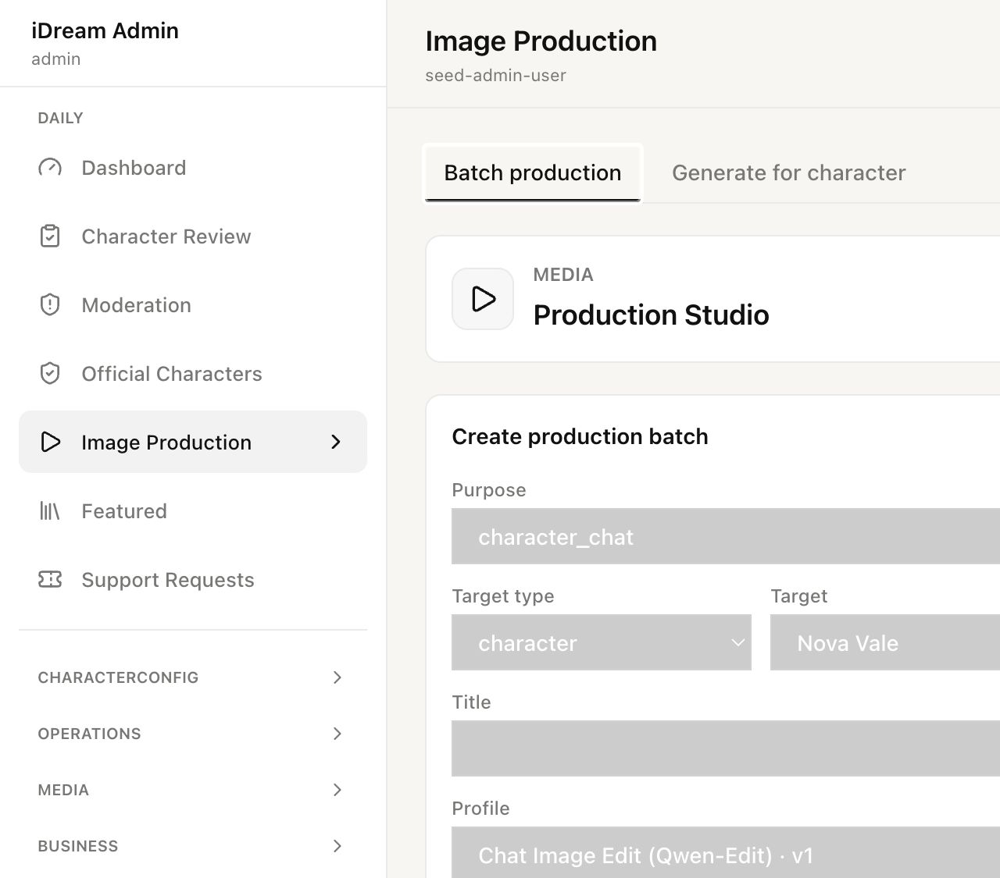
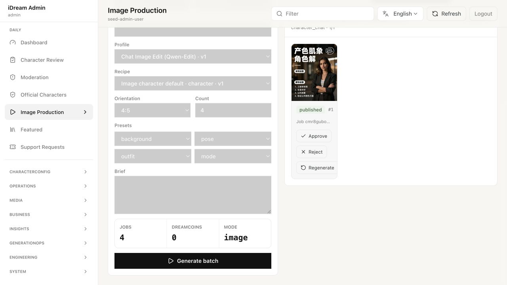
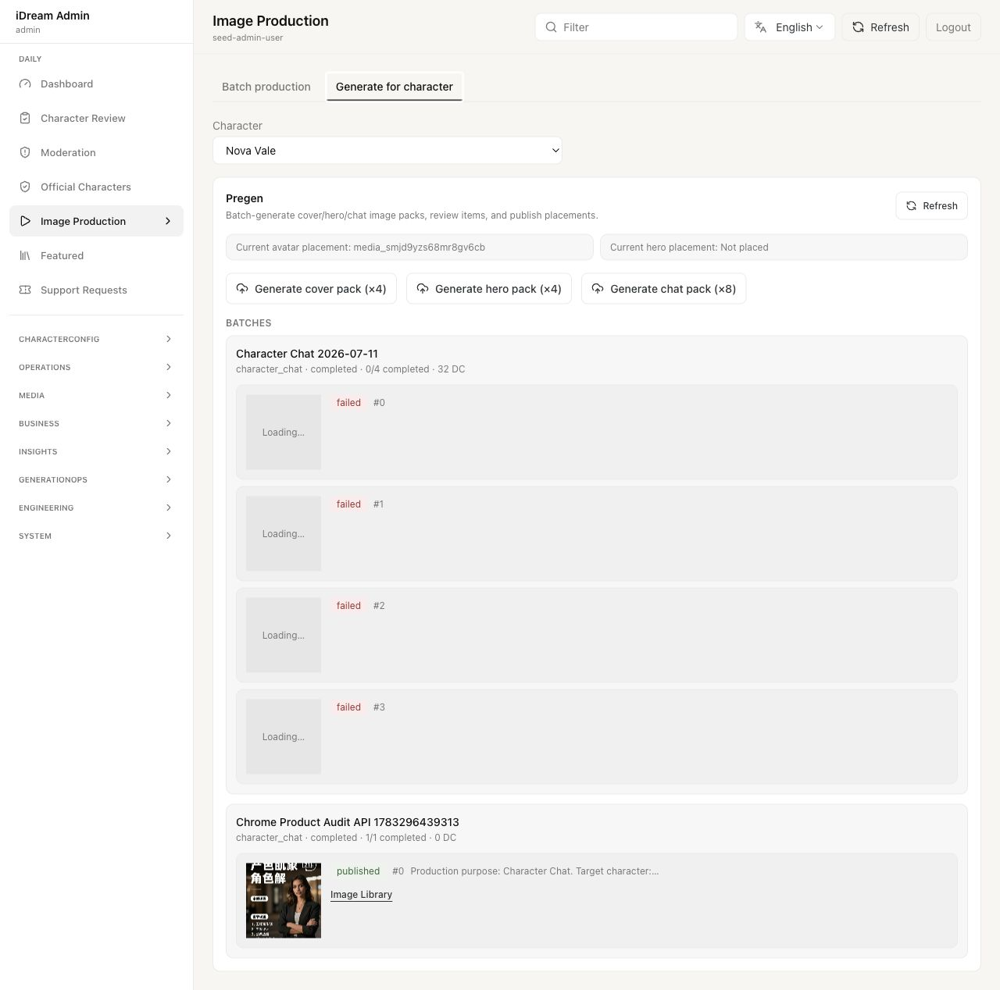

# 图片生产运营流程审计

审计日期：2026-07-10  
页面：`http://127.0.0.1:3001/admin/content/production`

## 结论

当前页面具备“创建批次 → 查看结果 → 审核/投放”的技术闭环，但还不是一个适合内容运营高频使用的创作工作台。它把运营人员放在“选系统参数并启动任务”的位置，而不是“围绕角色策划场景、组织提示词、比较变体、迭代并沉淀素材”的位置。

综合评分：**4/10（内部技术验收可用，日常运营创作不够用）**。

## 走查步骤

### 1. 进入图片生产页 — 健康度：一般



- 优点：入口明确；通用批量与角色预生成被收敛到一个页面；表单、历史批次、审核结果可以在同一屏工作。
- 问题：`Batch production` 与 `Generate for character` 的任务边界不清。两者都能针对角色生图，却使用不同的输入与审核体验。
- 问题：页面首屏先强调系统对象（Purpose、Profile、Recipe），没有先让运营确定“这批图要表达什么”。

### 2. 填写通用批次 — 健康度：较差



- `Brief` 是唯一开放创意输入，但没有示例、placeholder、结构化提示或创意建议。
- `Title` 和 `Brief` 都为空时，`Generate batch` 仍可点击；页面允许在完全没有创意意图的情况下直接出图。
- Preset 只有背景、姿势、服装、模式四个粗粒度下拉；没有情绪、故事时刻、镜头、光线、构图、时间、地点、参考图和变体强度。
- Profile 与 Recipe 暴露的是工程配置，默认值来自“第一个 active 项”，并非根据用途、角色能力或参考图自动推荐；运营容易选错组合。
- Purpose 使用 `character_chat`、`model_eval` 等内部枚举；角色选择中出现两个同名 `Nova Vale`，缺少头像、ID 或状态帮助区分。
- 成本显示为固定 `0`，无法帮助运营在提交前判断这批任务的真实成本。

### 3. 角色预生成与批次结果 — 健康度：较差



- 角色生成只有 cover×4、hero×4、chat×8 三个一键按钮；没有场景主题、prompt、参考图、风格方向或多组创意方案。
- 当前头像和主图只显示 media ID，不显示图片，运营无法快速判断“当前线上是什么”。
- 失败批次显示 `completed · 0/4 completed · 32 DC`，四个失败项仍显示 `Loading…` 占位；状态语言矛盾，且看不到失败原因与下一步。
- 历史批次平铺增长，没有搜索、筛选、排序、折叠或只看待审核/失败的视图。
- 已发布图片只提供跳转图片库；页面没有“以此为参考继续生成”“复制场景”“生成同主题变体”等创作闭环。

## 最高优先级问题

1. **缺少创意编排层。** 运营无法围绕一个角色定义主题、场景、情绪、镜头、服装、光线、故事目标和参考素材。
2. **两个生成入口割裂。** 通用批次有 Brief，但角色预生成没有；角色预生成能投放，但通用批次审核没有一致的元数据和投放体验。
3. **生成前没有可预期性。** 缺 prompt 预览、参考图、模型能力说明、成本估算和冲突校验。
4. **结果不可高效比较和迭代。** 缩略图小、缺大图/并排比较/评分/收藏/批量选择，也不能从某张图直接派生变体。
5. **失败处理不可信。** completed 与 failed 混用，失败项仍写 Loading，缺 error、重试策略和失败项批量重跑。

## 推荐目标流程

```text
选择角色与用途
  → 读取并展示角色身份状态、当前头像/主图、参考图
  → 创建“创意主题”（例如：雨夜下班后的自拍）
  → 用结构化场景字段 + Scene prompt 编排画面
  → 选择一致性：严格 / 平衡 / 创意
  → 生成 3–4 个创意方向或 prompt 方案
  → 勾选方向并批量出变体
  → 大图并排审核、评分、标签、描述、批量淘汰
  → 以某张图继续生成 / 调整局部 / 更换场景
  → 发布到头像、Hero、聊天素材池或活动位
```

建议把页面重构为三栏/两阶段工作台：

- 左侧“创意简报”：角色、用途、主题、场景、情绪、镜头、光线、服装、参考图、Scene prompt。
- 中间“创意方向与生成参数”：AI 辅助发散、可编辑 prompt 方案、严格/平衡/创意、一致性与成本预估。
- 右侧“结果工作区”：进行中、候选图对比、批量审核、More like this、投放。

高级的 Profile、Recipe、negative prompt、seed 放进可折叠的 Advanced；默认由用途和角色能力自动选择，不应挡在运营主流程前面。

## 可访问性风险

- 四个 Preset 下拉在 DOM 中没有可访问名称，只暴露为无名称 combobox。
- 两个顶部切换按钮没有 tab 语义和选中状态语义。
- 大量浅灰文字和灰底控件需要进一步做对比度测量；截图只能确认存在风险，不能据此宣称 WCAG 结果。
- 本轮未使用屏幕阅读器，也未执行完整键盘顺序、缩放与窄屏回流测试。

## 证据边界

- 本轮实际查看了通用批次、已完成批次和角色预生成三个状态；没有提交新批次、驳回、重生成或发布，避免改动现有运营数据。
- 结论由本轮截图、DOM 状态和当前实现代码共同支持。
