# Admin 已有角色编辑与运营审计

日期：2026-08-25  
环境：本地 Admin `http://127.0.0.1:3001`，受控开发数据  
主样本：Alexa Reeves；补充样本：Mara Vale Launch、Audit Rowan Vale 0825  

## 结论

角色域的后台权威边界基本正确：Visual identity、Image assets、Launch QA、Release、Serving/Live monitoring 没有被合并成一个含糊的“发布”动作，审批也没有被误当成上线。

主要问题不是能力缺失，而是运营界面没有把权威状态翻译成可执行任务：

1. `Edit details` 实际编辑 Project brief，而非页面上方的 Character details；autosave 成功后组件按版本 remount，编辑器自动关闭，连续编辑被打断。
2. `Needs attention` 的真实筛选原因是“上线超过 7 天仍无曝光/漏斗观测”，卡片却显示 journey 的下一步，导致运营看到完全不同的处理理由。
3. Live 与 Draft 完全一致时，Launch preview 和 Release 仍要求做 QA / release preparation，制造不存在的工作。
4. Live performance 把 8 个监控窗口写成 `8 views`；Video 在 0 个完成样本时展示 `0s average`。这些不是文案瑕疵，而是数据语义错误。
5. 桌面和移动端都把 journey 与展开的技术失败记录放在工作区之前；深链只切 tab，不把用户带到工作区，移动端尤其需要滚动多个屏幕才能开始任务。

## 第一性原理

一个运营角色后台应该始终回答五个问题：

1. 我现在处理的是哪个角色、哪个版本、线上还是草稿？
2. 为什么它现在需要我处理？
3. 下一步可执行动作是什么，做完会改变哪个权威状态？
4. 这个动作是否可逆，是否会影响线上？
5. 我怎么知道动作已保存、已审核、已发布或已生效？

当前系统在第 1、4、5 项的底层状态建模较强，但第 2、3 项的 UI 翻译不可靠。

## 完整路径与健康度

| # | 路径 | 健康度 | 结论 |
|---|---|---|---|
| 1 | 开发环境登录 | 良好 | Dev-only 边界和登录动作明确。 |
| 2 | Character portfolio | 需改进 | 默认按内部 ID 排序；所有者大量为空；首屏不像运营队列。 |
| 3 | 角色总览 / Journey | 需改进 | 阶段完整，但展开的媒体失败记录挤占主要工作区。 |
| 4 | Details / Project brief | 阻断 | 编辑对象命名错误；autosave 后自动退出编辑。 |
| 5 | Soul | 需改进 | 不可变版本权威正确；表单过长、对话样例和 JSON 面向工程师。 |
| 6 | Visual identity | 良好但有歧义 | 当前视觉权威和实验记录清楚；历史项文案承诺的操作并非所有记录都可用。 |
| 7 | Images | 良好但有歧义 | 生成、候选审核、选入草稿分离；“Images”实际只呈现当前/最近批次，与全图库范围不清。 |
| 8 | Video | 需改进 | 当前成片、成本和来源可追溯；0 样本仍显示 0 秒平均耗时，来源选择是长文本下拉。 |
| 9 | Voice | 良好 | Live voice、参考音频、脚本、变更理由与必填项清晰。 |
| 10 | Launch preview / QA | 良好但有错误任务 | 签名只读的 Live/Draft 用户面预览很强；无草稿差异仍要求 QA。 |
| 11 | Release control | 良好但有错误任务 | Release、Serving 分离且现状清楚；无变化仍提示准备 Release。 |
| 12 | Live performance / 决策 | 阻断 | 监控窗口被标成 views，且 attention 原因没有进入此工作区。 |
| 13 | Character Review | 良好 | 空态明确说明 Approval 不等于 Publishing。 |
| 14 | 手机端列表 / 工作区 / 导航 | 需改进 | 无横向溢出，Escape 与焦点返回正常；筛选区和大图卡片占满首屏，深链不落工作区。 |
| 15 | Needs attention | 阻断 | 队列筛选理由与卡片任务文案来自两套逻辑。 |

## 关键证据

### 1. 列表不是运营队列

默认 `Character ID` 排序对人没有任务意义。`Needs attention` 后端实际筛选“live release 已超过窗口且没有 exposure/funnel”，但卡片仍显示通用 journey action；Alexa 显示继续图片，Mara 显示 launch review，均没有告诉运营真正的异常是长期无观测。

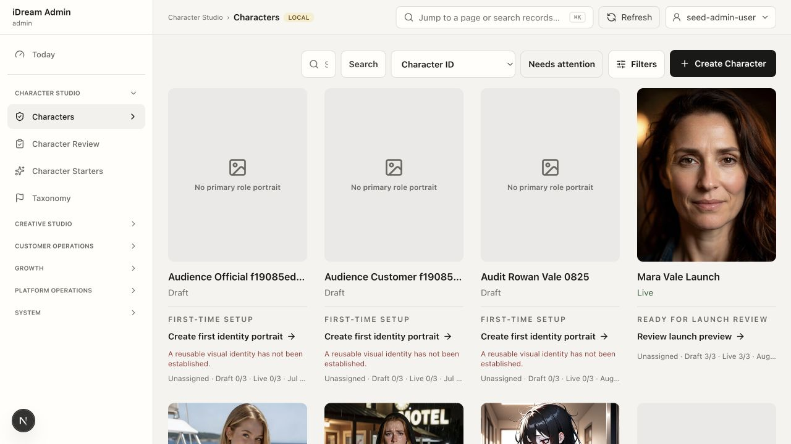

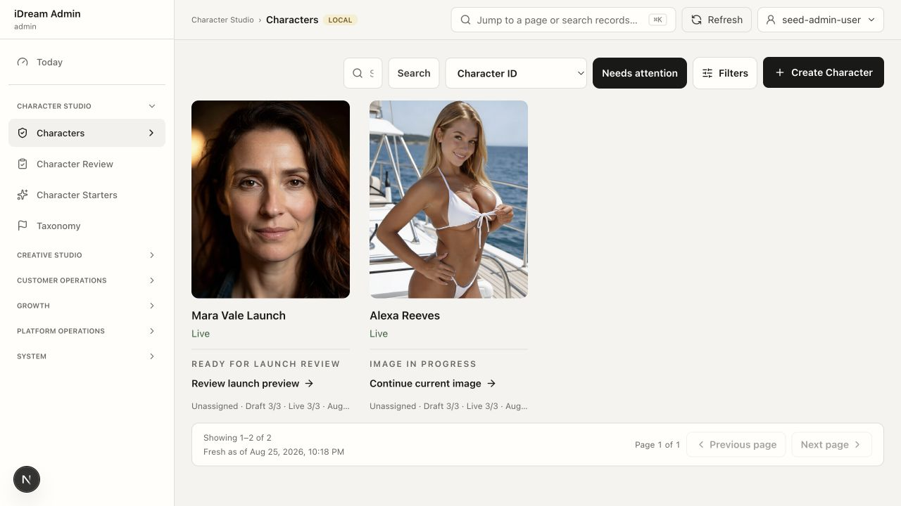

### 2. 连续编辑被 autosave 打断

`Edit details` 打开的是 Owner、Audience、Hypothesis、QA plan 等 Project details，不是同屏展示的 Description、Age、Gender、Style。任意字段 autosave 后 Project version 更新，父组件用版本作为 `key` 重挂载编辑器，`editing` 回到 false；保存过程中权限还短暂表现为 `Read only`。

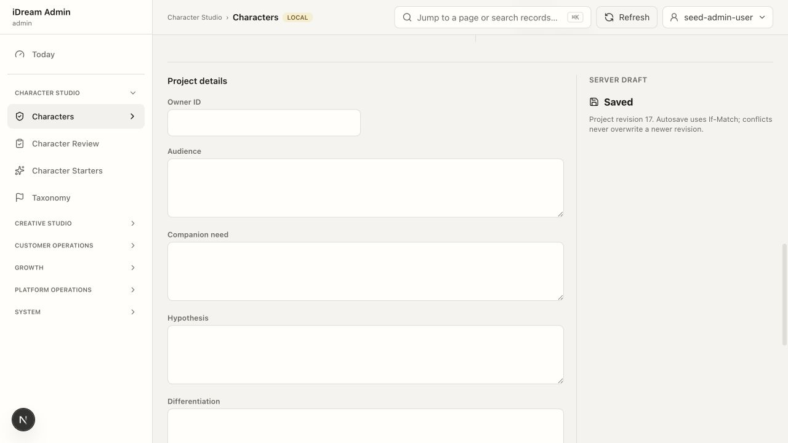

### 3. 生产权威边界是当前设计中最强的部分

Visual identity 明确当前 look、prompt、negative prompt、seed、reference、profile 和实验历史。Images 将生成、composition check、review、selected-in-draft 分开；这符合“生产证据不能直接成为线上资产”的不变量。

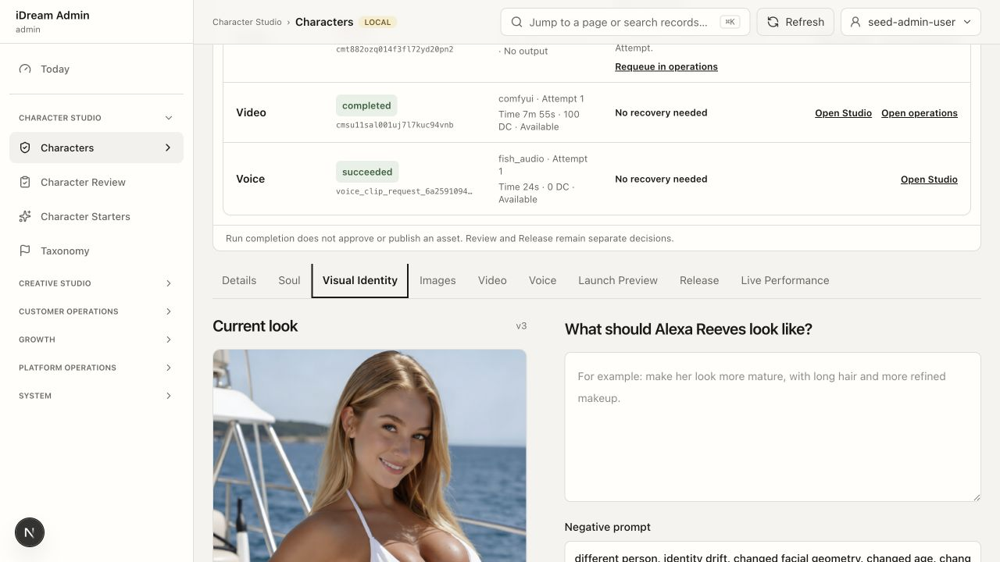

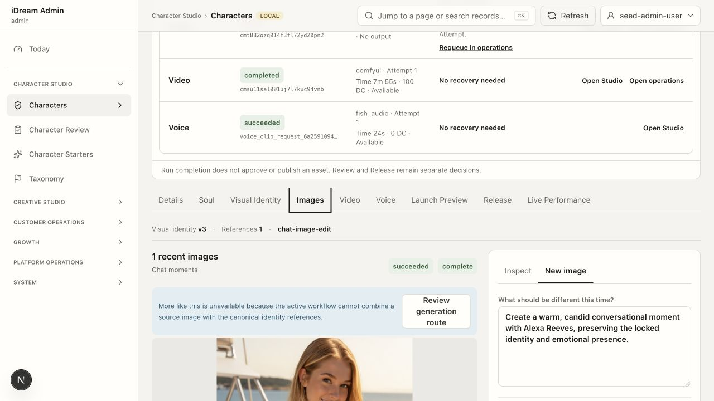

### 4. Preview / Release 对“无变化”处理不正确

Alexa 的 Live 与 Draft `changedFields=0`，Launch preview 显示没有 draft changes；Release 却提示必须先记录当前草稿 QA。这里应该闭环为“没有未发布变更，无需操作”，而不是制造下一步。

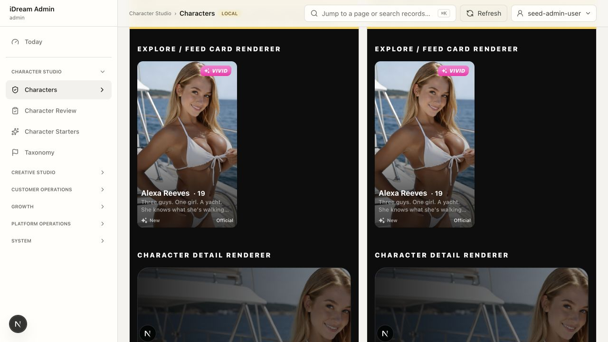

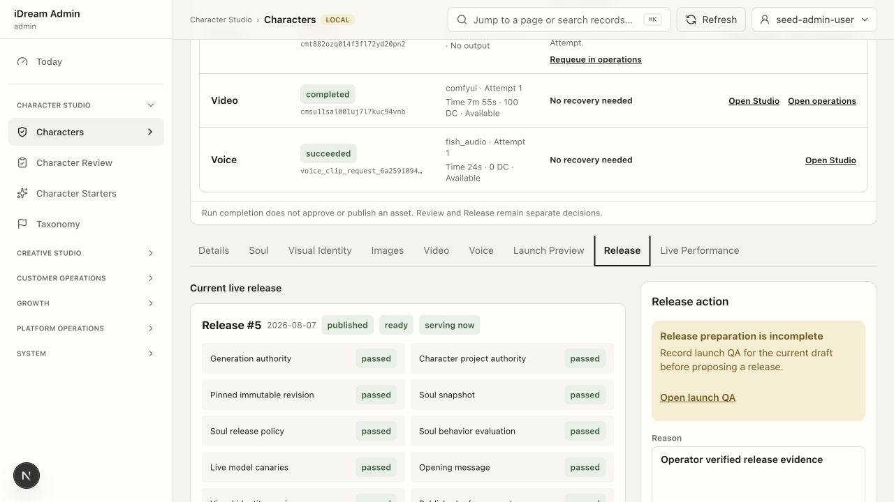

### 5. 数据语义直接误导运营

Live performance 在无观测时同时显示 `8 views` 和 `No performance data yet / 8 monitoring windows`。源码确认 `views` 使用的是 performance row 数量。Video 同理：`completedSampleCount=0` 时，只要 `averageDurationMs=0` 就显示 `0s average`。

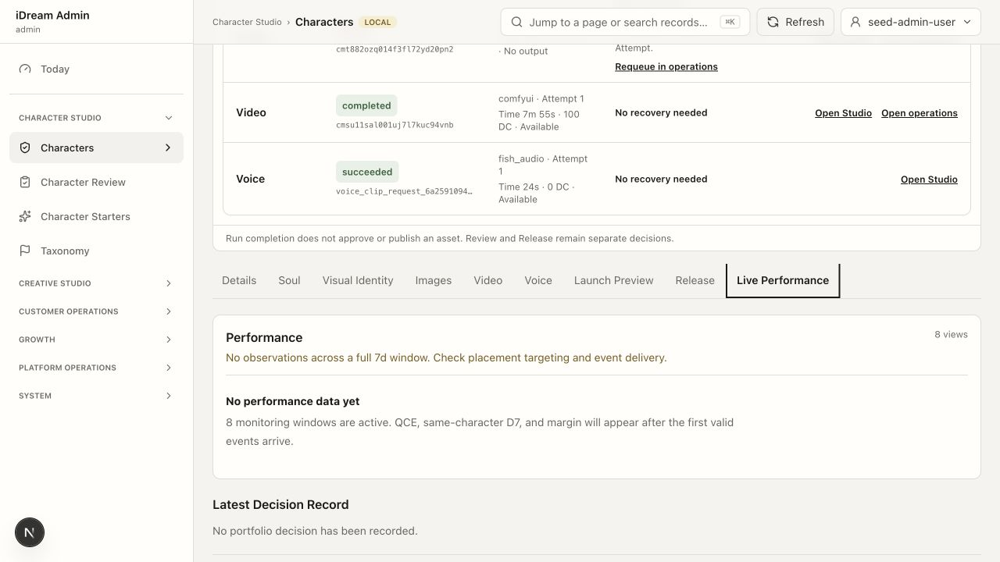

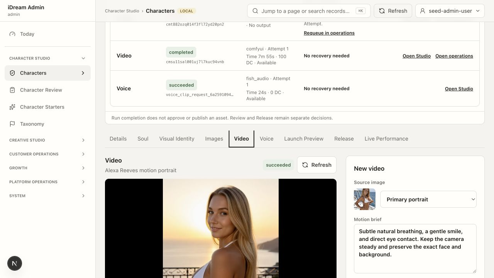

### 6. 移动端可用但不高效

390px 下没有页面级横向溢出；抽屉 Escape 关闭后焦点能回到导航按钮。但列表筛选占满首屏，第一张角色卡大图继续占屏；`?tab=assets` 打开后仍先看到 Journey 和展开的失败详情，工作区在多屏之后。

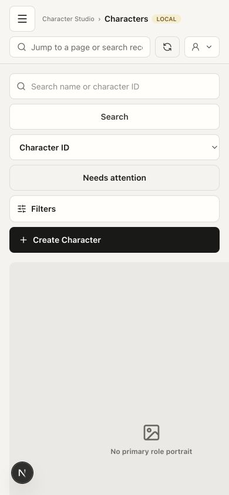

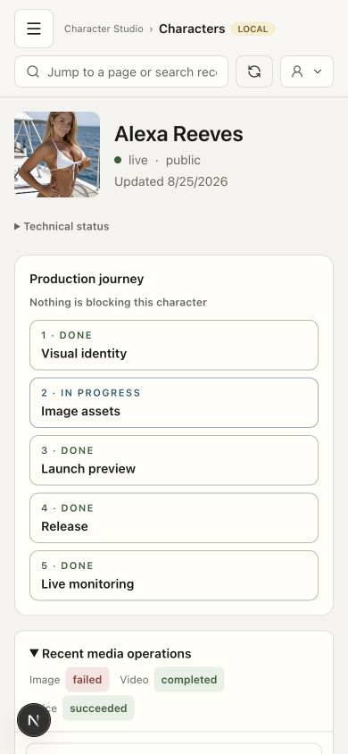

## 优化顺序

### P0：先修“错误任务”和“无法连续工作”

1. **稳定 Project editor**：不要用 `project.version` remount 整个编辑器；刷新权威数据时保留编辑模式和本地 draft。保存态只显示 `Saving / Saved vN / Conflict`，不要短暂显示 `Read only`。补行为用例：连续改两个字段，autosave 后编辑器仍打开且无草稿丢失。
2. **把 `Edit details` 改成 `Edit project brief`**：Description/Age/Gender/Style 归入明确的 Character profile / Soul 版本动作；在创建不可变版本前给字段 diff。
3. **给 Attention 单一权威理由**：portfolio contract 返回 `attentionReason`、发生时间、诊断深链和建议动作。卡片直接显示“上线 7 天无曝光/漏斗事件 → 检查 monitoring / pipeline”，不要复用 journey next action。
4. **无变化即闭环**：`changedFields=0` 且无 candidate 时，Preview/Release 显示“Live 与 Draft 一致，无需发布”，隐藏 QA 和 Release CTA。
5. **修正两个数据标签**：`performance.length` 显示为 monitoring windows；Video 只有 `completedSampleCount > 0` 才展示平均耗时。

### P1：把角色工作区变成任务工作台

1. active workspace nav 置于 journey/evidence 之前并保持 sticky；普通 `?tab=` 深链也要滚到 active panel。
2. Recent media operations 默认收成一条异常摘要：失败原因、影响、恢复动作；request/attempt/provider/time 放到 Technical evidence。
3. Portfolio 默认 `Recently updated`；Needs attention 模式按严重度、等待时长、最后更新时间排序，并显示 owner / due / attention reason。
4. Video 来源改为缩略图选择器，显示用途、是否 live、分辨率和生成时间；不要用 `Character image 4…23`。
5. 手机端把筛选折叠为一行，把角色主图缩成信息型缩略图，首屏至少露出角色名、状态、原因和 CTA。

### P2：降低认知负担和清理运营数据

1. Soul 按 Identity、Voice、Relationship、Dialogue、Compiled output 分段，增加段落导航、dirty indicator 和版本 diff；把对话样例从 raw JSON / `assistant :: reason` 改成结构化行编辑。
2. Launch preview 的 appearance / assetPack JSON 收到 Technical evidence，默认只呈现用户面差异和 QA 结论。
3. 对 `Mara Vale Launch`、`Chrome Launch Audit` 等真实审计数据做运营决策：重命名、降级、unlist 或 retire；不要用通用“删除 fixture”处理真实发布记录。
4. 建立最小数据卫生规则：live 角色必须有 owner；attention 必须有 reason、age、next action；无负责人进入单独队列。

## 验证与边界

- 浏览器：完整走查 15 个步骤；桌面 1280px、手机 390×844；手机无横向溢出，导航 Escape / 焦点返回通过。
- 测试：Admin 目标 Vitest 8 个文件、50 个测试通过；Main production-journey 1 个文件、8 个测试通过。
- 写入：只在专用 `Audit Rowan Vale 0825` 上临时填写 Audience 并恢复为空；内容已恢复，项目不可变 revision 从 1 增至 3。
- 未执行：没有新生成图片/视频/语音，没有 QA、Release、Serving 或公开发布写入，没有删除任何角色或运营记录。
- 证据边界：这是本地受控开发环境的浏览器、代码和测试证据，不代表正式生产可用性，也不是完整 WCAG 结论；Tab 遍历自动化结果不稳定，未据此宣称键盘完全合规。
- 工作区已有并在审计期间持续变化的 WIP 均未修改、未清理、未暂存。

## 截图索引

- `01-sign-in.png`
- `02-character-portfolio.png`
- `03-character-overview-and-journey.png`
- `04-edit-details-mismatch.png`
- `04-edit-project-details.png`
- `05-soul-editor.png`
- `06-visual-identity.png`
- `07-image-production.png`
- `08-video-production.png`
- `09-voice-operations.png`
- `10-launch-preview.png`
- `11-release-control.png`
- `12-live-performance.png`
- `13-live-decision-form.png`
- `14-character-review-empty.png`
- `15-mobile-character-list.png`
- `16-mobile-character-images-entry.png`
- `17-mobile-images-workspace.png`
- `18-needs-attention-mismatch.png`
