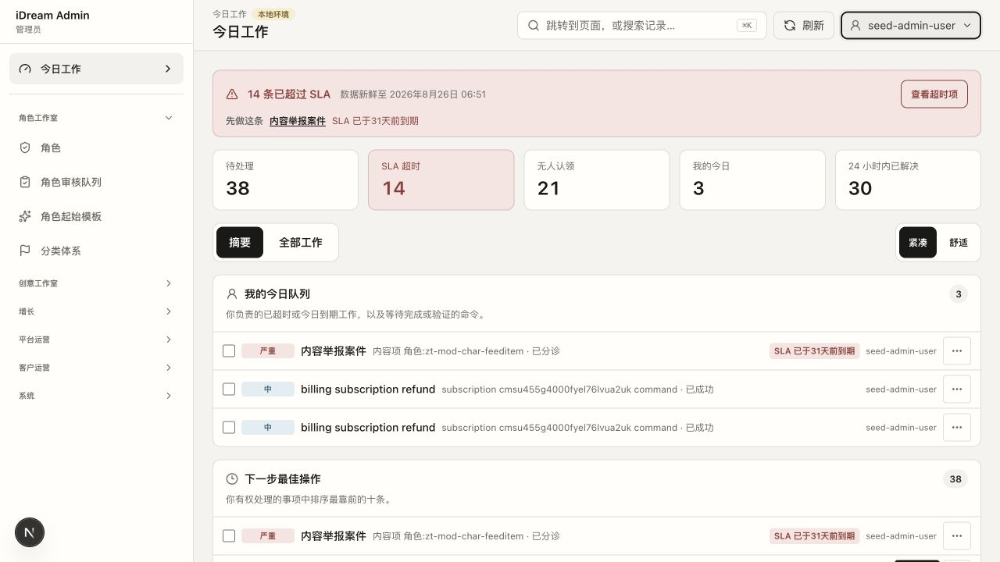
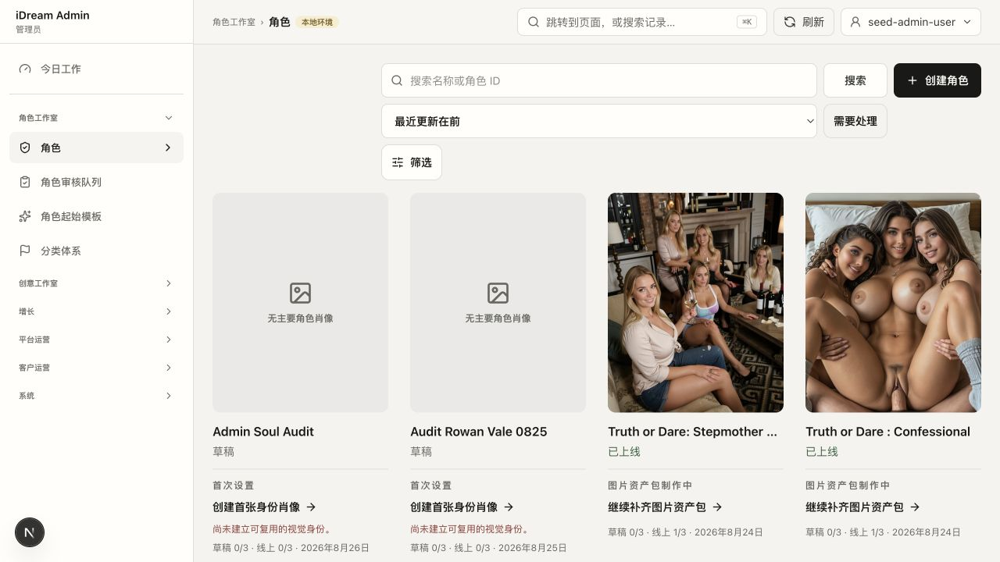
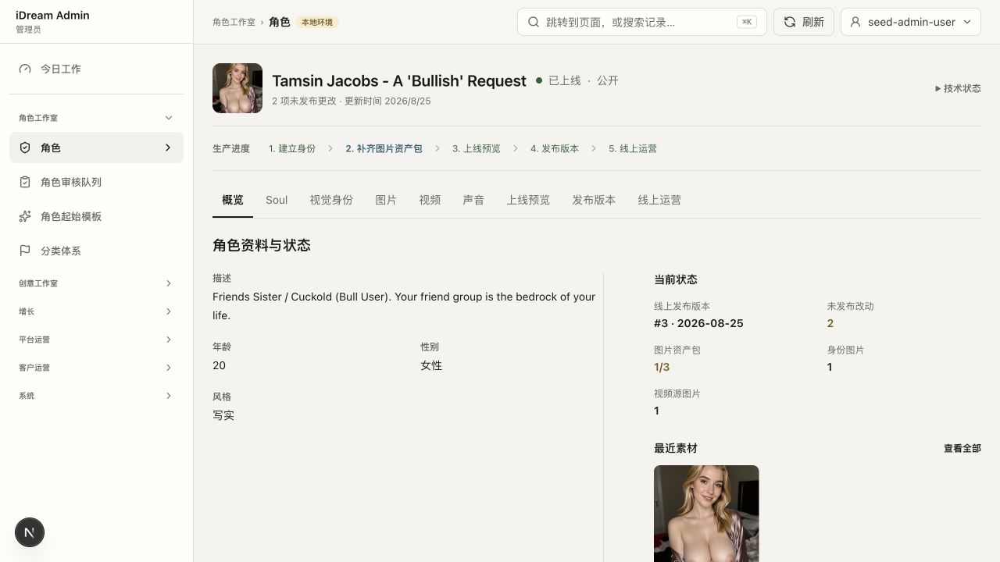
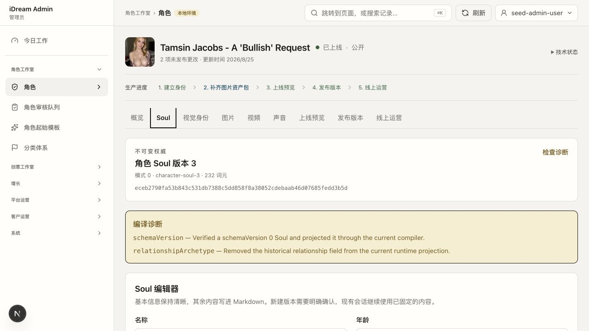
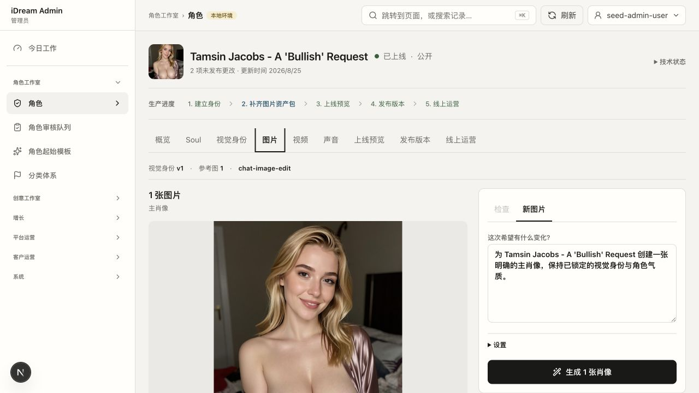
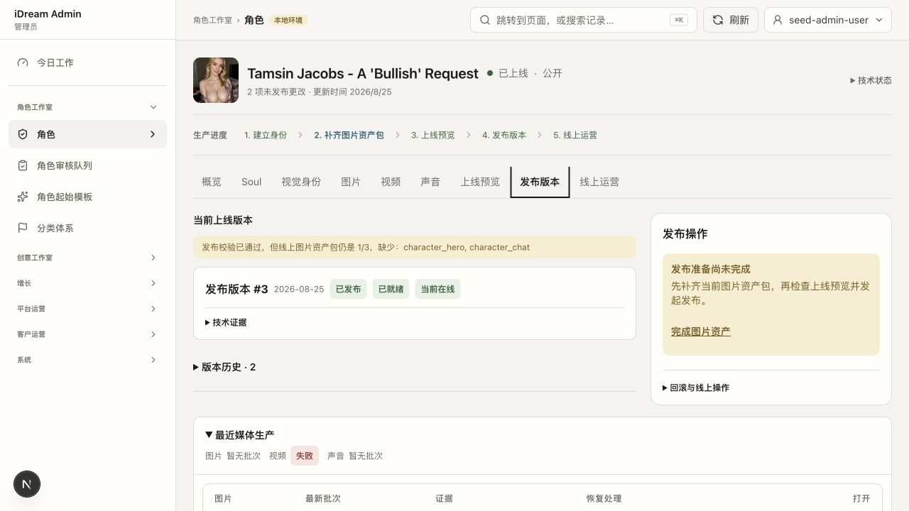
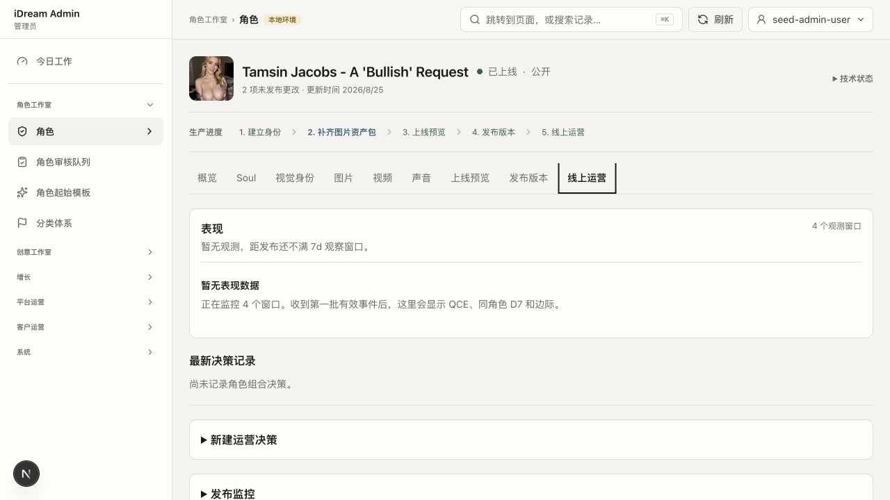
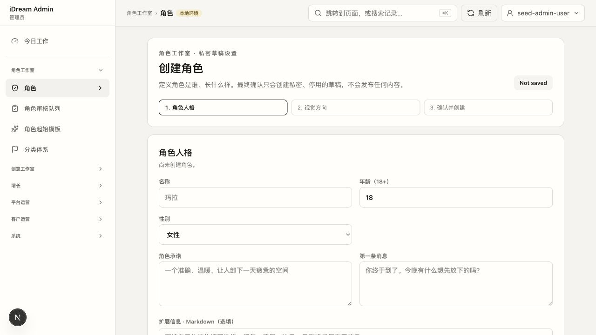
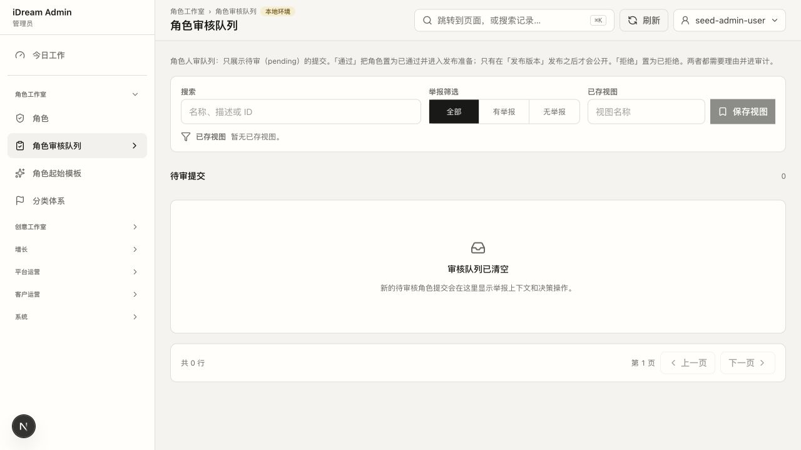

# iDream Admin MVP 产品设计审计

日期：2026-08-26
范围：仅 Admin；主站产品功能、页面和用户流程不在改动范围内。
核心任务：让运营可靠完成「角色创作 → 图片选择 → 发布 → 上线后决策」。

## 一句话结论

当前 Admin 的底层能力已经足够，问题不是缺功能，而是一个角色详情同时暴露了 9 个平级标签和过多技术事实。MVP 应建立两个真正独立的工作区：

1. **角色创作**：完成角色定位、对话人格、视觉身份，并围绕角色持续生产任意数量的图片候选。
2. **发布运营**：从已通过质量检查的角色图片库中选择三张不同图片填入三个产品槽位，组装候选版本，再审核、发布和观察。

两者共享同一个 Character 和现有版本权威，不复制角色数据，也不在同一个详情页里用模式开关混合操作。创作负责“把角色和素材做对”，发布运营负责“把什么放到哪里、何时上线、上线后怎么办”。图片创作是核心生产能力，但产品槽位选图是运营决策。

## 第一性原理

Admin 的价值不是“能配置多少字段”，而是缩短一个角色从想法到可靠上线的时间，并让运营知道下一步做什么。

因此 MVP 只需要守住五件事：

1. 角色是第一产品对象。
2. 创作与发布是两个不同工作区、两种职责和两个工作对象。
3. 图片是角色产品体验的一部分；生成图片与决定图片如何进入产品，是两件事。
4. 审核通过不等于发布；发布不等于上线后值得继续投入。
5. 技术血缘、指纹、编译提示和 provider 证据继续保留，但默认折叠。

## 领域边界：不是两套角色，而是两种职责

| 工作区 | 唯一目标 | 工作对象 | 可以修改 | 不可以做 |
|---|---|---|---|---|
| **角色创作** | 产出完整、连贯、可供运营选择的角色内容与素材 | Character Project、角色图片库 | 角色定位、对话人格、开场白、视觉身份、图片 brief、图片候选、创作交接 | 不能发布、不能修改当前线上版本、不能决定产品槽位最终用图 |
| **发布运营** | 把合适的内容放入正确产品槽位，并安全运营线上版本 | 发布候选、Release、Serving | 三个产品槽位的选图、预览检查、审核决定、发布时间、回滚/暂停、上线后决策 | 不能直接改 Soul、图片或生成参数；需要改内容时必须退回创作 |

“创作交接”和“发布候选”都是现有 Character Project、内容版本、素材选择和 Release 的产品视图，不要求新建数据库实体或通用工作流引擎。

MVP 不需要强制两个人参与。同一个运营人员可以同时拥有创作和发布权限，但必须进入不同工作区完成动作；系统继续使用现有的 propose / review / publish 权限，不新增一套岗位体系。

分开不是只换导航标签：角色创作入口打开 Character Project；发布运营队列打开发布候选。发布运营只能只读查看角色内容和图片库，角色创作也看不到发布、回滚或暂停按钮。两边只通过“提交创作交接”和“退回创作”连接。

### 图片必须拆成四个决定

1. **生成候选图**：创作者围绕角色写任意画面 brief，按批次生成或上传图片；不要求先选择产品槽位。
2. **图片质量通过**：确认人物一致性与基础质量，使图片进入角色的“可选择图片库”。
3. **选择产品槽位**：发布运营从可选择图片库中分别选择发现页封面、角色详情主视觉和聊天场景图。
4. **发布完整版本**：审核的是角色内容、视觉身份与三槽位组合形成的完整发布候选，而不是单张图片。

这四步不能合成一个“通过并发布”按钮。生成系统也不能自动决定哪个候选进入哪个产品槽位；它只提供候选和必要证据，最终选择属于运营。

### “场景”必须拆成两个词

- **画面场景**：图片里发生什么，例如卧室、约会、旅行或日常聊天；属于角色图片创作。
- **产品槽位**：图片在主站哪里展示；当前只有发现页封面、角色详情主视觉和聊天场景图，属于发布运营。

后续 Admin 文案不再使用模糊的“产品场景”。创作者可以生产很多卧室、约会或生活图片，它们都先进入同一角色图片库；运营之后才从库中选出三张不同图片填入三个产品槽位。

图片库中的图片只携带角色归属、画面 brief、尺寸/方向、审核状态和生成血缘，不携带最终槽位。发布运营选某个槽位时，界面按尺寸兼容性过滤或提示，但不会为选图自动触发生成。

### 唯一主流程

```text
角色创作中
  → 持续生成、检查图片候选
  → 提交创作交接
运营待选图
  → 从角色图片库组装三个产品槽位
待审核
  → 已批准
待发布
  → 已上线
上线复盘
  → 继续投入 / 需要改进 / 暂停
```

退回不是覆盖原稿：如果图片库里没有适合某个槽位的图片，运营提交明确的画面需求，角色回到创作队列继续出图；原发布候选继续保留。线上角色需要改动时，从当前线上版本开始新的创作稿，旧 Release 在新版本发布前继续服务。

### 当前实现与目标模型的差距

当前实现已经具备一个角色保存多张图片、图片审核、草稿选图、Release 和 Serving 分离的基础，但生成入口仍要求 Creative Run 预先选择 `character_cover`、`character_hero` 或 `character_chat`。这把“图片生成目的”和“最终产品槽位”提前绑在了一起。

目标模型应当是：

```text
Creative Run → Character → 多张图片候选 → 质量检查 → 角色图片库
                                                        ↓
Release Operations → 三个产品槽位选择 → 发布候选 → Release → Serving
```

实现时只需要解除生成入口对三个槽位的强绑定，并保留现有 `draftAssetSelections`、三槽位预览和 Release placement 权威；不需要改变主站的三槽位消费方式。

## 当前流程审计

### 1. 今日工作 — 健康度：需重构



- 优点：有 SLA、负责人、下一步和恢复入口。
- 核心问题：切换到“角色制作”工作模式后，首屏仍混入举报、退款、事故等跨领域事项。工作模式只改变排序，没形成真正的角色创作工作台。
- MVP 改法：角色制作默认只显示“继续创作、等待图片生成/检查、待交接运营”三类角色任务；跨领域异常放到独立的“全部工作”。
- 可访问性风险：严重程度主要依赖浅色底和小标签，需要实测对比度与键盘焦点。

### 2. 角色列表 — 健康度：基础正确，目标混杂



- 优点：角色卡直接展示上线状态、资产进度和下一动作。
- 核心问题：草稿、创作中、已上线角色混在同一个网格；操作者要自己判断是在创作还是运营。
- MVP 改法：Characters 列表只服务角色创作；已交接、待发布和已上线角色进入独立的发布运营队列。两个列表的卡片都只显示一个下一动作。
- 数据问题：真实列表首屏请求本次耗时约 24 秒，加载态缺少明确的超时/降级说明。

### 3. 角色概览 — 健康度：信息完整，层级过多



- 优点：角色、上线状态、未发布改动和服务版本在同一权威对象下。
- 核心问题：顶部 5 步生产轨道与下面 9 个标签重复表达流程；Overview 下面又混入标签、聊天生图开关、媒体恢复表。
- MVP 改法：不再把创作和发布放进同一个角色详情。角色创作详情只保留“角色 / 图片库 / 交接”；发布运营从独立队列打开发布候选详情，真实主站预览也只在发布运营出现。

### 4. Soul 编辑 — 健康度：权威正确，面向错误用户



- 优点：版本不可变、线上会话固定旧版本、发布边界明确。
- 核心问题：指纹、schema、compiler、token 数和编译诊断占据首屏；运营真正关心的角色承诺、语气、开场白反而在下面。
- MVP 改法：改名为“对话人格”，直接编辑角色承诺、语气与开场白；生成的 SOUL.md、系统提示词和编译诊断全部收进“技术详情”。
- 不改：版本化、确认、线上版本固定和发布快照。

### 5. 图片工作台 — 健康度：最接近正确产品形态



- 优点：身份参考、当前图片、创意简报、生成和质量审核在同一个上下文；生成不会自动审核或发布。
- 核心问题：图片生产和产品槽位选图仍在同一工作台，而且生成 Run 必须预先绑定某个槽位；这限制了一个角色持续积累多样图片。
- MVP 改法：创作模式改成角色图片库，可按任意画面 brief 批量生成、继续变体、检查和浏览该角色的全部图片，不展示槽位采用动作；发布运营固定展示现有三个产品槽位：
  - `character_cover`：发现页封面
  - `character_hero`：角色详情主视觉
  - `character_chat`：聊天场景图
  每个槽位从角色的“可选择图片库”选一张不同图片，并显示“当前线上 / 发布候选 / 缺失”。模型、workflow 和 prompt 细节留在创作模式的高级设置，不进入发布运营。

### 6. 发布版本 — 健康度：边界正确，可进一步聚焦



- 优点：审核、发布、当前在线和回滚保持分离；缺少图片槽位时明确阻断。
- 核心问题：发布动作和媒体生产恢复表同时出现；发布人员被迫理解创作管线故障。
- MVP 改法：发布运营只显示选图组装、候选版本、三槽位预览、对话人格摘要、检查结果和“批准/退回创作”；批准后才出现独立的“发布”动作。技术故障深链到运维，不在本页展开。

### 7. 线上运营 — 健康度：方向正确，MVP 需减法



- 优点：表现、决策记录和发布监控没有与创作状态混成一个 status。
- 核心问题：五种决策和三种证据类型对早期团队过重；空数据时没有最小可执行建议。
- MVP 改法：只保留“继续投入 / 需要改进 / 暂停”三个决定，附原因与复查日期。达到稳定数据量后再增加证据分级。

### 8. 角色创建 — 健康度：流程清晰，可合并字段



- 优点：三步向导简单，最终只创建私密草稿，不会意外发布。
- 核心问题：第一步把内部概念“角色承诺”和技术概念 Markdown 直接暴露给所有运营。
- MVP 改法：首步只问“她是谁、她如何说话、第一句说什么”；Markdown 作为高级编辑器。第二步进入视觉身份与图片候选生产，完成后提交给发布运营选图。

### 9. 角色审核队列 — 健康度：职责重复



- 优点：通过不等于发布的语义写清楚了。
- 核心问题：它作为独立导航页，与角色详情里的预览和发布审核形成两个入口；保存视图、举报筛选对 MVP 角色发布不是核心。
- MVP 改法：并入“发布运营”队列，统一为“待选图 / 待审核 / 待发布 / 已上线需关注”；举报上下文只在存在时显示。

## MVP 信息架构

```text
今日
角色创作
  ├─ 创作中
  ├─ 新建角色
  └─ 角色详情：角色 / 图片库 / 交接
发布运营
  ├─ 待选图
  ├─ 待审核
  ├─ 待发布
  └─ 已上线需关注
更多
  ├─ 客户运营
  ├─ 平台运维
  └─ 系统
```

两个工作区各自只有一个清晰对象，不再共用 9 个平级标签：

```text
角色创作详情（Character Project）
  角色：定位 + 对话人格
  图片库：视觉身份 + 任意画面 brief + 批量生成 + 质量检查
  交接：角色内容摘要 + 图片库可用数量 + 提交发布运营

发布候选详情（Release Candidate）
  选图：三个产品槽位 + 当前线上对比
  审核：主站真实预览 + 差异 + 批准 / 退回创作
  发布：独立发布 + 回滚
  表现：基础表现 + 下一决策
```

图片很重要，但“重要”不等于要成为第三个顶层业务域。MVP 中“图片库”是角色创作的核心页面，一个角色可以持续拥有很多图片；产品槽位选图只出现在发布运营的第一步。这样既让图片生产足够突出，也不会把同一角色拆成角色、图片、发布三套管理系统。

视频和声音保留现有能力，但 MVP 从角色详情一级标签移到“更多能力”；它们不阻塞角色首发。

## 不做什么

- 不改主站页面、路由、交互和三个图片槽位的消费方式。
- 不新建通用工作流引擎。
- 不复制 Character、Soul、Release 或 Serving 权威。
- 不把 Creative Run、provider、workflow、fingerprint 变成运营必填概念。
- 不把审核与发布合并成一个按钮。

## 建议实施顺序

1. 先把 Admin 收敛为“角色创作 / 发布运营”两个独立工作区，不改后端权威和权限键。
2. 角色创作工作区把三槽位生成器改为角色图片库：允许持续批量生成和浏览全部候选，不在生成时决定槽位。
3. 发布运营增加“待选图”，只在这里把三张不同的可选择图片放入三个现有产品槽位。
4. 把现有角色审核页并入发布运营，保留批准与发布的明确分隔。
5. 最后收敛 Today：按当前工作模式真正过滤任务，只展示一个下一动作。

## MVP 验收标准

- 创作者可以为同一个角色持续生成和管理很多图片，不需要在生成前选择发现页、详情页或聊天槽位。
- 创作者可以在不接触发布按钮的情况下完成角色、视觉身份和图片候选，并提交创作交接。
- 发布运营只能从已通过质量检查的角色图片库中为三个现有槽位选择三张不同图片；缺任一槽位不能进入审核。
- 运营可以在同一页比较当前线上版本与发布候选，并从真实主站预览进入检查。
- “批准”后不会自动发布；“发布”不会静默改变其他创作草稿。
- 退回创作必须附修改要求，创作者能从角色卡直接继续对应任务。
- 主站路由、交互、三个图片槽位及其消费方式保持不变。

## 证据边界

本次审计在本地 Admin 的中文、角色制作视角完成，覆盖创建、列表、角色概览、Soul、图片、发布、线上运营和空审核队列。截图只能支持视觉与信息架构判断；未声称完成正式 WCAG 验证，也未执行任何创建、审核、发布或删除动作。
