# Admin 导航 Chrome 端到端审计

日期：2026-08-31  
环境：本地 Admin `127.0.0.1:3001` + Main `127.0.0.1:3000`  
浏览器：用户 Chrome，真实本地 admin / support 登录态  
范围：全局入口、工作区入口、低频工具、搜索权限、键盘、响应式与控制台

## 总结

新的三级入口结构已经真实可用：`Today / Characters / Workspaces` 没有删除业务能力；工作区内先展示常规任务，再用 `Tools & diagnostics` 披露低频工具。低频工具页会自动展开自己的分组，支持角色只能看到权限允许的目的地，全局搜索也按权限裁剪。

仍有三个产品问题：

1. 当前 Chrome 内容宽度 1272px 时仍使用抽屉，而 1440px 才出现常驻侧栏。对普通桌面运营窗口来说，跨工作区多了一次点击。
2. 390px 的 Dead-letter 页面只留下 Job 与 Actions，却仍直接展示 Requeue / Discard；失败原因、重放资格、账本与成本均不可见，操作者缺少决策上下文。
3. support 角色首次打开 Support Cases 时 `Loading support requests…` 持续超过 20 秒，随后才恢复为 fresh。功能最终可用，但等待缺少明确进度与恢复提示。

次要问题：Platform Operations 菜单 `clientHeight=510`、`scrollHeight=581`，末尾 Presets / Workflow Diagnostics 需要滚动才出现；键盘会自动滚动到它们，但鼠标用户在 macOS 隐藏滚动条下不容易知道下面还有内容。

## 端到端步骤

### 1. 登录并进入 Characters — 健康

Admin 登录成功，角色列表从 loading 稳定到 30 条真实本地数据，页面无横向溢出。

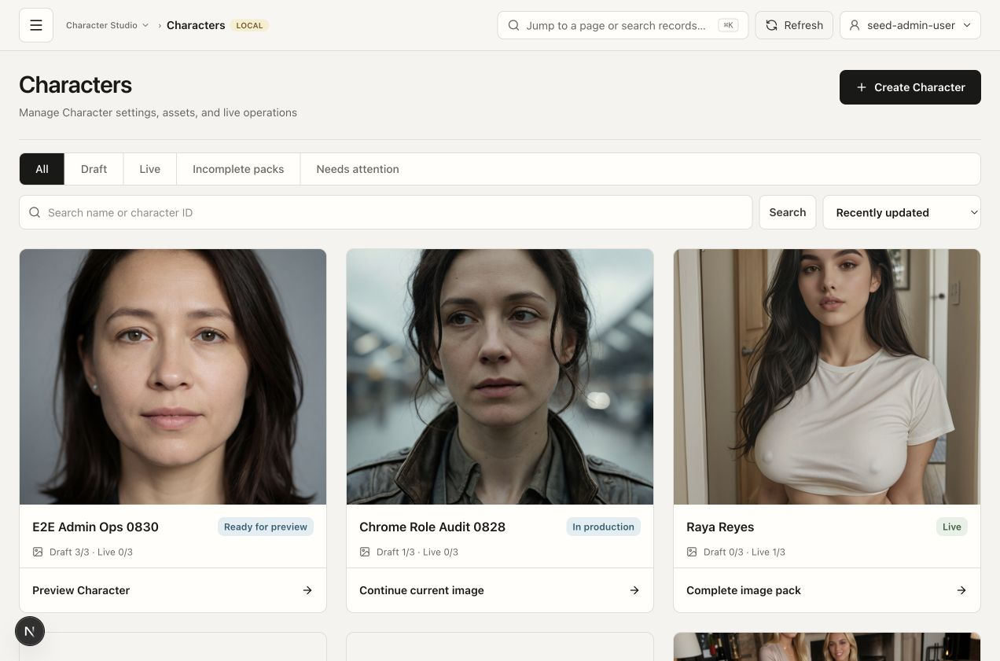

### 2. 打开全局导航 — 功能健康，桌面断点偏保守

1272px 下可通过抽屉到达 Today、Characters 和 5 个业务工作区；没有把几十个页面重新平铺。

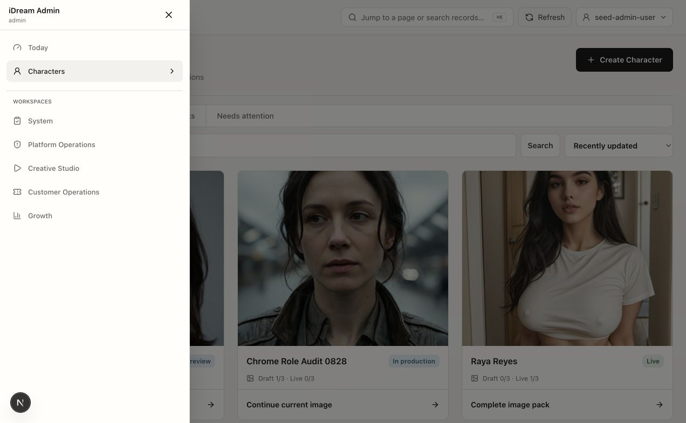

### 3. 打开 Character Studio 区内菜单 — 健康

Characters、Character Review 直接出现；低频工具保持折叠。

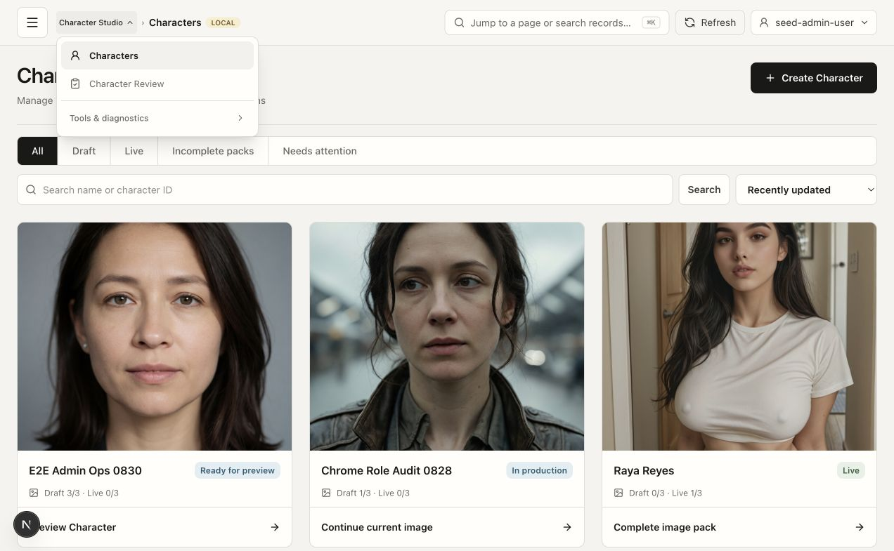

### 4. 展开 Character 工具 — 健康

Character Starters 与 Taxonomy 都可发现、可点击。

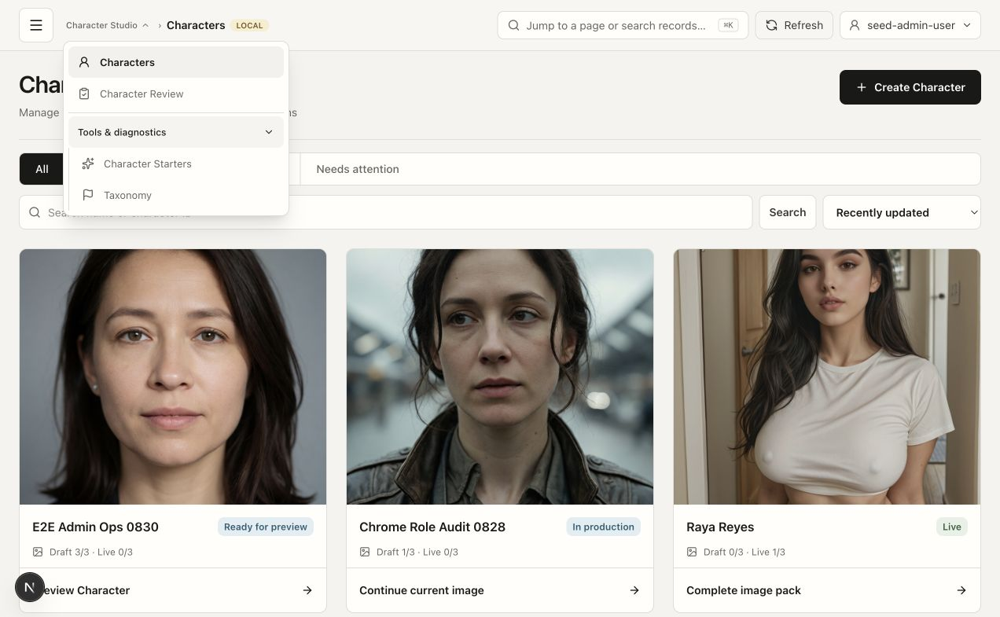

### 5. 进入 Character Starters — 健康

真实路由跳转到 `/admin/characters/starters?limit=25`；空状态与创建入口正常。再次打开区内菜单时，`Tools & diagnostics` 自动展开并标记当前页。

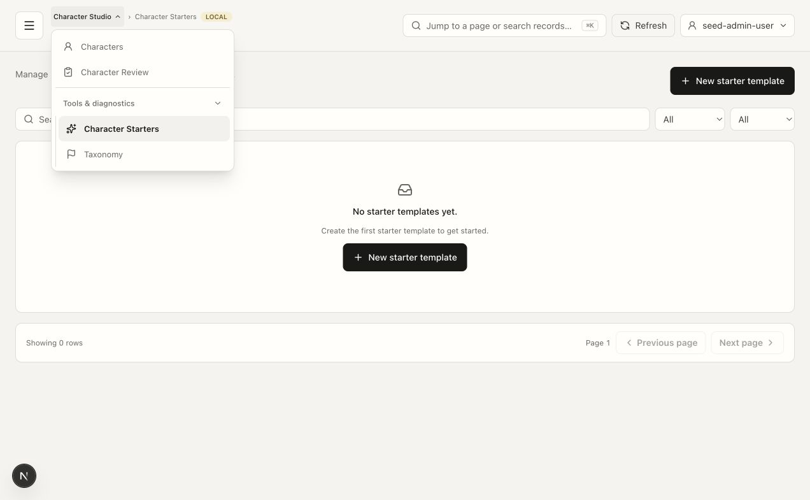

### 6. 进入 Platform Operations — 健康

工作区默认落到 Incidents；Incidents、Data Integrity、Generation Jobs、Providers、Profiles & Rollout、Prompt Recipes、Chat Operations 作为常规任务直接出现。

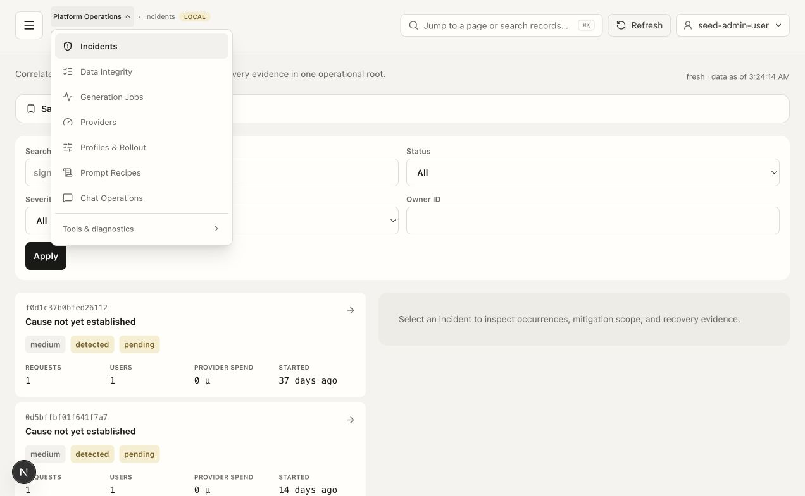

### 7. 展开平台工具 — 健康，有轻微滚动可发现性问题

Dead-letter、Backend Diagnostics、Generation Health、Profile Diagnostics、Presets、Workflow Diagnostics 均存在。菜单需要内部滚动才能看到最后两项。

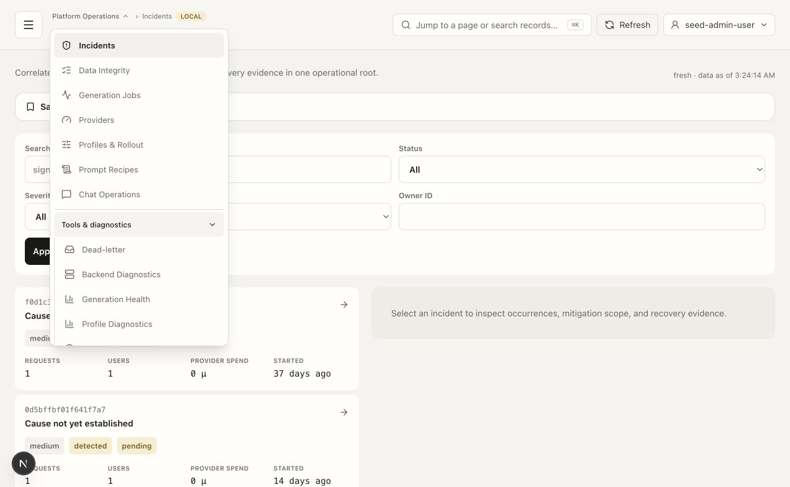

### 8. 进入 Dead-letter 并检查 390px — 导航健康，移动决策上下文不足

工具链接真实跳转到 `/admin/ops/jobs?view=dead-letter`，数据与动作加载成功。390px 页面没有全局横向溢出，但表格只显示 Job 和 Actions，危险动作失去必要上下文。

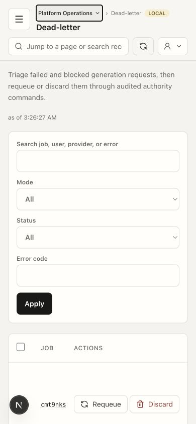

### 9. 390px 打开平台菜单 — 健康

所有常规页和工具仍可达。Tab 顺序走完 14 个入口；聚焦 Presets / Workflow Diagnostics 时菜单从 `scrollTop=0` 自动滚到 25 / 71；Escape 关闭菜单并把焦点还给 Platform Operations。

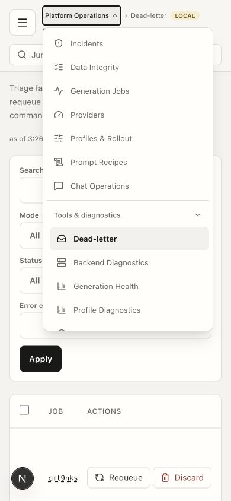

### 10. 切换 support 角色 — 权限正确，首次加载偏慢

Customer Operations 直接显示 Cases、Customers、Billing Operations；工具区只显示该账号允许的 Account Requests、Support Cases、Risk Cases。Support Cases 自动展开并标记当前页。搜索 `dead` 返回“没有获准访问且符合搜索条件的记录”，未泄漏 Dead-letter 目的地。

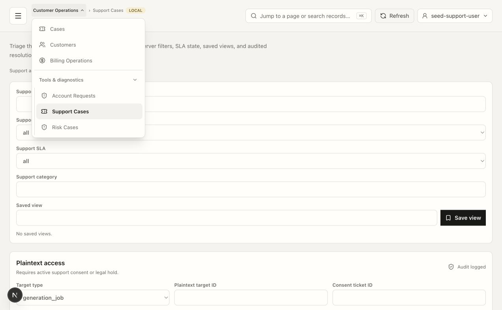

### 11. 1440px 宽桌面 — 健康

达到 `xl` 后常驻侧栏出现，结构清晰。但 1272px 与 1440px 之间的切换说明当前断点对常见桌面窗口偏晚。

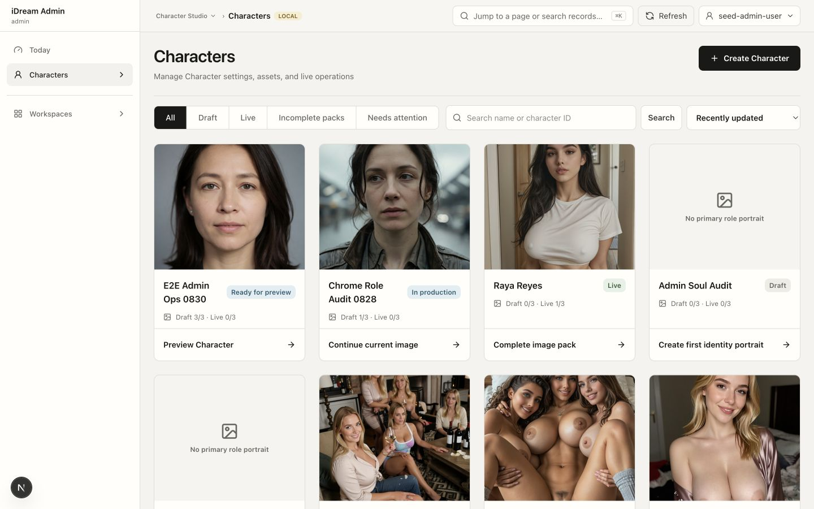

## 已确认的可访问性行为

- 页面使用真实 navigation / link / button 语义，并提供 `aria-expanded`、`aria-current`。
- 工作区菜单可用键盘遍历，隐藏在滚动区尾部的入口会自动滚入视野。
- Escape 会关闭工作区菜单并把焦点还给触发按钮。
- 移动抽屉打开后焦点进入 Close navigation，body 滚动被锁定；Escape 关闭后焦点回到 Open navigation。
- 390px 页面 `scrollWidth === clientWidth === 390`，没有整页横向溢出。
- 当前新鲜标签的 console warning / error 为 0。

截图不能证明完整 WCAG 合规；本轮未做自动对比度计算、读屏器语音输出或 200% 浏览器缩放测试。

## 运行时边界

第一次复用热更新前的 Chrome 标签时，页面数据已出现但 React 按钮不响应，console 仍为 0；新开标签后交互全部恢复。该现象属于本地开发热更新/陈旧客户端状态，不能直接外推为生产缺陷，但说明每次前端变更后的 Chrome 验证必须使用新标签。

本轮只做读取、导航、登录角色切换与截图，没有执行 Requeue、Discard、保存、发布或其他业务写操作。
