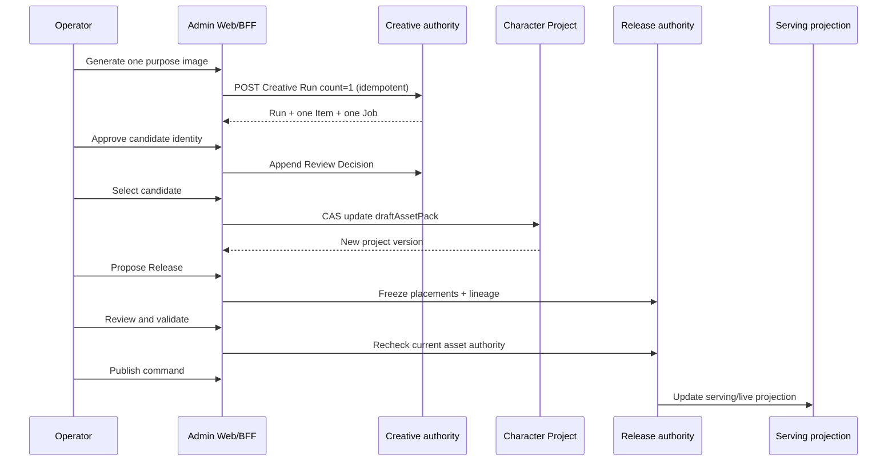

# ADR-12：Character Asset Studio 的草稿、审核与发布权威

更新日期：2026-07-13  
状态：Accepted / Implemented  
产品说明：[联合评审方案](../product/CHARACTER_ASSET_STUDIO_REVIEW.md)  
运营流程：[Character Asset Studio 运营手册](../product/CHARACTER_ASSET_STUDIO_OPERATIONS_GUIDE.md)

## 1. 决策

Character Asset Studio 复用 Creative Run 作为生成 authority、Creative Review Decision 作为审核 authority、Character Project 作为草稿选择 authority、Character Release/Serving 作为发布 authority。

任何单一 UI 状态、Asset ID 或 Character image 字段都不能跨越这些边界代替完整发布事实。

## 2. 领域映射

| 产品概念 | 实现 authority | 关键事实 |
| --- | --- | --- |
| 角色视觉身份 | active `CharacterVisualProfile` | immutable version、identity prompt、traits、anchors |
| 身份参考集 | active sealed `ReferenceSetRevision` | 精确 reference snapshot |
| 运行生成路线 | active `GenerationModelProfile` + pinned `GenerationRouteQualification` | 兼容的 profile/workflow version、单图策略、精确 lineage |
| Creative Run | `ContentProductionBatch` | purpose、targetType/targetId、profile/workflow、brief、count |
| Run Item | `ContentProductionItem` | ordinal、Job、Asset、status、version、direction lineage |
| 素材审核 | `CreativeReviewDecision` | decision、identityConsistency、artifactId、reviewer、reason |
| 草稿资产包 | `CharacterProject.draftAssetPack` | purpose 到 exact lineage 的内部映射 |
| 草稿主图 | `CharacterProject.draftImageAssetId` | cover 的可查询 FK 与 Preview fallback |
| 发布快照 | `CharacterRelease.releasePlacementManifest` | 三个 placement 的 immutable lineage |
| 线上事实 | `CharacterServing` + live Character projection | publish command 成功后才改变 |

代码中的 Creative Run 目前由 `ContentProductionBatch`/`ContentProductionItem` 持久化；公共契约统一使用 Creative Run 语言。

## 3. 核心不变量

### 3.1 生成前

- Run 必须绑定 `targetType=character` 与精确 `targetId`；
- purpose 只能是 `character_cover`、`character_hero`、`character_chat` 之一；
- 使用 active Visual Profile、active Reference Set 与当前兼容、非 stale route；
- 额外 reference 必须是可用图片，且属于同一个 Character；
- 角色运营 Run 每次必须且只能生成 1 个 Item；旧的模型评测矩阵不是正式生图前置门槛；
- 生成参数固定到 Run/Item lineage，不能随后静默替换。

### 3.2 审核与采用

- Review 可以在批次仍生成时对已完成 Item 进行；
- 可采用的最新 Review Decision 必须为 `approved` 且 `identityConsistency=passed`；
- Asset 必须存在、可用，并精确属于所提交的 Run Item；
- Run 的 target/purpose 必须和 Character/selection purpose 完全一致；
- Character Project 更新使用 `If-Match` + body `entityVersion` 做 compare-and-swap；
- 采用只更新草稿，不直接修改 live Character；
- active candidate Release 存在时禁止改写草稿资产包。

### 3.3 发布

- Release proposal 把三个草稿 entry 转换为 immutable placements；
- placement 保存 `assetId + runId + itemId + reviewDecisionId`；
- slot/purpose 映射固定为：
  - `character_avatar` → `character_cover`
  - `character_hero` → `character_hero`
  - `character_chat` → `character_chat`
- 发布 validation 重新检查素材可用性、角色归属、Run/Item/purpose 和**最新** Review Decision；
- proposal 后出现更新的拒绝决定时，历史 approved decision 不再足以发布；
- 只有 publish command 成功后才更新 Serving/live projection。

## 4. 状态流



## 5. 草稿数据形状

`CharacterProject.draftAssetPack` 的内部持久化形状：

```json
{
  "character_cover": {
    "assetId": "asset_...",
    "runId": "run_...",
    "itemId": "item_...",
    "reviewDecisionId": "decision_..."
  },
  "character_hero": {
    "assetId": "asset_...",
    "runId": "run_...",
    "itemId": "item_...",
    "reviewDecisionId": "decision_..."
  },
  "character_chat": {
    "assetId": "asset_...",
    "runId": "run_...",
    "itemId": "item_...",
    "reviewDecisionId": "decision_..."
  }
}
```

公共 Workspace DTO 只暴露每个 purpose 的 Asset ID，避免 UI 误用内部 lineage 代替服务端校验。服务端在 selection 与 Release proposal 时使用完整形状。

## 6. API 与权限参考

| 操作 | Endpoint | 权限 | 并发/幂等 |
| --- | --- | --- | --- |
| 查询角色 Runs | `GET /api/v2/admin/creative/runs?targetType=character&targetId=…&sort=updated_desc` | `creative.run.read` | cursor query |
| 创建 Run | `POST /api/v2/admin/creative/runs` | `creative.run.write` | `Idempotency-Key` |
| 查询 Run lineage | `GET /api/v2/admin/creative/runs/:id` | `creative.run.read` | read |
| 审核 Item | `POST /api/v2/admin/creative/runs/:id/items/:itemId/decisions` | `creative.run.review` | `Idempotency-Key` + entity version |
| 采用草稿素材 | `PATCH /api/v2/admin/characters/:id/draft-image` | `character.project.write` | `If-Match` + entity version |
| 创建 Release proposal | `POST /api/v2/admin/characters/:id/releases` | `character.release.propose` | `Idempotency-Key` |
| 审核 Release | `POST /api/v2/admin/characters/:id/releases/:releaseId/review` | `character.release.review` | `If-Match` |
| 校验 Release | `POST /api/v2/admin/characters/:id/releases/:releaseId/validation` | `character.release.publish` | `Idempotency-Key` |
| 发布 Release | `POST /api/v2/admin/characters/:id/releases/:releaseId/commands/publish` | `character.release.publish` | `Idempotency-Key` |

API manifest 与 Zod 契约的单一事实来源：

- `packages/shared/src/admin/api-manifest.ts`
- `packages/shared/src/admin/contracts/characters.ts`
- `packages/shared/src/admin/contracts/creative.ts`

## 7. 写入副作用

采用草稿素材的事务同时写入：

- Character Project 新版本；
- Audit event（before/after 与 reason）；
- Collaboration activity；
- Outbox event。

生成、审核、Release proposal、validation 与 publish 分别保留自己的审计与事件证据。客户端成功提示不是任何异步动作完成的 authority。

## 8. 失败语义

| 条件 | 结果 |
| --- | --- |
| Run target/purpose 不匹配 | fail closed |
| Asset 不属于 Item 或不可用 | fail closed |
| 最新审核未 approved/passed | fail closed |
| Character Project version 过期 | conflict，客户端刷新后重试 |
| active candidate Release 已存在 | conflict，先处理 Release |
| proposal 后审核权威变化 | validation failed，不执行 publish |
| 生成部分失败 | 保留成功 Item，可提前审核；失败项不冒充成功 |

## 9. 关键实现位置

- Admin 工作台：`packages/admin/src/features/characters/CharacterAssetStudio.tsx`
- Character Workspace 接入：`packages/admin/src/features/characters/CharacterWorkspace.tsx`
- 草稿采用 authority：`packages/main/src/server/modules/admin-v2/characters/asset-studio.ts`
- Release proposal：`packages/main/src/server/modules/admin-v2/characters/release-lifecycle.ts`
- 发布校验与执行：`packages/main/src/server/modules/admin-v2/characters/release-executor.ts`
- Shared contracts：`packages/shared/src/admin/contracts/characters.ts`、`creative.ts`
- Schema：`packages/main/prisma/schema.prisma`
- Migration：`packages/main/prisma/migrations/20260713010000_character_asset_studio/`

## 10. 验证契约

最低回归集：

```bash
bun test packages/admin/src/features/characters/CharacterAssetStudio.test.ts
bun test packages/shared/src/admin/contracts/characters-asset-studio.test.ts
bun test packages/main/src/server/modules/admin-v2/characters/asset-studio.integration.test.ts
bun test packages/main/src/server/modules/admin-v2/characters/release-lifecycle.integration.test.ts
```

合并前继续执行仓库级 `bun run check` 与完整测试。涉及 schema 时必须在隔离 PostgreSQL 数据库演练 migration；涉及工作台交互时必须完成真实浏览器生成、审核、三类采用、Preview 与控制台检查。
