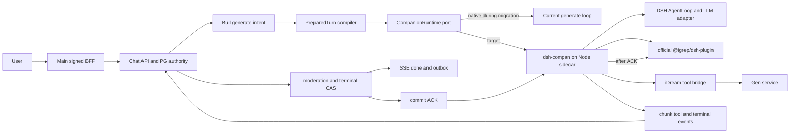

# ADR-19：以 DeepSeek Harness + igrep 构建陪伴式 Chat 执行内核

> 状态：Accepted / Phase 6 code implemented；最终验收 NO-GO（Gate R 尾延迟未达标，禁止扩大流量或宣称迁移完成）
> 调研快照：2026-08-19
> 适用范围：`packages/chat`、Chat BFF、Gen 工具桥、角色 Soul/关系/场景、长期记忆与 RAG
> 版本基线：DeepSeek Harness `0.1.0-rc.7` / `99f6f02`；`igrep-tme 0.1.132`；`@igrep/dsh-plugin 0.1.0`

## 0. 决策摘要

可以迁移，而且方向正确，但不是“用 DSH 替换整个 Chat 服务”。

目标边界是：

- `packages/chat` 继续拥有产品事实：会话、消息、Soul pin、PreparedTurn、Scene、关系、配额、审核、终态、SSE、outbox/inbox 与恢复。
- DeepSeek Harness（下文简称 DSH）成为可替换的**单轮 Agent 执行内核**：模型循环、流式事件、工具调用、取消与执行 trace。
- igrep 随包提供的官方 `@igrep/dsh-plugin` 完整承担 RAG 与 Agent Memory：`igrep_search`、`memory_search`、wake、transcript ingest、maintain。
- iDream **不再开发另一套记忆检索、记忆抽取或 profile 维护实现**。现有自研记忆链在迁移门通过后删除；Chat 只保留租户/角色作用域、`no-memory`、删除、终态提交顺序等产品策略。
- Scene 与 relationship 是结构化产品状态，不等同于通用 Agent Memory，仍归 Chat 管理。
- 推荐独立 Node.js `dsh-companion` sidecar，通过一个很薄的内部协议连接 Bun Chat worker。当前官方 SDK、ACP 和 headless 都不能直接满足 iDream 的逐 token SSE、逐 invocation 终态与取消语义。

一句话架构：

```text
Chat domain authority -> PreparedTurn -> DSH execution -> official igrep plugin
        ^                      |              |
        |                      v              v
  terminal CAS/SSE/outbox <- events       RAG + Agent Memory
```

本 ADR 不建议：

- 把 DSH Session 当成产品消息事实源；
- 直接加载 DSH 的 coding-agent `dsh-base` 全家桶；
- 为 igrep 重写 search、memory_search、wake、ingest 或 maintain；
- 在一次已经输出 token 或产生工具副作用的 attempt 中途切回 native runtime；
- 在 `no-memory` 会话中复用含个人 `.igrep/mem` 的 workspace。

---

## 1. 为什么现在迁移

当前 Chat 已经具备完整产品状态机，但 Agent loop 与 igrep 集成是项目自维护代码：

- [`packages/chat/src/prepared-turn.ts`](../../packages/chat/src/prepared-turn.ts) 已把 `PreparedTurn` 定义为唯一 generation-facing seam。
- [`packages/chat/src/generate.ts`](../../packages/chat/src/generate.ts) 自己处理模型流、首个工具调用、工具 follow-up、SSE 与 finalize。
- [`packages/chat/src/retrieval.ts`](../../packages/chat/src/retrieval.ts) 直接 spawn `igrep search` 并自行解析结果、超时和降级。
- [`packages/chat/src/extract.ts`](../../packages/chat/src/extract.ts) 仍调用旧的 `igrep mem derive` 接口；本机已核验的 `igrep 0.1.132` 只有 `recall / record / ingest / wake / doctor / maintain`，没有 `derive`。这是已经发生的版本漂移，不是理论风险。
- [`packages/chat/src/memory.ts`](../../packages/chat/src/memory.ts) 与 [`packages/chat/src/file-mutations.ts`](../../packages/chat/src/file-mutations.ts) 同时承担长期记忆、relationship 与 Scene 的派生/投影，职责需要在迁移中拆清，但不能把 Scene/relationship 一起误删。

DSH 提供了成熟度更高的 Agent loop、事件日志、工具流水线、取消与插件组合；igrep 已经为 DSH 提供原生 Cordis 插件。继续维护两套记忆能力没有收益。

迁移的收益不是“代码看起来更 Agent”，而是：

1. 由 DSH 统一多 step / 多 tool 的 think-act-observe 循环；
2. 由官方 igrep 插件统一 RAG、召回、对话 ingest 与 profile 维护；
3. Chat 收缩为产品域编排，不再拥有通用 Agent 基础设施；
4. DSH 与 igrep 可以独立升级、灰度、回滚，且不会改写历史消息与 Soul 权威。

---

## 2. 调研方法与可复现版本

### 2.1 DeepSeek Harness

本方案核验的是 DeepSeek 官方仓库，而不是同名第三方项目：

- 官方仓库：[deepseek-ai/deepseek-harness](https://github.com/deepseek-ai/deepseek-harness)
- 固定 commit：[99f6f02fecdb7dff40c3fbc9470f5907c29f74ca](https://github.com/deepseek-ai/deepseek-harness/commit/99f6f02fecdb7dff40c3fbc9470f5907c29f74ca)
- tag：[`dsh-v0.1.0-rc.7`](https://github.com/deepseek-ai/deepseek-harness/releases/tag/dsh-v0.1.0-rc.7)
- npm：[`@deepseek-ai/dsh@0.1.0-rc.7` registry metadata](https://registry.npmjs.org/@deepseek-ai%2Fdsh/0.1.0-rc.7)
- Node 要求：`^22.19.0 || >=24.0.0`；本项目当前 Node `v22.22.0` 满足要求。
- License：MIT。

官方 README 明确把 DSH 标为 developer preview，并明确提示会发生 breaking changes。因此生产集成必须固定 tag、commit、npm integrity 与 profile dump，不能跟随 `latest` 漂移。[官方 README](https://github.com/deepseek-ai/deepseek-harness/blob/99f6f02fecdb7dff40c3fbc9470f5907c29f74ca/README.md)

### 2.2 igrep 与 DSH 插件

核验版本为 [`igrep-tme 0.1.132`](https://pypi.org/project/igrep-tme/0.1.132/)。PyPI 官方说明明确列出：

```text
DeepSeek Harness | search + web search + memory | igrep setup deepseek-harness
```

该 wheel 随包交付 `@igrep/dsh-plugin 0.1.0`，其 peer dependencies 固定到：

```json
{
  "@deepseek-ai/dsh-llm": "^0.1.0-rc.7",
  "@deepseek-ai/dsh-tools": "^0.1.0-rc.7"
}
```

本机只读 dry-run 已核验安装链：

```bash
igrep setup deepseek-harness --profile headless --dry-run --json
```

它实际委托给 DSH profile manager：

```text
dsh plugin --profile headless add file:<igrep-wheel>/igrep-dsh
```

正式实施应为 iDream 创建专用 profile，再执行同一官方安装命令；不得复制插件源码进项目维护。

### 2.3 版本锁定表

| 组件 | 首次迁移固定值 | 升级条件 |
|---|---:|---|
| Node.js | `22.22.x` 或已验证的兼容版本 | DSH engine + 全套契约测试通过 |
| DSH | `0.1.0-rc.7` | 新版本 diff 审计、profile dump diff、live contract gate |
| DSH source | `99f6f02...` | 只随已批准的 DSH 版本变更 |
| igrep | `0.1.132` | plugin load、memory lifecycle、删除/重建、隔离门通过 |
| `@igrep/dsh-plugin` | wheel 内置 `0.1.0` | 跟随 igrep wheel，不独立 fork |

---

## 3. DSH 能力与限制

### 3.1 可直接采用的能力

DSH 的关键设计是 “Everything is a Plugin”。模型 adapter、工具 registry、session log、agent loop 都由 Cordis plugin 组合而成，可按 profile 替换。[架构文档](https://github.com/deepseek-ai/deepseek-harness/blob/99f6f02fecdb7dff40c3fbc9470f5907c29f74ca/docs/architecture.md)

对 iDream 有用的核心 seam：

| DSH seam | iDream 用法 |
|---|---|
| `ctx.agents` / `ctx.agentLoop` | 单轮多 step 模型与工具循环 |
| `ctx.sessions` / `session/event` | attempt 内的执行事件、chunk 与工具 trace |
| `ctx.systemPrompt` | 注入已编译、已 pin 的 Soul 与当前上下文 |
| `ctx.llm` | 固定 provider/model 的流式 adapter |
| `ctx.tools` | 只注册 iDream 明确允许的 companion tools |
| `agent/pre-step` | 把 `PreparedTurn` 投影为本次模型可见输入 |
| `agent/turn-stopping` | 终态提交门与 igrep ingest 的有序边界 |
| `Agent.cancel()` | 把 Chat 取消映射到当前 DSH activity |

DSH 一个 turn 包含零个或多个 step；一个 step 是一次模型请求及随后工具执行。`turn/*`、`step/*`、`assistant/chunk`、`assistant/message`、`tool/*` 都进入 append-only SessionEvent log。[turn flow](https://github.com/deepseek-ai/deepseek-harness/blob/99f6f02fecdb7dff40c3fbc9470f5907c29f74ca/docs/architecture.md#turn-flow)

### 3.2 不能直接作为生产 Chat 接口的官方入口

| 入口 | 核验结果 | 决策 |
|---|---|---|
| `dsh-headless` | 单任务、无 server、完成后退出、没有交互 follow-up surface | 排除生产 Chat；仅可做 smoke test |
| SDK JSON-RPC | 有 raw `session.event`，但没有 per-prompt result、mid-turn cancel、session close；协议无版本协商 | 不直接作为产品协议 |
| ACP | 支持取消，但只交付 committed assistant message，不交付逐 token chunk；只支持 fresh session | 不直接承载现有 SSE |
| Web host | 无产品级鉴权、TLS、租户状态和 iDream 终态语义 | 不暴露公网 |

证据：

- [SDK protocol](https://github.com/deepseek-ai/deepseek-harness/blob/99f6f02fecdb7dff40c3fbc9470f5907c29f74ca/packages/sdk/protocol/README.md)
- [SDK client](https://github.com/deepseek-ai/deepseek-harness/blob/99f6f02fecdb7dff40c3fbc9470f5907c29f74ca/packages/sdk/client/README.md)
- [ACP](https://github.com/deepseek-ai/deepseek-harness/blob/99f6f02fecdb7dff40c3fbc9470f5907c29f74ca/packages/acp/acp/README.md)
- [headless](https://github.com/deepseek-ai/deepseek-harness/blob/99f6f02fecdb7dff40c3fbc9470f5907c29f74ca/packages/bundle/headless/README.md)

### 3.3 不直接加载 `dsh-base`

`dsh-base` 是 coding agent 组合，包含 bash、filesystem、skills、goal、subagent、workflow、web 等能力。陪伴式 Chat 不需要这些能力，直接加载会扩大权限、提示词和升级面。

iDream 应构造最小 companion composition，只包含：

- Session / Agent / AgentLoop / SystemPrompt / Tools / LLM 所需核心插件；
- 一个明确的模型 adapter；
- `@igrep/dsh-plugin`；
- iDream context/commit/tool/event bridge；
- 必要的 retry、checkpoint 与 telemetry；
- 不加载 shell、fs 写入、terminal、subagent、goal、scheduler、coding persona、通用 web tool。

---

## 4. 当前 iDream Chat 的事实边界

### 4.1 服务与部署

Chat 是独立服务/部署单元，但不是独立产品：

- [`packages/chat/src/main.ts`](../../packages/chat/src/main.ts) 同进程启动 Web 与 worker；
- [`ecosystem.config.js`](../../ecosystem.config.js) 以单实例运行 Chat，当前本地文件权威要求单 writer；
- [`packages/chat/prisma/schema.prisma`](../../packages/chat/prisma/schema.prisma) 拥有 `chat.*` 会话、消息、版本、usage、outbox、file mutation 等表；
- [`packages/main/src/server/bff/chat-proxy.ts`](../../packages/main/src/server/bff/chat-proxy.ts) 是签名 BFF；Main 消费 Chat outbox 投影，不执行 Chat agent。

### 4.2 当前执行链

```text
signed BFF
  -> Chat service: durable user message + pending assistant intent
  -> BullMQ generate job
  -> buildChatContext
  -> PreparedTurn
  -> generate.ts custom model/tool loop
  -> output moderation + terminal CAS/finalize
  -> SSE start/delta/done
  -> Scene/relationship/memory derivation
  -> file mutation + outbox
  -> Main projection
```

其中：

- pending assistant row 是 durable intent；Redis job 丢失可由 reconciler 重建；
- terminal finalize 必须是 Chat 的 CAS；
- `PreparedTurn` 已整合 Soul、关系、Scene、记忆、模型、工具、预算与 trace；
- Scene 以 session/version 为作用域，regeneration 使用历史 anchor；
- `no-memory` turn 不能生成记忆或 relationship evidence；
- 用户 boundaries 每轮完整读取并 fail closed，不参与相关性裁剪；
- tool 当前只有 `generate_image_async` 与 `edit_last_image` 两个产品能力。

这些都应保留。DSH 只替换 `PreparedTurn -> model/tool loop -> terminal candidate` 这一段。

---

## 5. 第一性原理：迁移后必须成立的不变量

### I1. 角色权威只有一个

```text
immutable CharacterContentVersion Soul snapshot
  -> Release / Serving
  -> session/message pin
  -> PreparedTurn
  -> DSH system prompt section
```

DSH 不读取 mutable Character 字段，不生成另一份 persona，不把自身 Harness identity/coding persona 拼进提示词。Soul section 应为 agent-scoped，并使用 `complete: true` 或等价方式保证它是完整人格权威；具体优先级必须由 live composition test 锁定。

### I2. Chat 终态只有一个

DSH `assistant/message` 或 `turn/end` 只表示执行候选完成，不表示产品消息已完成。只有 Chat PG terminal CAS 成功后，才能发送 SSE `done`、交付 outbox，并允许该回答进入长期记忆。

### I3. DSH Session 不是产品会话

DSH SessionEvent 是 attempt execution log。Chat Message / MessageVersion / PreparedTurn / Scene anchor 才能重建产品状态。sidecar 崩溃后允许从 Chat durable intent 与 PreparedTurn 重新创建 DSH session。

### I4. igrep 是唯一通用记忆实现

目标态不再保留：

- 自研 semantic retrieval 排序；
- 自研记忆候选抽取；
- 自研 `memory.md` 长期记忆投影；
- 自研 profile wake/maintain；
- 直接 spawn 不稳定 igrep 子命令的多处适配器。

以上由官方 `@igrep/dsh-plugin` 提供。iDream 只决定本轮是否允许记忆、使用哪个隔离 workspace、何时允许 commit、何时删除整个作用域。

### I5. Scene 与 relationship 不归通用记忆

Scene 是 session-scoped/versioned runtime state；relationship 是 source-linked、可重建的产品状态。它们继续由 Chat 派生并写入现有权威。igrep 记忆可帮助模型回忆，但不能直接推进 relationship tier 或改写 Scene anchor。

### I6. `no-memory` 是不可绕过的产品边界

`no-memory` turn 必须同时满足：

- 不加载 igrep resident profile；
- 不注册 `memory_search`；
- 不 ingest 用户与 assistant turn；
- 不读取普通 relationship memory workspace；
- 不创建 relationship evidence；
- 不通过 `igrep_search` 搜到 `.igrep/mem`；
- 仍允许 Soul 与该 session 的 Scene anchor。

### I7. 工具副作用幂等

所有 DSH tool call 必须带 `attemptId + callId` 进入 Chat/Gen tool bridge。相同 key 重试只能返回同一 effect/outcome，不能重复生成、扣费或投递。

### I8. 运行时选择在 attempt 前固定

一旦输出了第一个 delta，或任何 tool call 已进入 durable intent，就不能中途从 DSH 切换到 native。灰度和回滚只影响尚未开始的新 attempt。

---

## 6. 目标架构

### 6.1 拓扑



### 6.2 为什么推荐 sidecar

| 方案 | 优点 | 缺点 | 结论 |
|---|---|---|---|
| Bun Chat 进程内嵌 DSH | 少一次 IPC、最低延迟 | DSH 只声明 Node 支持；RC 依赖/崩溃/HMR 与 Chat 同故障域 | 不作为首发 |
| 每 turn 启动 headless | 隔离简单 | 无长驻协议、启动成本、无产品流/取消语义 | 排除 |
| 独立 Node sidecar | 版本与故障隔离；可单独扩缩、升级和熔断 | 需要薄协议桥 | **推荐** |

sidecar 只监听 loopback/Unix socket，不暴露公网，不持有 Main/Chat 数据库写凭据。Chat 通过内部 capability token 或 Unix socket 文件权限鉴权。

### 6.3 深模块接口

Chat 只依赖一个小接口，不能感知 Cordis、DSH SessionEvent 或 igrep 文件格式：

```ts
interface CompanionRuntime {
  run(input: CompanionInvocation, port: CompanionRuntimePort): Promise<CompanionResult>;
  cancel(invocationId: string, reason: "user" | "timeout" | "shutdown"): Promise<void>;
}

interface CompanionInvocation {
  invocationId: string;
  attemptId: string;
  sessionId: string;
  userId: string;
  characterId: string;
  preparedTurn: PreparedTurn;
  memoryMode: "normal" | "private" | "shadow";
  expectedProfileDigest: string;
  deadlineAt: string;
}

interface CompanionRuntimePort {
  emit(event: CompanionEvent): Promise<void>;
  executeTool(call: CompanionToolCall): Promise<CompanionToolResult>;
  commit(candidate: CompanionTerminalCandidate): Promise<CompanionCommitAck>;
}
```

`CompanionEvent` 只暴露产品需要的稳定词汇：

```text
started | text_delta | reasoning_usage | tool_started | tool_finished |
usage | heartbeat | terminal_candidate | failed | cancelled
```

DSH 版本专属事件只保存在 sidecar trace 中，不进入跨包公共契约。

Chat 必须把 readiness 已验证的 profile digest 固定到 invocation。sidecar 在加载实际插件后、创建 workspace/Context 和调用 provider 前重算执行 composition；摘要不一致立即失败。`started` 同时返回实际 `profileDigest`，Chat 再次比对并写入 attempt telemetry，禁止准入快照与实际执行发生静默漂移。

### 6.4 DSH 内部 composition

目标 profile 至少包括：

1. DSH Session / Agent / AgentLoop / SystemPrompt / Tools / LLM；
2. provider adapter；
3. 官方 `@igrep/dsh-plugin`；
4. `idream-prepared-turn`：Soul/历史/Scene/relationship/boundaries 投影；
5. `idream-tool-bridge`：注册两项明确工具；
6. `idream-event-bridge`：chunk/usage/status 投影；
7. `idream-turn-commit-gate`：在 igrep ingest 前等待 Chat terminal ACK；
8. deadline、max step、max tool call 与 telemetry。

其中 4–8 是产品桥，不实现模型、RAG 或记忆算法。

---

## 7. `PreparedTurn` 到 DSH 的映射

### 7.1 映射表

| `PreparedTurn` 内容 | DSH 投影 | 权威 |
|---|---|---|
| compiled Soul prompt | agent-scoped complete system prompt section | immutable Soul pin |
| global boundaries | 高优先级 system/context section | Chat boundary file；读取失败则不启动 DSH |
| Scene anchor | plugin-source context snapshot | Chat Scene revision |
| relationship state | plugin-source context snapshot | Chat reducer projection |
| prior messages | DSH session seed，保留 role/content，但 source 标为 plugin/replay | Chat MessageVersion |
| current user message | 唯一 `source.kind=user` 的 user message | Chat durable user message |
| memory mode | 选择 normal/private profile + workspace | Chat message policy pin |
| model/profile/budget | DSH exact provider/model/maxTokens/deadline | PreparedTurn |
| tool schemas | agent-scoped tool registrations | Chat capability allowlist |
| trace metadata | request header + invocation trace | Chat runtimeTrace |

### 7.2 为什么历史消息不能伪装成新用户消息

官方 igrep DSH plugin 只把两类可见证据写入 transcript：

- `source.kind === "user"` 的 `user/message`；
- 模型生成的 `assistant/message` 文本。

plugin 注入上下文、tool result、assistant chunk 与 reasoning 不进入记忆。

因此每个 iDream turn 可以创建短生命周期 DSH session，但必须：

- 历史/Soul/Scene/关系/召回上下文作为 seed 或 `source.kind=plugin` 注入；
- 只有当前真实用户消息使用 `source.kind=user`；
- 否则每次从 `PreparedTurn` 重放历史都会被重复 ingest。

该映射必须有真实插件回归测试，不能只测 mock。

---

## 8. igrep 官方插件：完整采用，不重写

### 8.1 插件已经提供的能力

插件注册到现有 DSH seam，不创建自己的 `ctx` 权威：

| seam | 官方插件能力 |
|---|---|
| `ctx.tools` | `igrep_search`、`memory_search`、可选 `igrep_web_search` |
| `ctx.skills` | 可选 igrep routing skill |
| `ctx.web` | id=`igrep` 的 WebSearchProvider |
| `ctx.systemPrompt` | 搜索提示与 `mem wake` resident profile |
| `tools/post-execute` | grep/bash thin-result routing reminder |
| `session/event` | 投影可见 turn 到 `.igrep/dsh-transcripts/*.jsonl` |
| `agent/turn-stopping` | awaited `igrep mem ingest` |
| `session/disposed` | final drain + `igrep mem maintain` |
| `agent/session-start` | `igrep mem wake` |

插件是 igrep CLI 的薄客户端；iDream 不解析 `.igrep/mem` 内部格式，不复制 lifecycle，不 fork plugin。

### 8.2 专用 profile

至少预装两套不可混用的 DSH profile/process pool：

#### `idream-companion-memory`

```yaml
igrep:
  command: igrep
  search: true
  searchMode: normal
  maxResults: 8
  webProvider: false
  webTool: false
  memory: true
  memorySearchMode: ultra
  memoryMaxResults: 6
  ingest: true
  wake: true
```

#### `idream-companion-private`

```yaml
igrep:
  command: igrep
  search: false
  webProvider: false
  webTool: false
  memory: false
  ingest: false
  wake: false
```

`memory:false` 是实际总开关；其余显式 false 用于让 profile dump 和审计结果一眼可见。

不能只在 normal profile 上临时隐藏 `memory_search`。wake、ingest 与 `igrep_search` 仍可能读取同一 workspace，无法证明 `no-memory`。

### 8.3 workspace 是租户边界

插件把 `agent.session.header.cwd` 当作 retrieval 与 memory workspace。因此必须给每个 `userId + characterId` relationship 分配独立目录：

```text
<CHAT_AGENT_WORKSPACE_ROOT>/relationships/<user-key>/<character-key>/
  knowledge/                    # 只读、已发布的角色/lore 资料
  .igrep/dsh-transcripts/       # 官方插件管理
  .igrep/mem/                   # igrep 管理

<CHAT_AGENT_WORKSPACE_ROOT>/_meta/<user-key>/<character-key>.json
                                # Chat 管理的作用域/迁移元数据，不在检索根内
```

要求：

- 路径 segment 使用服务端生成的安全 key，不接受客户端 path；
- DSH/igrep 对同一 relationship workspace 的写入串行化；
- `knowledge/` 只包含已 Release/Serving 的内容，不指向整个代码仓库或 Admin draft；
- Soul 正文仍从 pin 注入，不能以 RAG 命中替代；
- 用户 global boundaries 仍由 Chat 每轮完整加载，不交给相关性检索。

### 8.4 private workspace

`no-memory` turn 不得把 cwd 指到 normal relationship workspace，因为即使 `memory:false`，若 `igrep_search` 仍启用，它也可能检索 `.igrep/mem`。

首发采用最简单、可证明的策略：

```text
<CHAT_AGENT_WORKSPACE_ROOT>/private/<invocation-id>/
```

- 使用 private profile；
- `search:false`、`memory:false`；
- 不挂载 normal relationship workspace；
- 只通过 PreparedTurn 注入 Soul 与 session Scene；
- attempt 完成后可回收该临时目录。

如果未来需要 private turn 的角色知识 RAG，使用独立、只读、无个人 `.igrep/mem` 的 lore-only workspace；不能放宽到 normal workspace。

### 8.5 终态提交门

官方插件在 `agent/turn-stopping` 中执行 awaited ingest，而 Chat 当前在模型完成后才做 output moderation 与 PG terminal CAS。直接启用插件会产生一种错误顺序：

```text
DSH answer -> igrep ingest -> Chat finalize failed/rejected
```

这会记住一条用户最终没有得到的回答。

正确顺序必须是：

```text
DSH terminal candidate
  -> idream-turn-commit-gate
  -> Chat moderation + terminal CAS
  -> commit ACK
  -> official igrep turn-stopping ingest
  -> DSH turn/end
  -> Chat SSE done / job complete
```

实施必须用真实 DSH `0.1.0-rc.7` 验证 Cordis serial listener ordering 与前置 listener 失败是否会阻断后续 igrep ingest：

- 能保证：固定插件注册顺序并加入兼容测试；
- 不能保证：生产 profile 暂时 `ingest:false`，只启用官方 search/memory read；向 igrep/DSH 上游补齐 hook 后再开写入；
- **禁止**为绕过这个门自己实现一套 ingest。

---

## 9. 模型与工具

### 9.1 模型 adapter

DSH 提供两条官方路径：

- `dsh-llm-deepseek`：直接 DeepSeek HTTP/SSE，provider route 为 `deepseek-official`；
- `dsh-llm-pi-ai`：以 pi-ai 作为 provider transport library，支持声明 OpenAI-compatible/self-hosted route。

这里需要区分“Pi Agent runtime”和“pi-ai provider adapter”。当前 iDream 并没有 Pi Agent runtime；目标 Agent loop 是 DSH。若 `dsh-llm-pi-ai` 能精确表达现有 OpenRouter/自托管路由，首发应直接复用官方 adapter，不另写 transport。只有以下契约无法满足时，才写一个窄 DSH `LlmAdapter`：

- exact provider/revision/model pin；
- `allow_fallbacks:false`；
- attribution/request id；
- stream usage/finish/error 语义；
- AbortSignal；
- 当前模型的 context/output limit。

模型选择权仍在 `PreparedTurn.model`；DSH 不得自行更换 provider/model。官方 adapter contract 见 [adding an LLM adapter](https://github.com/deepseek-ai/deepseek-harness/blob/99f6f02fecdb7dff40c3fbc9470f5907c29f74ca/docs/cookbook/adding-an-llm-adapter.md)。

### 9.2 工具 profile

首发只注册现有两项：

```text
generate_image_async
edit_last_image
```

不注册 bash、grep、filesystem write、terminal、subagent、goal、job、scheduler 或任意 Admin tool。

工具桥规则：

- DSH 只看到 schema 与 opaque result；
- Chat/Gen 验证 session/user/character/entitlement；
- `attemptId + DSH callId` 是幂等键；
- effectful tool 首发 `concurrency=1`；
- tool intent 先 durable，再执行；
- timeout/cancel 不能把“结果未知”伪装成失败后自动重试；
- tool result 不能直接写 Chat terminal message。

DSH checkpoint 只证明 intent 已持久，不等于 exactly-once；官方文档同样要求 effectful tools 自带幂等键。[checkpoint policy](https://github.com/deepseek-ai/deepseek-harness/blob/99f6f02fecdb7dff40c3fbc9470f5907c29f74ca/packages/session/session-checkpoint-policy/README.md)

---

## 10. 事件、终态、取消与重试

### 10.1 事件映射

| DSH 事件 | Chat 行为 |
|---|---|
| `turn/start` | 记录 attempt start；SSE `start` 仍由 Chat 发一次 |
| `assistant/chunk` text delta | SSE `delta` + heartbeat；不直接落最终消息 |
| reasoning delta | 默认不对用户暴露，只计 trace/usage |
| `tool/call` | 调用窄 tool bridge，记录 callId |
| `tool/result` | 写 runtime trace，供下一 step 使用 |
| `assistant/message` | 形成 terminal candidate，不是终态 |
| `agent/turn-stopping` | Chat commit gate，然后 igrep ingest |
| `turn/end` | 确认 DSH activity quiescent；Chat 再完成 job |
| error/aborted | 映射现有 Chat machine-readable error/CAS |

### 10.2 取消

官方 SDK 没有 mid-turn cancel，但 DSH `Agent.cancel()` 有。自有 sidecar protocol 必须提供：

```text
cancel(invocationId, reason)
```

sidecar 把它映射到 exact Agent；LLM 与协作式工具收到 AbortSignal。若工具已经进入 durable side effect：

- 不假设取消等于撤销；
- 查询幂等 outcome；
- Chat 按现有 attempt/terminal CAS 结算；
- 未知结果进入 reconciliation，不重复消费。

### 10.3 重试

DSH 内部 provider retry 只处理同一 execution 的网络/限流等短暂错误；BullMQ/Chat retry 处理 sidecar crash 与整个 attempt 恢复。二者必须有上限，不能叠加成失控重试。

规则：

- provider retry 次数、backoff 和可重试 code 固定入 profile；
- Chat job retry 前检查是否已有 delta、tool effect、terminal CAS；
- DSH session id 与 Chat `attemptId` 建立稳定映射；
- 同一 relationship workspace 同时只允许一个可写 memory turn；
- 验证 igrep 对相同 `session-id` / transcript 重放是否幂等；未证明前不得扩大并发；
- 不依赖 DSH retry 的 turn/step 编号做业务结算，当前 RC 的文档与源码测试对此已有漂移。

### 10.4 sidecar crash

| crash 点 | 恢复 |
|---|---|
| DSH 接收前 | Bull job 安全重试 |
| 首 token 前 | 相同 runtime/attempt 重建 |
| 已输出 delta、无工具 | 当前 attempt 标为失败；不在同一流静默换 runtime |
| tool intent 后 | 按 callId reconcile；禁止盲重试 |
| Chat commit ACK 前 | Chat CAS 未完成则失败/重试；igrep 不应 ingest |
| Chat commit ACK 后、igrep ingest 前 | 消息终态已完成；重放/repair memory ingest，不能重写消息 |
| igrep ingest 后、SSE done 前 | Chat 终态已存在；重连读取终态并补 `done`/outbox |

---

## 11. 长期记忆迁移

### 11.1 目标态职责

| 能力 | 当前 | 目标 |
|---|---|---|
| 记忆召回 | Chat `retrieval.ts` + igrep CLI/heuristic | 官方 `memory_search` / wake |
| 对话入库 | Chat extraction + file mutation | 官方 DSH plugin transcript ingest |
| profile | Chat prompt assembly | 官方 `igrep mem wake/maintain` |
| RAG | Chat 自己 spawn `igrep search` | 官方 `igrep_search` |
| Scene | Chat | Chat（不变） |
| relationship evidence/reducer | Chat | Chat（不变） |
| no-memory policy | Chat | Chat 选 private profile/workspace |
| 删除 | Chat 删除租户作用域 | Chat 删除整个隔离 workspace；不解析 igrep 内部格式 |

### 11.2 旧数据导入

旧 `memory.md` 不能直接复制到 `.igrep/mem` 私有格式。导入器只调用 igrep 公共命令：

1. 读取旧的 user/character memory records；
2. 校验 source message 仍存在、未删除、不是 no-memory；
3. 对每条有效事实调用 `igrep mem record --workspace <relationship-workspace>`；
4. 调用 `igrep mem maintain --workspace ... --rebuild`；
5. 调用 `igrep mem doctor --workspace ...`；
6. 用一组已知问题对比 legacy recall 与 `memory_search`；
7. 在 workspace 之外写入 Chat 自有 `_meta/<user-key>/<character-key>.json` 迁移 marker（旧数据 checksum、igrep version、完成时间），不写 igrep 内部文件，也不让模型检索该元数据。

不导入：

- global boundaries（继续每轮 fail-closed 读取）；
- Scene snapshot（由 session anchor 提供）；
- relationship tier（由 reducer 提供）；
- 已删除/blocked/no-memory turn；
- 无法追溯 source 的低可信旧记录，除非运营明确批准。

### 11.3 删除与重建

因为每个 relationship 独占 workspace，删除无需懂 igrep 内部结构：

- relationship reset：停止该 workspace 新 invocation，等待/取消 writer，删除或隔离整个 workspace，再创建空 workspace；
- user deletion：删除该用户所有 relationship workspace 与 private leftovers；
- rebuild：从仍然有效的 Chat canonical messages 重新调用 igrep 公共 ingest/record + `maintain --rebuild`；
- 删除完成前，路由层不得再把新 DSH session 指向旧 workspace。

文件删除仍由 [`packages/chat/src/chat-fs.ts`](../../packages/chat/src/chat-fs.ts) 的安全 path/single authority 扩展执行；不让 sidecar接受任意 delete path。

### 11.4 过渡期而非永久双写

过渡期允许 legacy memory 与 igrep shadow workspace 同时派生，用于比较和回滚；但一次用户可见 turn 只能选一个 recall authority。

达到 Gate M 后：

- normal cohort 的 recall/write authority 切到官方 plugin；
- legacy memory 文件保留只读一个回滚窗口；
- 回滚窗口结束后删除 legacy memory candidate/retrieval/write 代码；
- 不保留“以防万一”的永久双写或 fallback。

---

## 12. 代码迁移地图

### 12.1 新增的深模块

| 位置 | 职责 |
|---|---|
| `packages/shared` 的 companion runtime wire contract | 稳定 invocation/event/tool/commit 协议；不暴露 DSH 类型 |
| `packages/chat-agent`（Node） | 最小 DSH composition、两个 profile、官方 igrep plugin、四个 iDream bridge |
| `packages/chat/src/companion-runtime.ts` | native/dsh 两个 adapter 与 attempt 前路由 |
| `packages/chat/src/companion-workspace.ts` | 安全 workspace key、normal/private 生命周期与锁 |

名称可按仓库现有约定微调，但接口边界不能被拆散到多个零散 helper。

### 12.2 修改现有文件

| 文件 | 修改 |
|---|---|
| `prepared-turn.ts` | 保持唯一 generation input；补稳定序列化/协议契约测试 |
| `generate.ts` | 把现有实现包成 `NativeCompanionRuntime`；逐步移除内置 Agent loop |
| `agent-tools.ts` | 变成 DSH tool bridge provider，保留产品校验/幂等 |
| `runtime-readiness.ts` | 增加 DSH/igrep exact version、profile dump、plugin load、model warmup |
| `worker.ts` | relationship workspace 串行、sidecar health/timeout/cancel |
| `reconcile.ts` | DSH crash、commit-acked/memory-pending、unknown tool outcome 恢复 |
| `env.ts` | 增加明确 runtime/backend/profile/sidecar 配置；移除旧 igrep derive 配置 |
| `context.ts` | normal 模式由 DSH igrep plugin 提供 memory；仍组装 Soul/Scene/relationship/boundaries |
| `turn-extraction.ts` | 只保留 Scene + relationship domain derivation |
| `memory.ts` | 拆除 memory candidate/write 分支；保留/重命名 Scene/relationship application |
| `file-mutations.ts` | cutover 后删除 legacy `memory.md` mutation；保留 relationship/evidence/其他投影 |

### 12.3 最终删除

完成 Gate M 与回滚窗口后：

- 删除 `retrieval.ts` 中自研 igrep ranking/CLI parsing；
- 删除 `extract.ts` 中 `igrep mem derive` 与 heuristic memory candidate 路径；
- 删除长期 `memory.md` 的写入、cap、projection 与读取；
- 删除 `CHAT_MEMORY_RETRIEVAL`、`CHAT_MEMORY_EXTRACT`、旧 timeout 等环境开关；
- 删除被新 runtime 取代的 `generate.ts` 多 step/tool loop；
- 不保留 `_legacy`、`v2`、deprecated fallback 副本。

注意：只有在 Scene/relationship 职责已经迁出后才能删除相关旧模块，不能按文件名整文件先删。

### 12.4 数据库

Phase 0–4 不要求 DB schema 变更。首发把以下信息写入现有 `runtimeTrace` JSON：

```text
runtime=dsh
dshVersion / dshCommit / profileDigest
igrepVersion / pluginVersion
invocationId / dshSessionId
provider / model
steps / toolCalls / usage
workspaceKeyHash / memoryMode
commitAckAt / memoryIngestOutcome
```

只有当实际运行证明需要跨 attempt 查询完整 DSH event log，才另提 schema 设计与迁移脚本；本 ADR 不预建表。

---

## 13. 分阶段实施

### Phase 0：冻结契约，不改行为

1. 将现有 `generate.ts` 包装为 `NativeCompanionRuntime`；
2. 固定 `PreparedTurn` 序列化 contract；
3. 定义 stable companion wire protocol；
4. 建 runtime routing，但默认 100% native；
5. 记录基线：首 token、总耗时、tool rate、错误、usage、memory/relationship/Scene 结果。

退出门：现有 Chat 测试和真实 signed probe 全绿，行为无变化。

### Phase 1：最小 DSH sidecar

1. 固定 DSH `0.1.0-rc.7`；
2. 构造最小 companion composition，不加载 `dsh-base`；
3. 实现 PreparedTurn、event、tool、commit 四个薄 bridge；
4. 创建 memory/private 两套 profile 与独立 process pool；
5. 用官方命令安装 `@igrep/dsh-plugin`；
6. readiness 输出 exact version 与 `--dump-config` digest。

退出门：Soul prompt、流式文本、两个 tools、cancel、deadline、private profile 都通过真实 sidecar contract test。

### Phase 2：shadow execution

1. 对受控测试 turn 同时运行 native 与 DSH；
2. DSH tool bridge 使用 dry-run/无副作用模拟；
3. igrep 写入 shadow workspace，绝不指向生产 relationship workspace；
4. 对比 provider/model、回答完整性、step/tool decision、usage、延迟、error taxonomy；
5. 不把 DSH 输出交付给用户。

退出门：无越权工具、无 Soul 污染、无跨 workspace 读取、终态候选可稳定映射。

### Phase 3：终态与 memory lifecycle gate

1. 验证 commit gate 必定先于官方 igrep ingest；
2. 注入 Chat commit reject、moderation reject、PG CAS conflict；
3. 证明失败候选未进入 memory search/wake；
4. 验证相同 attempt/session replay 不重复 ingest；
5. 验证 `no-memory` 无 transcript、无 wake、无 relationship evidence。

退出门：上述任一项不能证明，`ingest:true` 不得进入 canary。

### Phase 4：受控 beta canary

1. 按 relationship 稳定 hash 选 cohort；
2. 一段 relationship 在观察窗内固定 runtime/memory backend；
3. 从内部账号开始，再到低比例受控 beta；
4. 真实验证消息、regeneration、图片 tool、取消、sidecar crash、SSE reconnect、outbox/Main projection；
5. 保留 legacy memory shadow derivation作为短期回滚材料，但不参与用户 prompt。

退出门：错误/延迟/费用/记忆质量达到 Gate R、M、T、E。

### Phase 5：memory 数据切换

1. 按 relationship 导入 legacy memory；
2. `doctor` + `maintain --rebuild`；
3. 运行已知问题 recall parity；
4. 切换该 relationship 到 normal DSH workspace；
5. 观察删除、重建、no-memory 与跨角色隔离。

退出门：100% 受控 beta 使用官方 plugin 作为唯一 recall/write authority，且可从 Chat canonical messages 重建。

### Phase 6：删除 legacy 路径

1. 结束回滚窗口；
2. 删除自研 memory retrieval/extraction/projection；
3. 删除 native Agent loop；
4. 删除过渡 env 与 shadow job；
5. 更新 `CURRENT_FUNCTIONAL_COVERAGE.md` 与运行手册。

只有此阶段完成，才可以说“已从当前 custom harness 完成迁移”。

---

## 14. 验证门

### Gate C：静态与契约

- Shared wire schema round-trip；
- PreparedTurn snapshot parity；
- DSH event -> companion event exhaustive mapping；
- unknown DSH event fail loud/ignorable policy；
- tool schema 与 idempotency；
- profile dump 无 shell/fs/subagent/goal/scheduler；
- exact DSH/igrep/plugin version mismatch fail readiness。

### Gate S：Soul / Scene / relationship

- immutable Soul pin 与当前 release 一致；
- Harness identity/coding persona 不进入 system prompt；
- regeneration 使用历史 Scene anchor；
- relationship evidence source-linked、可 rebuild；
- no-memory 不创建 relationship evidence；
- character distinctiveness/evaluator 回归不低于基线。

### Gate M：记忆与 RAG

- normal turn：wake、memory_search、ingest、maintain 实际发生；
- private turn：上述四项均不发生；
- current message 仅 ingest 一次，PreparedTurn 历史不重复；
- user A/character X 无法召回 user A/character Y 或 user B 的记忆；
- `igrep_search` 只能看到批准的 released knowledge；
- Chat commit reject 的候选不可被 recall；
- legacy import、doctor、rebuild、delete 均通过；
- igrep timeout/error 按定义降级，不能把“调用失败”当“无记忆”。

### Gate T：工具与恢复

- 多 step 单 tool、tool error、tool timeout；
- callId 重放不产生重复 artifact/扣费；
- crash before/after tool intent、before/after result；
- cancel 不重复执行未知 outcome；
- sidecar 重启后 Chat reconciler 收敛。

### Gate E：真实端到端

最短真实证据链：

```text
signed BFF
  -> create/send
  -> SSE start/delta/done
  -> exact session re-fetch
  -> Chat DB terminal/finalize
  -> Scene/relationship assertions
  -> igrep recall/wake assertion
  -> outbox delivered
  -> Main recent_chats projection
```

还必须覆盖：

- unsigned BFF 401；
- SSE 断线重连；
- no-memory；
- regeneration；
- image generation/edit；
- provider error、DSH crash、igrep timeout；
- 用户/relationship 删除与重建；
- runtime rollback 后的新 turn。

### Gate R：发布指标

canary 与 native 基线比较：

- p50/p95 first-token latency；
- p50/p95 total latency；
- turn steps / tool calls / retry count；
- provider/model/usage/cost；
- empty/truncated/error/cancel rate；
- sidecar crash/restart rate；
- igrep search/memory latency、hit、empty、failure、ingest/maintain lag；
- duplicate ingest 与 cross-scope probe 必须为 0；
- terminal CAS conflict 与 SSE incomplete；
- outbox delivery lag。

阈值先用 Phase 0 基线和受控 beta 数据制定，不在无数据时臆造百分比。

---

## 15. 运维、容量与升级

### 15.1 readiness

`dsh-companion` readiness 必须返回：

- DSH version + commit；
- profile name + normalized dump digest；
- igrep version + plugin version；
- exact provider/model resolve；
- memory/private 两个 profile load；
- normal workspace read/write probe；
- private workspace negative capability probe；
- tool bridge reachability；
- Chat commit bridge reachability。

任一 exact version/profile 不匹配，实例不接流量。

### 15.2 并发

- Chat generate queue 继续做总量背压；
- sidecar 有全局 agent 并发上限；
- effectful tools 独立限流；
- 同一 `userId + characterId` normal workspace 写入串行；
- igrep maintain 不与该 workspace ingest 并发；
- private workspace 不复用，无跨 turn writer。

### 15.3 升级流程

每次升级 DSH 或 igrep：

1. 读取 release diff 与 breaking changes；
2. 固定新 artifact integrity；
3. 对比 `dsh --dump-config`；
4. 跑 Gate C/S/M/T；
5. shadow；
6. relationship-sticky canary；
7. 才更新 production pin。

禁止在生产 profile 上直接 `latest` 更新。

### 15.4 trace 与隐私

- 产品消息继续按现有 Chat 规则持久化；
- DSH raw chunk/session trace 设定短 TTL，只用于执行诊断；
- runtimeTrace 记录事实与标识，不重复存整段 Soul/记忆；
- sidecar 日志不得输出 provider secret、完整用户 profile 或 tool payload；
- DSH process 无 Chat/Main DB 通用凭据，只能走窄 commit/tool RPC。

---

## 16. 回滚

### 16.1 两个独立开关

过渡期保留两个明确、有限生命周期的选择：

```text
CHAT_COMPANION_RUNTIME=native|dsh
CHAT_MEMORY_BACKEND=legacy|igrep-dsh
```

组合必须由 rollout policy 校验，不能任意混搭。最终 Phase 6 删除 `native` 与 `legacy`。

### 16.2 回滚规则

- 只切换未开始的新 attempt；
- relationship-sticky cohort 一次整体切换；
- 不在已经输出 delta/调用 tool 的 attempt 内 failover；
- 正在执行的 DSH turn先结算为成功/失败/取消；
- legacy memory shadow 在回滚窗口内持续可重建；
- Chat messages、Scene、relationship、outbox 没有迁出，因此无需反向迁移产品事实；
- igrep workspace 保留供诊断，除非用户删除请求要求清除。

### 16.3 自动熔断条件

以下任一出现时停止扩大 cohort，并把**后续新 turn** 路由回 native：

- exact version/readiness 不一致；
- cross-user/cross-character memory 命中；
- private turn 出现 wake/memory_search/ingest；
- terminal rejected candidate 可被 memory recall；
- tool 重复副作用或费用异常；
- DSH/SSE terminal 大量不收敛；
- sidecar crash loop；
- provider/model attribution 不可证明。

---

## 17. 风险与已做取舍

| 风险 | 处理 |
|---|---|
| DSH developer preview / breaking changes | exact pin + profile digest + upgrade gate + sidecar 隔离 |
| 官方 SDK 没有 invocation 终态/取消 | 自有薄 protocol driver；不 fork AgentLoop |
| ACP 无逐 token | 不用于产品 SSE |
| igrep ingest 早于 Chat finalize | turn commit gate；无法证明 ordering 则禁止开 ingest |
| `no-memory` 通过 search 旁路 | private profile + 独立 workspace + search:false |
| PreparedTurn 历史重复 ingest | 历史标 plugin/replay，只有当前消息 source=user |
| DSH/Chat 双 session 权威 | DSH session 只做 attempt trace；Chat durable intent 可重建 |
| 通用 memory 误替代 Scene/relationship | 明确保留结构化 domain derivation |
| tool retry 重复副作用 | attemptId + callId；unknown outcome reconciliation |
| sidecar 增加延迟 | 长驻进程、loopback/Unix socket、度量 p95，再决定是否内嵌 |
| legacy 永久存在 | Phase 6 明确删除，不保留长期 fallback |

---

## 18. 最终验收定义

只有同时满足以下条件，迁移才算完成：

1. 生产 Chat 用户可见 turn 由 DSH AgentLoop 执行；
2. Soul/PreparedTurn/Scene/relationship/terminal/outbox 权威仍在原位置；
3. RAG 与通用 Agent Memory 只由官方 `@igrep/dsh-plugin` 提供；
4. 旧自研 memory retrieval/extraction/projection 与 custom Agent loop 已删除；
5. `no-memory`、删除、重建、跨租户/跨角色隔离有真实负向证据；
6. Chat commit ACK 必定早于 igrep ingest；
7. signed BFF -> SSE -> DB -> igrep -> outbox -> Main 全链路通过；
8. canary 指标满足已制定的 Gate R；
9. DSH/igrep exact version、profile 与 provider/model 可从每个 attempt trace 追溯；
10. 回滚演练证明不会在半个 attempt 中切 runtime，也不会重复工具副作用。

在 Phase 6 前，`CURRENT_FUNCTIONAL_COVERAGE.md` 只能写“迁移中/受控 beta”，不能写“已完成 DSH 迁移”。

---

## 19. 一手资料索引

### DeepSeek Harness

- [官方仓库与 developer preview 声明](https://github.com/deepseek-ai/deepseek-harness)
- [固定 commit `99f6f02`](https://github.com/deepseek-ai/deepseek-harness/tree/99f6f02fecdb7dff40c3fbc9470f5907c29f74ca)
- [架构：Cordis、profiles、turn flow、session log、capability seams](https://github.com/deepseek-ai/deepseek-harness/blob/99f6f02fecdb7dff40c3fbc9470f5907c29f74ca/docs/architecture.md)
- [Agent 生命周期](https://github.com/deepseek-ai/deepseek-harness/blob/99f6f02fecdb7dff40c3fbc9470f5907c29f74ca/docs/agent-lifecycle.md)
- [Session append-only event model](https://github.com/deepseek-ai/deepseek-harness/blob/99f6f02fecdb7dff40c3fbc9470f5907c29f74ca/docs/subsystems/session.md)
- [LLM streaming/adapter contract](https://github.com/deepseek-ai/deepseek-harness/blob/99f6f02fecdb7dff40c3fbc9470f5907c29f74ca/docs/subsystems/llm-streaming.md)
- [Tool pipeline](https://github.com/deepseek-ai/deepseek-harness/blob/99f6f02fecdb7dff40c3fbc9470f5907c29f74ca/docs/subsystems/tools.md)
- [SDK protocol limitations](https://github.com/deepseek-ai/deepseek-harness/blob/99f6f02fecdb7dff40c3fbc9470f5907c29f74ca/packages/sdk/protocol/README.md)
- [ACP limitations](https://github.com/deepseek-ai/deepseek-harness/blob/99f6f02fecdb7dff40c3fbc9470f5907c29f74ca/packages/acp/acp/README.md)
- [Headless limitations](https://github.com/deepseek-ai/deepseek-harness/blob/99f6f02fecdb7dff40c3fbc9470f5907c29f74ca/packages/bundle/headless/README.md)
- [Persistence](https://github.com/deepseek-ai/deepseek-harness/blob/99f6f02fecdb7dff40c3fbc9470f5907c29f74ca/docs/subsystems/persistence.md)
- [Checkpoint 与 tool outcome](https://github.com/deepseek-ai/deepseek-harness/blob/99f6f02fecdb7dff40c3fbc9470f5907c29f74ca/packages/session/session-checkpoint-policy/README.md)

### igrep

- [`igrep-tme 0.1.132` PyPI 项目页](https://pypi.org/project/igrep-tme/0.1.132/)
- PyPI 页面“接入编码 Agent”表明确列出 DeepSeek Harness：search + web search + memory。
- 随 wheel 发布的 `@igrep/dsh-plugin` README、`package.json`、`cordis.patch.yml`、`memory-lifecycle.mjs` 与 `index.mjs` 已在本次调研中逐文件核验；这些是插件实际发行 artifact，比另行推测 API 更权威。

### iDream 当前事实

- [`14-chat-service-tech-design.md`](14-chat-service-tech-design.md)
- [`18-character-soul-runtime-design.md`](18-character-soul-runtime-design.md)
- [`CURRENT_FUNCTIONAL_COVERAGE.md`](../product/CURRENT_FUNCTIONAL_COVERAGE.md)
- [`packages/chat/src`](../../packages/chat/src)
- [`packages/chat/prisma/schema.prisma`](../../packages/chat/prisma/schema.prisma)
