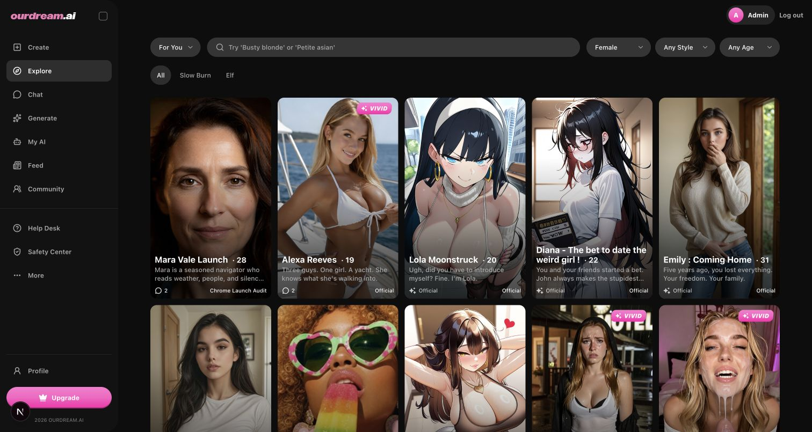

# 2026-08-11 Chrome launch continuation

This folder extends the full launch audit with current responsive, keyboard and live Chat evidence. It does not replace the launch gate or authorize the pending production migrations.

## Browser matrix

| Journey | 390 px | 768 px | 1280 px | Result |
| --- | --- | --- | --- | --- |
| Admin Chat Ops / target-missing backlog | `114`, `117` | `115` | `116` | Final refresh has no page-level horizontal overflow; 3–4 wide regions retain scoped horizontal scrolling and no uncontained overflow. |
| Admin Today | `111` | `112` | `113` | Current authority data renders with zero page-level overflow and zero console warning/error entries. |
| Admin Support | `05` | — | covered by the parent audit | Filters and the 14-column authority table remain readable; table overflow is scoped. |
| Admin Alexa Voice | `119` | `120`, earlier `07` | `121`, earlier `06` | The current Voice workspace has zero page-level overflow and zero broken visible images at all three breakpoints. The 390 px System Voice Defaults summary now stacks its action instead of collapsing the description into word-by-word wrapping; candidate creation remains input-gated. |
| Customer Explore | `105`, `118` | `106` | `107` | Final refreshed build has no page-level overflow at all three breakpoints, 20 images with zero broken visible images and zero console warning/error entries. |
| Customer Mara detail / Chat | `108`, plus earlier `12`, `94` | `109` | `110` | Public serving detail has zero overflow/broken visible images at all three breakpoints; earlier evidence proves Chat opening, real reply and reload persistence. |
| Customer Generate / Gallery | `95` | — | parent audit | Real queued → generating → completed image remains visible in Gallery. |
| Customer Community Follow | `96` | — | parent audit | Following authority survived reload and exposed the truthful Unfollow state. |
| Admin Incident correlation | `97` | — | parent audit | Durable failed-row authority and the operator panel render without page overflow. |

## Keyboard and focus

1. At 390 px the Admin skip link was the first product focus target after page load.
2. Before the fix, activating it changed the hash but left focus on `BODY`.
3. `#admin-main-content` now has `tabindex="-1"`; Chrome verified `Tab → Enter` moves the real active element to that section.
4. The next `Tab` moves to `Open navigation`.
5. Customer Explore at 390 px starts on the named `Open navigation menu` button; `Enter` expands `App navigation` and the next `Tab` reaches `Create`.
6. The final refresh repeated both keyboard paths on the current source: evidence `117` proves Admin skip-link focus and `118` proves customer navigation expansion/focus order.

## Live customer Chat evidence

1. Chrome opened public Mara from Explore and entered session `sess_622b893576f14214a8893628d74dc6ac`.
2. The pinned opening message appeared immediately and survived reload with the same session URL.
3. The opening retained `Play voice` but did not expose the invalid `Regenerate reply` action.
4. The real prompt `Give me one short welcome aboard line.` completed through the live Chat service. The generated assistant reply reached terminal state, exposed the normal reply actions and survived reload.
5. Browser console warning/error count for the customer journey was zero.
6. The current audit account does not include voice playback. Clicking `Play voice` returned the truthful upgrade state and did not pretend that synthesis completed.

The Chat process was refreshed to load the current source. Two initial model warm-up attempts exceeded the 45-second first-token budget; a subsequent retry completed and `/readyz` returned `ready=true` at `2026-08-11T23:39:12.161Z`. The customer message was sent only after readiness became green.

## Code-owned launch fixes in this continuation

- Admin skip-link target is programmatically focusable, with a mounted shell regression.
- Launch readiness only checks `PIPELINE_API_URL`, `PIPELINE_API_TOKEN` and `PIPELINE_IMAGE_MODEL_DEFAULT` when `GEN_IMAGE_PROVIDER=pipeline`; `mock` no longer creates two false failures and one false warning.
- PM2 topology omits `gen-video` whenever the effective Gen provider is `mock`; backend/pipeline still register it.
- Sentry now initializes in all four runtimes only under explicit production+DSN authority, and the launch gate requires a fresh capture/flush/API-query canary report; no real Sentry canary was executed in this continuation.
- Fish Audio runtime idempotency cache is ignored as local state.
- Main/Admin source development now writes only `.next-development`, while production builds continue to own `.next`; this removes the build-versus-dev artifact race that produced a real React hydration mismatch in Chrome.
- The System Voice Defaults summary now stacks its action below the authority copy below 640 px, with a focused component regression; wider layouts retain the existing inline action.

## Build/runtime isolation evidence

1. Chrome first reproduced different server/client Explore grid classes and a React hydration mismatch after a production build overwrote the running development `.next` tree.
2. Main and Admin development startup now set the same explicit `.next-development` authority; invalid development or Playwright combinations fail closed in both Next configs.
3. Main and Admin production builds then completed while both development services stayed online.
4. A fresh Chrome navigation after both builds saw the exact responsive grid class, 17 character links, zero broken/incomplete images, zero page-level overflow, and zero warning/error console entries.
5. The final read-only Chrome smoke after the migration-authority and Appeal-restoration fixes again rendered Main Explore with 17 character links and 20/20 loaded images at 1512 px, plus Admin Today and Incidents with zero page-level overflow. The Incident correlation table reached its terminal loaded state and correctly kept the live `attempt_missing` row non-selectable; no write command was invoked.
6. A final Chrome breakpoint pass at `2026-08-12T05:00:55.909Z` rechecked Explore, Mara detail, Admin Today and Admin Chat Ops at 390/768/1280 px. All 12 page states reported `document.scrollWidth === viewport width`, zero console warning/error entries and zero broken visible images; Chat Ops kept every wide table inside explicit horizontal-scroll regions. Machine-readable measurements are stored in `.tmp/chrome-responsive-final-2026-08-11.json`, with screenshots `105`–`118` in this directory.
7. The current Alexa Voice workspace was then rechecked at 390/768/1280 px. All three states reported page overflow `0` and broken visible images `0`; the System Voice Defaults description measured 264×48 px at 390 after the responsive fix, then returned to a single 321×24 px line at 768 and 1280. Screenshots are `119`–`121`.

## Current launch result

`.tmp/check-launch-2026-08-12-final-core.json` is the latest read-only gate artifact after the provider-attribution, observability, durable-backlog, recovery-evidence and Main persistence fixes:

- **22 pass / 37 fail / 1 warn** under the explicit `LAUNCH_SCOPE=core` contract
- Product database remains **67/71** migrations.
- Disposable PostgreSQL 16 databases passed both fresh 71/71 deploy+seed and an exact legacy Premium v1 upgrade rehearsal. In the upgrade rehearsal, v1 stayed archived with its historical Krea2 execution pin while the new active Premium v2 used RedMix3; exact catalog migration authority and Product Config were green in both disposable states. This does not change the product database state.
- The migration-authority checker now reads the portable server version before PG16-only catalog columns. A disposable PostgreSQL 14 database therefore returns the intended structured `postgres-catalog: launch migration fingerprints require PostgreSQL 16` failure instead of crashing.
- The stale active Premium v1 image profile still blocks Product Config.
- The gate queries the exact Main→Chat event-type authority before production PM2 can pause, stop, start or resume anything. The 48 target-missing carriers were subsequently terminalized through the dual-permission Chrome operator flow; the fresh read-only audit is now zero and this check passes.
- The gate now directly verifies a flat checksummed Main PostgreSQL + Chat FS + Blob recovery bundle. The historical bundle passed its artifact checks but was rejected as migration `60/71`; no migration-71 rehearsal bundle is configured.
- Current local env is not a production envelope and lacks object-storage and four-runtime observability closure evidence. The fixed `core` scope excludes only Payment and Age Verification from the executable gate; compliance remains outside this run's verdict.

This remains **NO-GO for public launch**. Repository tests and local Chrome success do not substitute for the four operator migrations, real storage/Sentry evidence, or a fresh quiesced backup and independent restore rehearsal. The target-missing outbox disposition is now closed. The persisted gate evidence is `.tmp/check-launch-2026-08-12-final-core.json`; payment, age verification and compliance are not counted.

## Evidence limits

- Screenshots prove the named visible state only; DOM assertions, focus checks, service readiness and reloads provide the interaction evidence.
- No production migration was applied and no Main/Chat/Blob backup was created in this continuation.
- No external R2/S3 or Sentry credential was available, so those in-scope product loops remain unverified. Payment, age verification and compliance were excluded by instruction.
- The Voice candidate clone → preview → activation → Chat audio loop was not executed. A local reference recording exists, but Chrome-controlled upload remained unavailable because the browser extension did not have file-URL access; no alternate upload path was used. Independently, the product database is still before the Voice payload migration, so the terminal product loop cannot yet be signed off.
