# Admin 运营与管理能力审计 — 2026-08-19

## 结论

当前本地 Admin 已达到**受控运营可用**：运营人员可以从 Today 进入角色、创意生产、客户、工单、账务、增长、平台运维和系统治理，并在原权威域完成判断、命令、验证和审计。35 个导航目的地均在 Chrome 中完成真实加载；桌面、平板和手机没有页面级横向溢出。

本轮不新增第二套状态机或“万能工作流”。Today 只做排序和入口，角色、生成、案件、账务、事故等命令仍回到各自权威域。修复集中在会让运营人员看错、走丢或在小屏无法开工的路径。

这不是公开生产 Go：证据来自本地受控环境。生产域名、生产密钥、生产数据新鲜度、真实告警/通知和发布后观察仍需在生产基础设施上另行验收。

## 第一性原理

1. **先回答“现在该做什么”**：Today 给出超时、无人认领和下一步最佳操作，但不复制业务状态。
2. **每个动作只有一个权威**：Admin 是 UI/BFF；角色、生成、工单、账务、事故等状态由 Main 权威域持有。
3. **高风险动作先看影响，再确认，再验证**：退款、重放、丢弃、发布、事故结案均保留影响说明、权限、原因、确认与审计。
4. **异常必须可恢复**：失败原因要能读懂，恢复入口要回到正确对象，并显示是否允许自动重试或需人工新尝试。
5. **详情链接就是工作入口**：从 Today、书签或告警进入时，不能要求运营人员先翻列表再找同一对象。
6. **少即是多**：删除重复严重度、重复单位和无行动价值的背景噪音；不增加新层级、新向导或重复配置页。

## 运营任务闭环

| 步骤 | 运营任务 | 结果 | 健康度 |
| --- | --- | --- | --- |
| 1 | Today 判断优先级、领取、关注、推迟、筛选全部工作 | 19 条待处理、4 条超时、7 条无人认领；系统标题中文化，首条动作直达权威页 | 健康 |
| 2 | 角色从资产生产到预览、QA、发布、线上监控 | Alexa 已上线状态不再被后续草稿资产误判为“预览/发布未开始” | 健康 |
| 3 | 创意批次创建、执行、审核、部署、失败恢复 | 创建不等于发布；失败项区分“不可自动重试”和“可由运营恢复” | 健康 |
| 4 | 工单取证、认领、决定、验证、结案 | 证据不可变；详情深链在手机上先出现，可直接进入 Customer 360 | 健康 |
| 5 | 客户 360 与账务处置 | 关系、生成、订阅、工单、账本、操作历史贯通；退款显示精确金额和权益影响 | 健康，未执行不可逆退款 |
| 6 | 增长与产品健康 | 指标口径、样本缺失和降级状态不被伪装成正常；实验空态明确 | 健康，当前本地指标降级 |
| 7 | 事故、死信、生成、供应商与 Chat 运维 | 影响、缓解、恢复验证、重放权威、成本和持久化链可追踪 | 健康 |
| 8 | 权限、审批、审计与未知路径 | 删除账号不可被状态按钮“恢复”；审批空态清楚；审计可导出；未知路由为 HTTP 404 | 健康 |

## 本轮修复

- **详情优先**：Case、Customer、Incident 的直接深链在手机/平板上先呈现详情，不再被长列表和筛选器压到页面底部。
- **角色上线事实**：线上角色保留已经完成的预览、发布和线上监控阶段；新草稿资产只影响当前图片阶段。
- **生成任务深链**：列表归一化、打开/关闭详情时保留 `job` 查询参数，刷新和分享不会丢对象。
- **共享路由状态**：列表查询更新不再清掉相邻的 `view`；预设页刷新后仍是预设，不会退回提示词配方。
- **标签页名称**：共享 Jobs 路由按 `view` 输出“生成任务/死信”标签页标题，便于多标签工作。
- **失败恢复文案**：创意失败批次的审核和重试状态完整中文化；明确“不可自动重试”不等于禁止运营授权新尝试。
- **Today 标题降噪**：系统生成的案件和事故标题跟随中文界面；事故标题不再重复已经由色标表达的严重度。
- **系统治理边界**：已删除账号只显示“由账号删除流程管理”，不再提供错误的恢复/封禁按钮。
- **可访问与布局**：窄屏刷新按钮有可访问名称；页面只裁剪横向溢出，不再制造会破坏 sticky 的伪纵向滚动容器。

## Chrome 证据

### 1. Today：当前状态与下一步

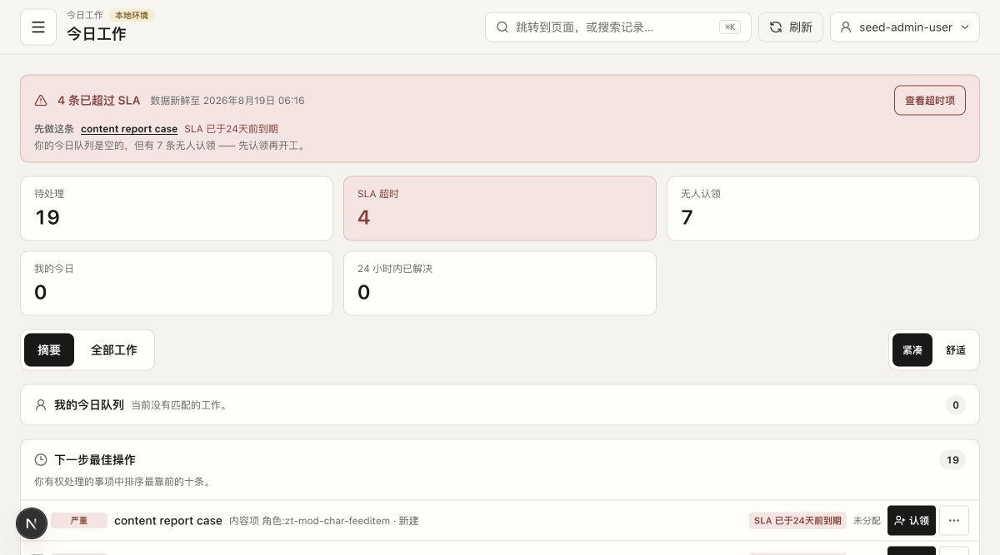

### 2. 角色资产组合

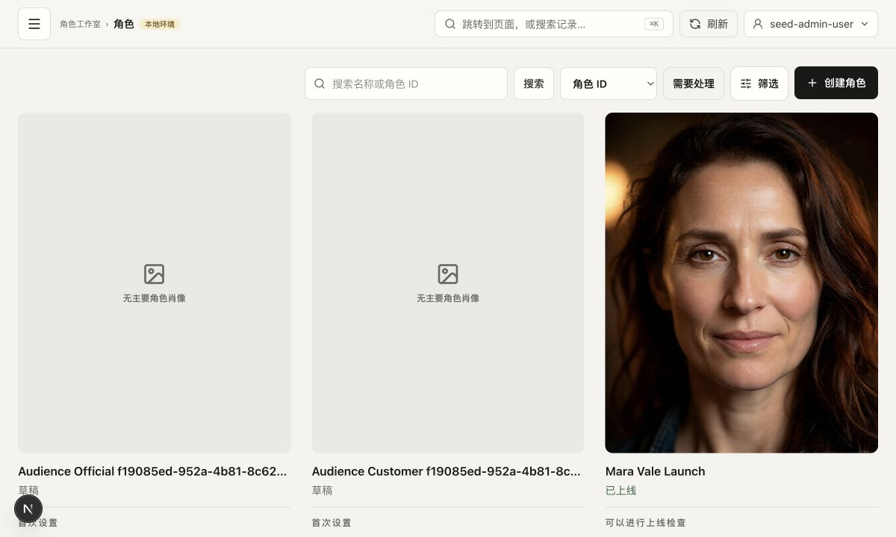

### 3. 角色详情：修复前发现上线进度失真

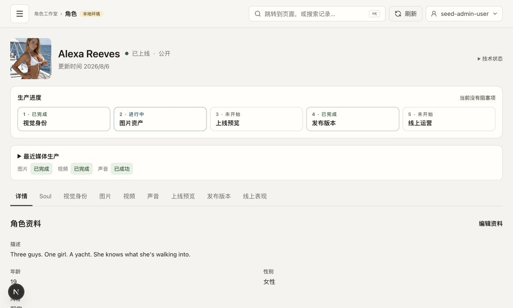

### 4. 用户预览与 QA

### 5. 线上监控

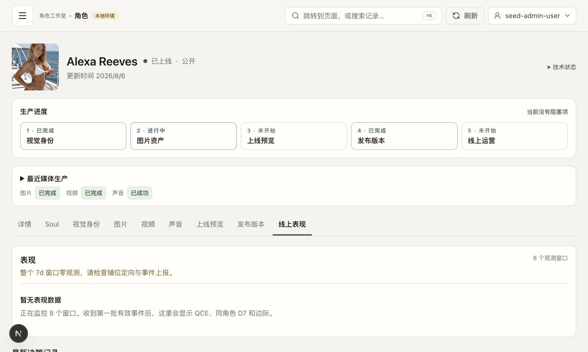

### 6. 创意生产批次

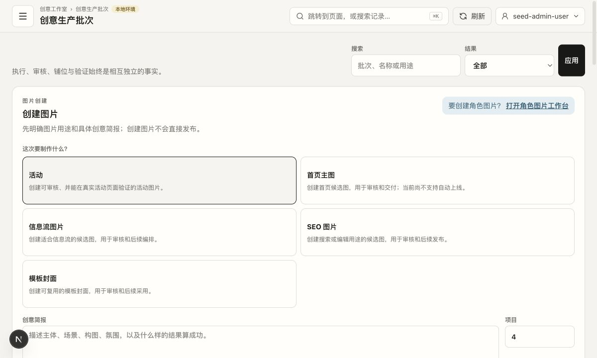

### 7. 失败恢复入口

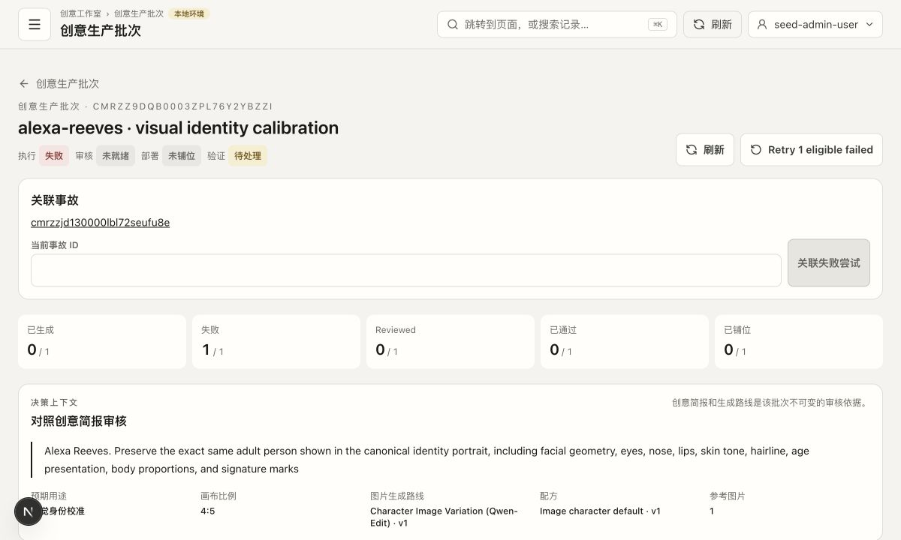

### 8. 工单证据与决策闭环

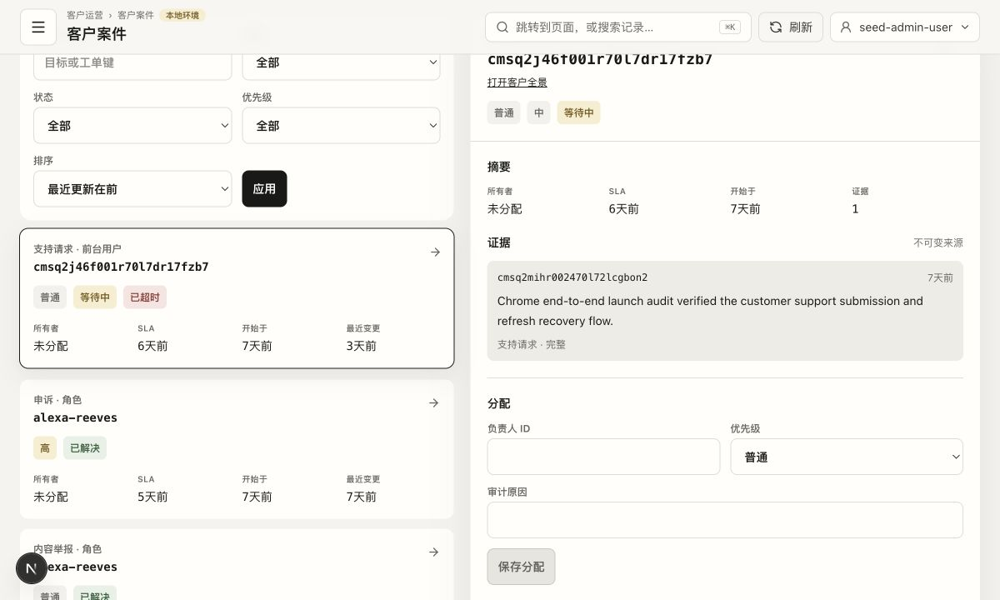

### 9. Customer 360

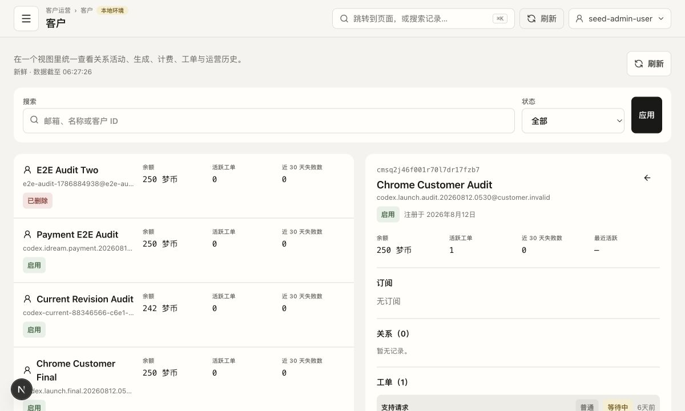

### 10. 退款影响与确认边界

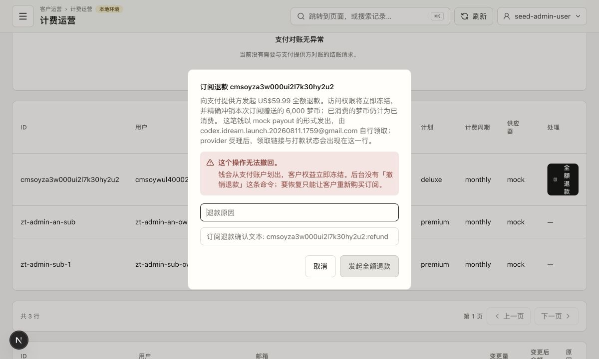

### 11. 产品健康：如实显示降级与零样本

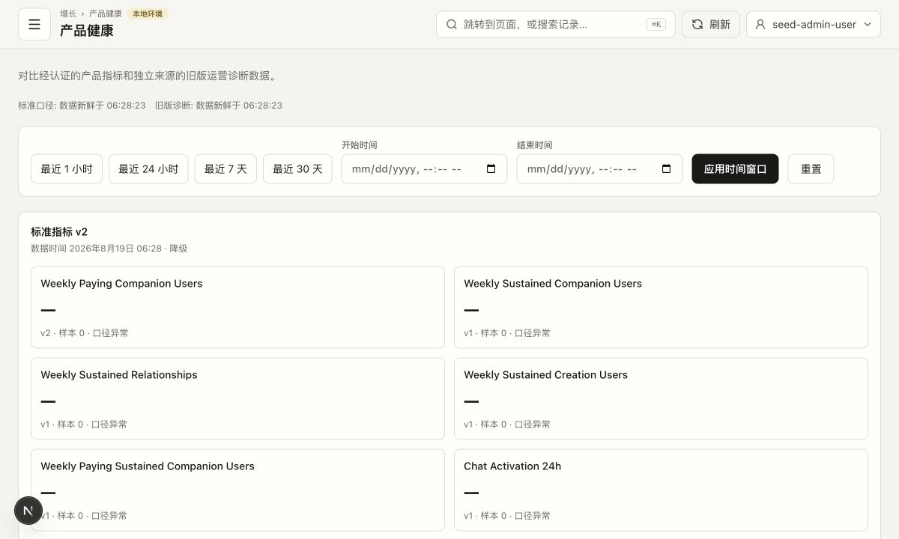

### 12. 事故恢复闭环

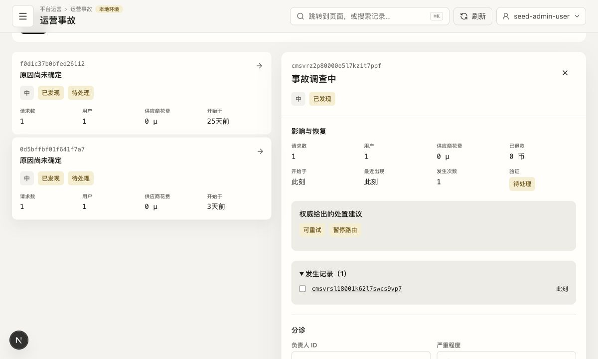

### 13. 生成权威深链修复后

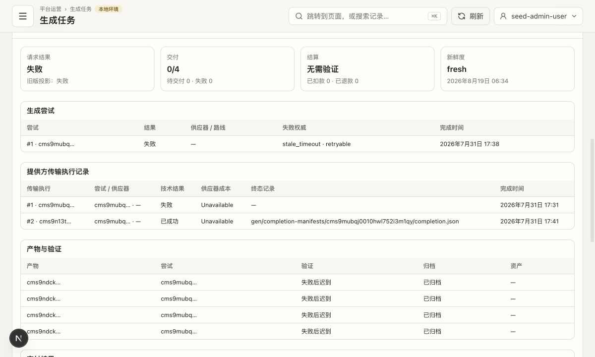

### 14. 角色上线进度修复后

### 15. 手机导航与键盘焦点

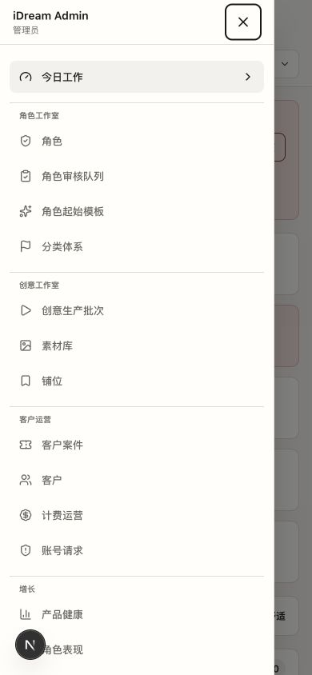

### 16. 手机工单详情优先

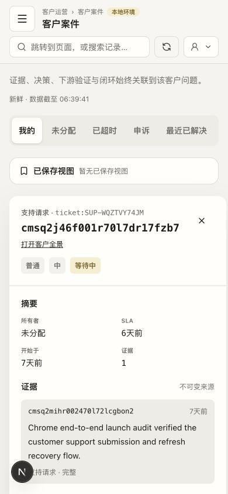

### 17. 平板 Today

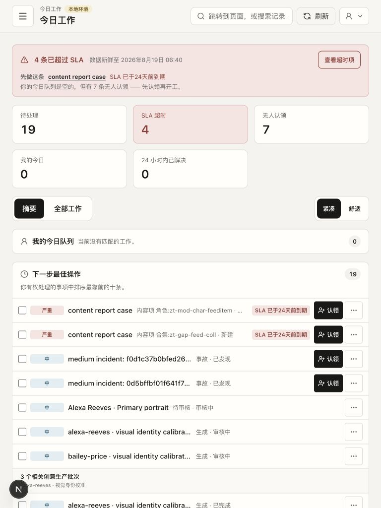

### 18. Today 系统标题本地化修复后

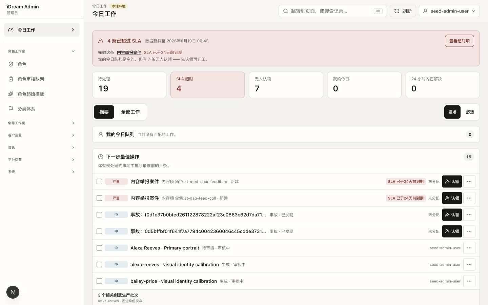

## 验证结果

- Chrome 导航扫描：**35/35** 目的地加载成功；Backends 在约 5 秒内完成权威加载。
- 响应式：`390×844`、`768×1024`、`1200×800`、`1440×900` 均无页面级横向溢出。
- 键盘：手机抽屉焦点顺序、`Escape` 关闭、焦点返回打开按钮均通过。
- HTTP：Admin Today `200`；Main health `200`；未知 Admin 路由 `404`。
- 运行时：PM2 **11 个进程 online**。
- Admin 自动化：**165 个测试文件、954 个测试全部通过**。
- Admin `lint + typecheck + production build`：通过；现存 **7 条 warning、0 error**，均不是本轮新增阻断。
- Main：TypeScript 检查通过；角色生产旅程 **8/8** 通过。
- 真实生成持久化复核：`cmsu0jpa4000oj7l7j3zd2xlx`，Attempt `cmsu0jpao000uj7l79noaebtl`，`comfyui / chat-image-edit / qwen-image-edit-img2img`；请求与尝试成功，terminal receipt 已处理、outbox 已交付、transport 成功、1 个 artifact 有效且已交付、1 个 MediaAsset 投影一致。

## 边界与未执行动作

- 没有执行退款、死信丢弃/重放、发布、事故结案等不可逆或可能影响线上状态的命令；其确认边界、权限、影响说明和现有审计记录已验证，命令行为由自动化测试覆盖。
- 没有为了重复证明而新消费一次生成；本轮对已存在的真实生成结果重新执行了数据库权威链探针，并实时检查了本地 provider/backend 健康。
- 当前本地产品健康指标明确处于降级/零样本状态；这是数据现状，不是 UI 假阳性。
- 本轮可访问性证据覆盖语义名称、键盘焦点、`Escape` 和响应式溢出；截图不能证明完整 WCAG 合规。

