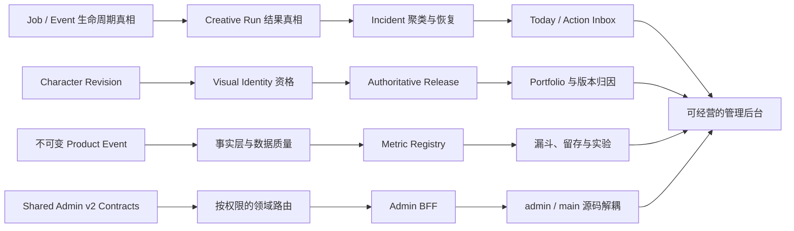
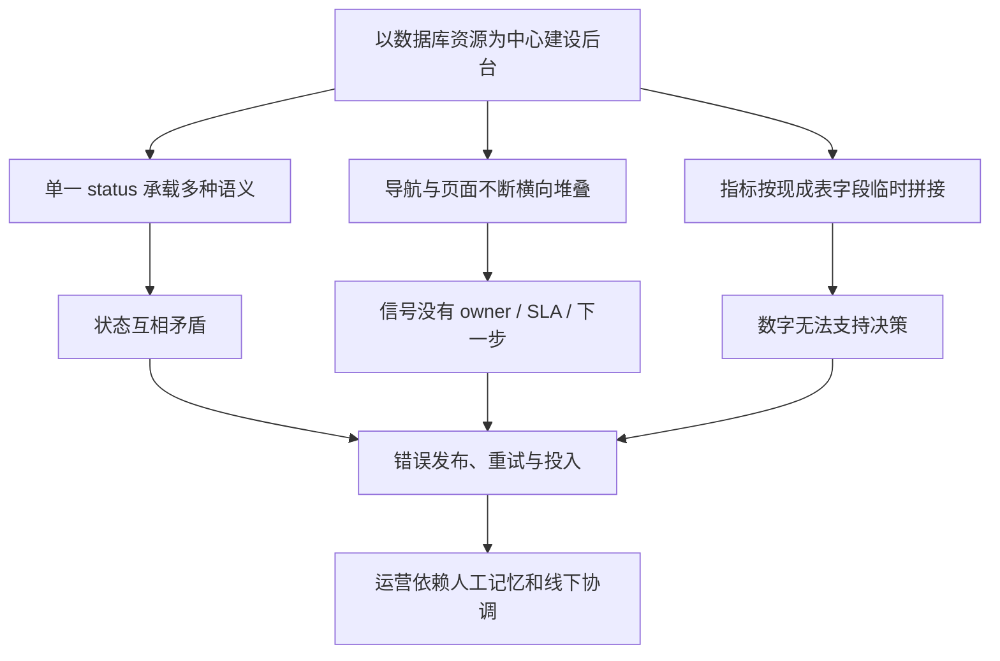
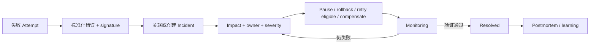
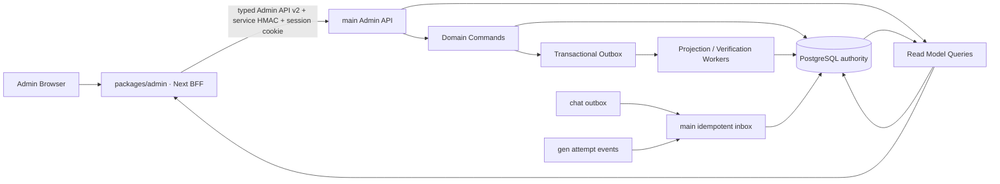
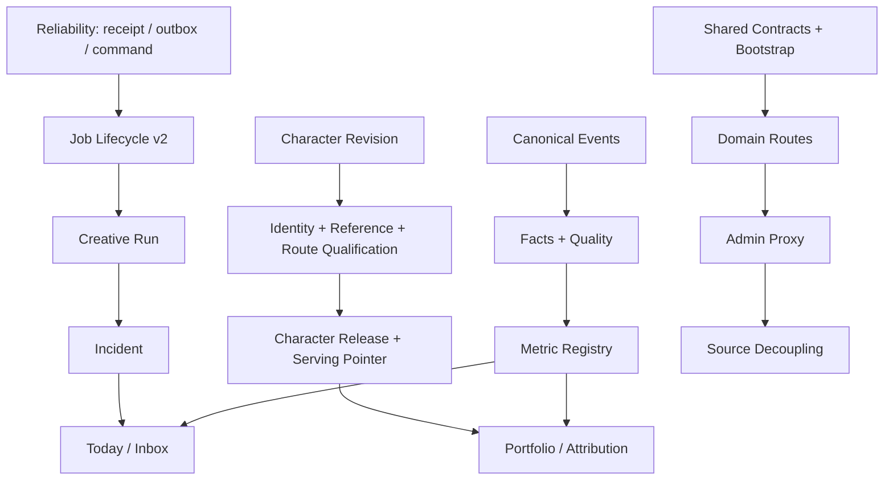

# iDream 管理后台第一性原理修复方案

更新日期：2026-07-11

状态：目标产品设计 / 完整执行蓝图 / 尚未代表实现完成

适用范围：`packages/admin`、`packages/main` 中的 Admin API 与领域服务、`packages/chat` 到 main 的业务事件、后台依赖的读模型与度量事实层。

## 0. 文档地位与使用方式

本文定义管理后台从当前“功能控制面”升级为“公司运营操作系统”的目标模型、状态与指标口径、信息架构、关键工作流、技术迁移、测试、发布和验收门槛。

文档关系如下：

- 当前真实实现状态仍以 [`CURRENT_FUNCTIONAL_COVERAGE.md`](./CURRENT_FUNCTIONAL_COVERAGE.md) 为唯一事实来源；本文不声明任何尚未落地的能力已经完成。
- [`ADMIN_CONSOLE_PLAN.md`](./ADMIN_CONSOLE_PLAN.md) 中已经落地的 permission key、审计、高风险确认、审批、配置版本化与回滚约束继续有效。
- 本文取代旧方案中以数据库资源和功能入口为中心的目标信息架构、工作流、状态语义与分析指标定义。
- 图片生成领域已有的详细设计继续参考 [`GENERATION_ADMIN_OPERATIONS_REDESIGN.md`](./GENERATION_ADMIN_OPERATIONS_REDESIGN.md)，但其中 `completed` 等含混状态按本文的多轴状态模型修正。
- 实施任一阶段后，必须同步更新 `CURRENT_FUNCTIONAL_COVERAGE.md`；不得用本文的目标状态覆盖实现事实。

审计依据包括当前产品文档、Prisma schema、Admin 前后端源码、跨服务事件契约和 2026-07-11 实机后台审计。关键证据摘要见 §2，完整审计记录位于 [`REPORT.md`](../../.codex/product-audits/2026-07-11-admin-product-audit/REPORT.md)。

## 1. 执行结论

### 1.1 后台的真正定位

iDream 当前同时提供陪伴关系与视觉创作两条价值路径。本方案的第一性原理建议是 **companion-first**：长期核心价值不是“生成一张图”或“完成一次点击”，而是用户与一个角色建立并持续发展个性化陪伴关系，视觉生成增强角色表达和这段关系；但这属于产品战略选择，必须经 §13.1 的 `NS-01` 决策并同步 PRD，不能由 Admin 改造静默改写。无论是否批准，后台都必须完整支持并分别度量两条路径。

因此，管理后台不是内部 CRUD 网站，也不是数据库对象的可视化目录。它是公司的**决策执行系统**，唯一合理的价值函数是：

> 在不破坏产品真相的前提下，缩短从信号到可验证结果的时间。

后台的基本闭环必须是：

```text
信号 → 诊断 → 决策 → 动作 → 验证 → 学习
```

一个功能只有在操作者能够发现问题、理解影响、明确负责人、执行动作、验证结果并沉淀学习时才算完成。按钮可点击、API 返回 200、数据库写入成功，都不等于业务闭环完成。

### 1.2 根因判断

当前后台的主要矛盾不是“页面不够多”，而是已经拥有大量底层能力，却缺少三个上层约束：

1. **状态真相**：同一对象的工作阶段、质量、执行结果、可见性和资金结算混在一个 `status` 中，产生互相矛盾的事实。
2. **指标真相**：窗口、cohort、分子分母、事件时间和样本成熟度没有统一定义，数字看似精确但不能支持经营决策。
3. **运营闭环**：异常、举报、发布阻塞和失败任务以原始表格存在，没有 owner、SLA、影响、推荐动作和恢复验证。

信息架构拥挤、巨型组件、前后端耦合是上述问题的放大器，不是第一因。正确修复顺序是：

```text
真相 → 领域工作流 → 决策队列 → 信息架构 → 工程解耦 → 视觉打磨
```

### 1.3 四条依赖链

本方案不是一次大爆炸重写，而是四条可独立验收、最终汇合的修复链：



### 1.4 本方案明确不做

- 不先做视觉换肤、Dashboard 卡片墙或导航重命名来掩盖错误真相。
- 不创建一个包办所有领域的通用工作流引擎；领域对象仍拥有自己的权威状态。
- 不把 Admin 变成 Prisma Studio，也不允许客户端任意 PATCH 状态字段。
- 不为了解耦而一次性重写全部 API 和页面；采用领域逐条迁移的 strangler 路径。
- 不在数据量和查询负载尚未证明需要时先上重型数仓。
- 不把 Feature Flag 的全量趋势包装成 A/B 实验结论。
- 不伪造历史数据；无法从权威事件回放的历史区间明确显示不可用。

## 2. 当前问题与业务后果

| 优先级 | 当前证据 | 真实问题 | 业务后果 | 修复原则 |
| --- | --- | --- | --- | --- |
| P0 | 公开且 approved 的角色仍只有 50% release readiness | 审核状态、公开状态与发布资格不是同一事实 | 不完整角色可能继续服务，团队无法判断“是否真的上线完成” | 引入不可变 Release Snapshot；每次 publish 服务端重算 checks |
| P0 | active Visual Identity 可以没有 anchor、reference 和评估分数 | “被选中”被误当作“质量合格” | 角色一致性没有证据，后续生成不可预测 | serving、lifecycle、quality 三轴分离 |
| P0 | Production Batch 显示 `completed · 0/4`，四项全部失败 | “流程停止”被误当作“执行成功” | 失败任务从队列消失，成本和产出被误报 | execution、review、deployment 独立建模 |
| P0 | failed Job timeline 仍出现 `job.completed` | 终态字段和事件语义冲突 | 操作者无法相信排障证据，重试可能造成重复执行或重复结算 | typed event + terminal invariant + attempt 模型 |
| P0 | Activation 等于任意 generation job；Conversion 混合两个窗口总体 | 指标没有统一 cohort 和成功结果 | 增长团队可能优化错误行为、做出错误投入决定 | Metric Registry + immutable facts + cohort maturity |
| P0 | D1/D7 是注册后 1/7 天内累计任意活动 | “时间窗内活跃”冒充“指定日返回” | 留存趋势被系统性高估 | 精确 calendar bucket；rolling retention 另立指标 |
| P0 | Jobs、Reports、Moderation 是原始行列表 | 信号没有聚类成需要完成的工作 | 同类问题重复处理、无人负责、没有恢复验证 | Incident / Case + owner + SLA + verification |
| P1 | Character Performance 只有 lifetime chats/likes/views | 角色没有曝光到关系留存的漏斗，也没有版本上下文 | 无法决定 Promote、Improve、Pause 或 Retire | Character Portfolio + per-release attribution |
| P1 | 新建角色草稿主要保存在浏览器 | 草稿不是可协作的服务端业务对象 | 跨设备丢失、多人覆盖、没有 owner 和上线计划 | server draft + revision + optimistic concurrency |
| P1 | 34 个静态导航入口对所有操作者一致 | 后台按功能表而不是角色任务组织 | 学习成本高，日常工作被不相关入口淹没 | permission + 工作模式派生导航和 Today |
| P1 | 全局筛选只对已加载 rows 做 `JSON.stringify` | 搜索不是全量、不可复现、不可分享 | 操作者误以为“没有数据”，返回后上下文丢失 | 服务端 search/filter/sort，URL 作为查询状态 |
| P1 | `AdminConsoleClient.tsx` 约 7,305 行，`service.ts` 约 4,964 行 | 产品边界没有映射到代码边界 | 修改任一领域都扩大回归面 | typed domain contracts + route/module 按领域拆分 |
| P1 | `packages/admin` 直接编译和导入 main 源码 | 独立 Admin 包只是部署外壳，不是清晰服务边界 | 发布耦合、权限与 DTO 边界难以验证 | Admin 只依赖 shared SDK，经 BFF 调 main API |

### 2.1 因果链



### 2.2 值得保留的基础

这不是推倒重来。以下能力应保留并深化：

- permission key、用户级 grant/revoke 与服务端授权。
- `AdminAuditLog`、reason、typed confirmation、双人审批、版本发布与 rollback。
- 官方角色详情页的工作区骨架。
- Creative Production 的 Brief → Directions → Review 思路。
- `CharacterVisualProfile`、`ContentProductionBatch/Item`、`MediaAsset/Placement`、`GenerationJobEvent` 等已有领域基础。
- `SupportRequest` 已有的 assignment 与 SLA 字段。
- chat outbox 到 main consumer 的跨服务事件通道。
- 后台已有的 list/detail/new UI 原语和测试基础。

## 3. 第一性原理与不可破坏的产品不变量

### 3.1 价值单位

在 NS-01 作出正式选择前，后台并列承认两个用户价值单位：

- `Qualified Companion Episode`：一次达到深度门槛的角色互动；长期价值是跨 engagement session、跨日持续的同角色关系。
- `Successful Generation Delivery`：用户真正收到有效创作结果；长期价值是跨日重复创作，以及资产被保存、使用、发布或带回角色体验。

消息数、job 数、按钮点击和 provider 成功都不是用户价值本身。若 NS-01 批准 companion-first，关系价值成为顶层 North Star、生成成为独立护栏与关系增强器；若不批准，两条价值路径继续并列，不影响状态与运营闭环修复。

由此导出后台的经营优先级：

1. 用户是否真正收到 QCE 或 Successful Generation Delivery，而非技术层假成功。
2. 用户是否跨日持续关系或重复创作。
3. 角色、视觉、生成、供给和分发的哪个版本推动或破坏了价值。
4. 商业投入是否改善被 NS-01 选定的顶层价值，同时守住另一条路径。
5. 系统故障和客户问题是否被快速、可靠地恢复。

### 3.2 六条不变量

1. **一个业务事实只有一个权威解释**：客户端只能展示服务端派生状态，不重新发明 readiness 或 outcome。
2. **独立语义必须独立建模**：工作阶段、服务状态、质量、执行结果、可见性和资金结算不得塞入同一 status。
3. **状态改变只能通过业务命令**：使用 `publishRelease`、`retryAttempt` 等命令，不开放任意状态 PATCH。
4. **数字必须绑定决策问题**：每项指标都必须说明分子、分母、cohort、窗口、排除项、版本、owner 和新鲜度。
5. **动作完成不等于结果完成**：发布、重试、回滚、退款或处置后必须进入 verification，系统证明结果生效后才能关闭。
6. **工作必须可归责、可追踪、可恢复**：关键对象必须有 owner、SLA/due date、活动历史、版本、幂等键与 rollback/补偿路径。

### 3.3 后台自身的一级指标

后台不是用“页面数”衡量。上线后应监控：

| 指标 | 定义 | 目标方向 |
| --- | --- | --- |
| Time to Detect | 业务异常/机会首次出现到产生可见 Work Item | 下降 |
| Time to Ownership | Work Item 产生到被领取或分派 | 下降 |
| Time to Decision | 产生到记录明确动作与理由 | 下降 |
| Time to Verified Result | 动作开始到系统验证恢复/生效 | 下降 |
| Decision Error Rate | 因错误状态、数据或归因导致的撤销/纠正决定占比 | 下降 |
| Unowned Work Rate | 超过分派期限仍无 owner 的工作占比 | 接近 0 |
| SLA Breach Rate | 超过领域 SLA 且未有有效 waiting 原因的工作占比 | 下降 |
| Reopen / Recurrence Rate | Case 重开或 Incident 同签名复发占比 | 下降 |

## 4. 目标运营模型

### 4.1 从“资源”转向“决策对象”

后台围绕六类需要被完成的决策对象建设：

| 决策对象 | 它必须回答的问题 | 当前可复用基础 | 主要新增能力 |
| --- | --- | --- | --- |
| Character Project / Release | 为什么做、做到哪、能否上线、上线后是否继续投入 | Character、Submission、Official workspace | Project、Revision、Release Snapshot、checks、monitoring |
| Visual Identity Version | 当前版本是否被服务、是否有证据证明合格 | CharacterVisualProfile、MediaAsset | validation lifecycle、evidence、quality version |
| Creative Run / Asset / Placement | 为何生产、结果怎样、审片怎样、投放哪里、效果如何 | ContentProductionBatch/Item、MediaAsset/Placement | 多轴 outcome、统一 lineage、投放验证 |
| Incident | 哪类系统性故障、影响多大、如何缓解、是否恢复 | GenerationJob/Event、provider health | signature、occurrence、owner、mitigation、verification |
| Customer Case | 谁遇到什么问题、证据是什么、谁处理、下游是否生效 | ContentReport、Appeal、SupportRequest | Case 聚合、SLA、360 上下文、verification |
| Experiment / Decision Record | 假设是什么、证据是否可信、决定和复查是什么 | FeatureFlag、AnalyticsEvent | assignment/exposure、metric version、decision history |

所有对象遵循同一闭环，但共享层不能成为第二套领域真相：

```text
领域对象 → 派生信号 → Work Item → Decision → Action → Verification → Learning
```

`Work Item` 只统一展示、排序和 deep link；owner、priority、SLA、verification 只读穿透领域 root，watch/snooze/pin 来自 `OperationalWorkPreference`。Character Release、Creative Run、Incident、Case 等仍拥有自己的根状态与 assignment command。

### 4.2 运营节奏

| 节奏 | 输入 | 核心会议/动作 | 输出 |
| --- | --- | --- | --- |
| 每班次/每日 | Today、Incident、Case、release blocker、data quality | 领取、分派、缓解、验证 | owner、SLA、已验证结果 |
| 每次发布 | revision、identity、QA、placement、基线 | validate → approve → publish → monitor | Release Snapshot、24h/72h 决定 |
| 每周角色组合评审 | 7d/28d 漏斗、留存、成本、版本变更 | Promote / Maintain / Improve / Pause / Retire | Decision Record、owner、复查日 |
| 每月指标评审 | metric version、coverage、freshness、异常 | certify / degrade / invalidate / revise | 新版本定义、迁移和解释 |

### 4.3 操作者与主工作模式

权限继续由 effective permission keys 决定；工作模式只控制默认导航、Today 排序和 saved views，不扩张权限。

| 工作模式 | 首要目标 | 默认工作对象 |
| --- | --- | --- |
| Character producer | 把有明确定位的角色可靠上线并迭代 | Projects、Releases、Review、Portfolio |
| Creative operator | 生产、审片、投放可追溯素材 | Creative Runs、Asset Review、Placements |
| Platform ops | 维持生成与聊天服务健康 | Incidents、Jobs、Providers、Rollouts |
| Support | 在完整客户上下文中解决问题 | Cases、Customers、Jobs、Billing |
| Moderator | 完成有证据、有 owner、有 SLA 的复核 | Cases、Character Review、Appeals |
| Growth analyst | 识别漏斗与角色组合机会 | Product Health、Retention、Performance、Experiments |
| Admin | 处理跨团队风险和高风险审批 | Approvals、P0/P1 incidents、Access、Audit |

### 4.4 v2 权限增量

工作模式不是授权角色。Phase 1 必须把以下 permission keys 加入 shared contract 和现有 role→permission 映射；Character producer、Creative operator 等先作为用户级 grant bundle，不新增粗粒度 auth role。

| permission key | admin | moderator | support | ops | analyst |
| --- | :-: | :-: | :-: | :-: | :-: |
| `character.project.read` | ✓ | | | | |
| `character.project.write` | ✓ | | | | |
| `character.release.read` | ✓ | | | | |
| `character.release.propose` | ✓ | | | | |
| `character.release.review` | ✓ | | | | |
| `character.release.publish` | ✓ | | | | |
| `character.performance.read` | ✓ | | | | ✓ |
| `creative.run.read` | ✓ | | | ✓ | |
| `creative.run.write` | ✓ | | | | |
| `creative.run.review` | ✓ | | | | |
| `creative.asset.read` | ✓ | | | ✓ | |
| `creative.placement.read` | ✓ | | | ✓ | |
| `creative.placement.publish` | ✓ | | | | |
| `ops.incident.read` | ✓ | | scoped | ✓ | |
| `ops.incident.manage` | ✓ | | | ✓ | |
| `case.read` | ✓ | ✓ | scoped | | |
| `case.assign` | ✓ | ✓ | scoped | | |
| `case.decide` | ✓ | ✓ | subtype only | | |
| `customer.read` | ✓ | | ✓ | | |
| `analytics.metric.read` | ✓ | | | technical only | ✓ |
| `analytics.metric.export` | ✓ | | | | ✓ |
| `experiment.manage` | ✓ | | | | |

建议 grant bundles：

- `character_producer`：Character project read/write + release read/propose/review + scoped character performance read；publish 仍单独授予。
- `creative_operator`：Creative run read/write/review + asset/placement read；distribution placement publish 与 character release publish 分别单独授予。
- `growth_operator`：metric read + experiment manage；export 单独授予。

`scoped/subtype only` 必须落实为服务端 query scope 和 DTO 字段裁剪，不是 UI 隐藏。全局搜索、Today、Customer 360、Case Evidence 和导出都复用同一 effective permission resolver；现有逐目标证据查看门控继续有效。新 command 未进入权限矩阵前不得上线。

`creative.placement.publish` 仅适用于 distribution-owned slot；release-owned slot 最多使用 `character.release.propose` 创建候选，最终 pointer swap 始终重新校验 `character.release.publish` 或绑定该完整 command 的审批。

## 5. 目标信息架构

```text
Today
  ├─ My work
  ├─ Unassigned
  ├─ Watching
  └─ Recently resolved

Character Studio
  ├─ Portfolio
  ├─ Projects
  ├─ Releases & Launch Calendar
  ├─ Character Review
  └─ Starters & Taxonomy

Creative Studio
  ├─ Creative Runs
  ├─ Asset Review
  ├─ Library
  └─ Placements

Customer Operations
  ├─ Cases
  ├─ Customers
  ├─ Billing Operations
  ├─ Account Requests
  └─ Reports & Appeals

Growth
  ├─ Product Health
  ├─ Funnels & Retention
  ├─ Character Performance
  ├─ Experiments
  ├─ Campaigns & Merchandising
  ├─ CMS & SEO
  └─ Pricing & Offers

Platform Operations
  ├─ Incidents
  ├─ Jobs
  ├─ Providers
  ├─ Profiles & Rollout
  ├─ Workflows & Recipes
  └─ Chat Operations

System
  ├─ Approvals
  ├─ Team Access
  ├─ Audit Log
  └─ System Configuration
```

### 5.1 路由建议

| 工作区 | 建议路由 |
| --- | --- |
| Today | `/admin/today`（Summary / All work tabs）；旧 `/admin/inbox` redirect 到此 |
| Character Studio | `/admin/characters`、`/admin/characters/new`、`/admin/characters/:id`、`/admin/characters/releases`、`/admin/characters/calendar`、`/admin/characters/review` |
| Creative Studio | `/admin/creative/runs`、`/admin/creative/runs/:id`、`/admin/creative/review`、`/admin/creative/library`、`/admin/creative/placements` |
| Customer Operations | `/admin/cases`、`/admin/cases/:id`、`/admin/customers`、`/admin/customers/:id`、`/admin/customer-ops/billing`、`/admin/customer-ops/account-requests` |
| Growth | `/admin/growth/health`、`/admin/growth/funnels`、`/admin/growth/characters`、`/admin/growth/experiments`、`/admin/growth/merchandising`、`/admin/growth/content`、`/admin/growth/offers` |
| Platform Operations | `/admin/ops/incidents`、`/admin/ops/incidents/:id`、`/admin/ops/jobs`、`/admin/ops/providers`、`/admin/ops/profiles`、`/admin/ops/recipes` |
| System | `/admin/system/approvals`、`/admin/system/access`、`/admin/system/audit`、`/admin/system/config` |

旧 URL 在迁移期保留 redirect 或兼容 route；saved view 和 deep link 迁移完成前不得直接删除。

### 5.2 全局 Shell 规则

- 导航由 effective permission keys 生成；没有权限的模块不出现，直接访问时显示页面级无权限状态。
- `admin` 可选择主工作模式，避免因为拥有全部权限而看到一个超级导航和超级 Inbox。
- 固定显示环境 `Production / Staging / Local`、数据分类、fixture 是否包含、产品时区、数据最后更新时间。
- 全局搜索由服务端完成，支持 User、Character、Creative Run、Case、Incident、Job，并按权限裁剪结果。
- 列表 filter、sort、cursor/page、view 和 selection 进入 URL；刷新、分享和返回可恢复。
- Desktop 使用侧边栏，tablet 使用可折叠 rail/drawer，mobile 使用抽屉；核心操作不依赖横向铺开导航。
- 所有详情页有稳定 breadcrumb、对象 ID、线上版本/草稿版本和 Activity/Audit 深链。

### 5.3 现有 34 个入口的迁移归宿

| Legacy route | Target route / view | 权限 | 处置 |
| --- | --- | --- | --- |
| `/admin` | `/admin/today` | `dashboard.read` | merge；旧根路由 redirect |
| `/admin/content/review-queue` | `/admin/characters/review` | 现有 review permissions | keep，迁移 saved views |
| `/admin/moderation` | `/admin/cases?view=moderation` | `case.read` | merge 为 typed Case view |
| `/admin/content/official` | `/admin/characters` | `character.project.read` | keep，切 Portfolio/Project |
| `/admin/content/production` | `/admin/creative/runs?template=pregen` | `creative.run.read` | merge；Pregen 变 Run template |
| `/admin/content` | `/admin/growth/merchandising?view=featured` | 现有 content permissions | merge 为 merchandising view |
| `/admin/support` | `/admin/cases?view=support` | scoped `case.read` | merge 为 Support Case view |
| `/admin/content/templates` | `/admin/characters/starters` | 现有 content permissions | keep |
| `/admin/content/tags` | `/admin/characters/taxonomy` | 现有 content permissions | keep |
| `/admin/generation/config` | `/admin/ops/profiles` | `generation.config.read` | keep，重命名 Profiles & Rollout |
| `/admin/generation/recipes` | `/admin/ops/recipes` | `generation.config.read` | keep |
| `/admin/generation/presets` | `/admin/ops/recipes?view=presets` | `generation.config.read` | merge 为 Recipe subtype/view |
| `/admin/content/assets` | `/admin/creative/library` | `creative.asset.read` | keep |
| `/admin/content/placements` | `/admin/creative/placements` | `creative.placement.read` | keep；动作再区分 distribution publish / release proposal |
| `/admin/cms` | `/admin/growth/content` | 现有 CMS permissions | keep，归 Growth 内容运营 |
| `/admin/users` | `/admin/customers` | `user.read` / `customer.read` | keep，升级 Customer 360 |
| `/admin/billing` | `/admin/customer-ops/billing` | `billing.read` | keep |
| `/admin/pricing` | `/admin/growth/offers?view=pricing` | `config.pricing.write` | merge 为 Pricing & Offers |
| `/admin/promo` | `/admin/growth/offers?view=promo` | 现有 promo permissions | merge 为 Pricing & Offers |
| `/admin/announcements` | `/admin/growth/merchandising?view=announcements` | 现有 announcement permissions | merge |
| `/admin/analytics` | `/admin/growth/health` | `analytics.metric.read` | replace；旧指标标 invalid |
| `/admin/insights` | `/admin/growth/funnels` | `analytics.metric.read` | merge |
| `/admin/experiments` | `/admin/growth/experiments` | `analytics.metric.read` / `experiment.manage` | replace；不合格项转 Flag Monitoring |
| `/admin/risk` | `/admin/cases?view=risk` | scoped `case.read` | merge 为 Case saved view |
| `/admin/generation/jobs` | `/admin/ops/jobs` | `generation.job.read` | keep；Incident 是默认入口 |
| `/admin/generation/dead-letter` | `/admin/ops/jobs?view=dead-letter` | `generation.job.requeue` | merge 为 saved view |
| `/admin/generation/backends` | `/admin/ops/providers?view=backends` | `ops.queue.read` | diagnostic；默认折叠 |
| `/admin/ops/providers` | `/admin/ops/providers` | `ops.queue.read` | keep |
| `/admin/generation/workflows` | `/admin/ops/recipes?view=workflows` | `generation.config.read` | diagnostic；默认折叠 |
| `/admin/generation/metrics` | `/admin/ops/providers?view=generation-metrics` | `ops.queue.read` | merge 为 technical health |
| `/admin/chat` | `/admin/ops/chat` | 现有 Chat Ops permissions | keep |
| `/admin/compliance` | `/admin/customer-ops/account-requests` | 现有 scoped permissions | keep until migrated；Case-compatible reviews 可建 subtype，但所有非 Case commands、确认、权限和 Audit 完成等价迁移前不得 redirect/sunset |
| `/admin/approvals` | `/admin/system/approvals` | 现有 approval permissions | keep |
| `/admin/audit-log` | `/admin/system/audit` | `audit.read` | keep |

每个 legacy route 必须有 redirect、permission mapping、saved-view/query migration 和 usage telemetry。只有连续两个业务周期无真实访问且无外部 deep link 后才能 sunset；diagnostic 不等于删除，只是从普通运营导航折叠。

## 6. Today 与统一工作队列

### 6.1 Today 的产品职责

Today 不是指标卡墙。它必须让操作者在 30 秒内回答：

1. 我现在最应该处理什么？
2. 为什么它比其他工作更重要？
3. 影响谁、影响多大？
4. 谁负责、何时到期？
5. 下一步是什么？
6. 已执行动作是否真的生效？

首屏固定包含：

1. `My shift`：已超时、今日到期、等待我审批、验证失败。
2. `Next best actions`：最多 10 项，显示排序原因、影响、owner、SLA、建议动作。
3. `Unassigned work`：当前操作者有权领取的高优先级工作。
4. `Watching`：关注对象的新变化与验证结果。
5. `Recently resolved`：最近 24 小时已完成且已验证的动作。

完整 Inbox 使用 `Mine / Unassigned / Watching / All`，支持 domain、severity、SLA、owner、状态、environment 和 saved views。

| 工作模式 | Today 默认优先内容 |
| --- | --- |
| Character producer | 发布阻塞、待 QA、临近上线、上线后验证失败 |
| Creative operator | review-ready、部分/全量失败、待投放、超预算 Run |
| Platform ops | Critical Incident、失败聚类、队列积压、provider/profile 退化 |
| Support | 我的 Case、即将超时、关联 Incident 已恢复、等待回复 |
| Moderator | 未分派/超时 Case、Appeal、角色 Review、待验证决定 |
| Growth analyst | 数据新鲜度失败、漏斗异常、实验到期、角色表现突变 |
| Admin | 高风险审批、P0/P1 Incident、重大发布阻塞、权限/配置变更 |

### 6.2 Work Item 读模型

不建设通用 `AdminTask` 状态机，也不持久化第二套可写 `OperationalWorkItem`。Today 是完全可重建的 projection：owner、priority、SLA 和 verification 始终来自领域 root。用户特有的 watch/snooze/pin 单独存入 `OperationalWorkPreference`；转派、改优先级或验证必须委托来源领域 command。

| 字段 | 说明 |
| --- | --- |
| `sourceType/sourceId` | Character Release、Creative Run、Case、Incident、Approval 等权威来源 |
| `title/summary` | 人类可读的“发生了什么” |
| `severity/priority` | 系统影响和业务优先级，二者可分开 |
| `impactSnapshot` | 受影响用户、收入、成本、内容或上线计划 |
| `ownerId/watchers` | owner 从领域 root 派生；watchers 从用户偏好关系派生 |
| `slaDueAt/dueAt` | 领域 SLA 或业务 deadline |
| `recommendedAction` | 下一步动作、理由与置信度 |
| `deepLink` | 打开带正确对象、tab 和筛选的上下文 |
| `verificationState` | pending / verifying / passed / failed / overridden |
| `lastChangedAt` | 最近变化 |
| `environment/dataClass` | 防止生产、fixture、内部测试混淆 |

服务端排序建议：`severity × impact × SLA urgency × backlog age`，具体权重版本化。界面必须展示排序原因；pin/snooze 写用户偏好，转派写领域 root；均记录 Activity，涉及高风险对象时同时写 Audit。任何来源若不能提供权威 owner/SLA/verification，就先补齐该领域模型，不能让 Today 代为拥有。

### 6.3 Today 验收

- permission override 生效后，导航和 Today 在刷新后同步变化。
- 每个 Work Item deep link 到具体对象，不得只跳到无筛选大表。
- 计数和排序基于服务端完整查询，不从已加载的 50/100 行推算。
- 领取、转派、关注、snooze、验证均有明确反馈和历史。
- 验证失败的对象自动重新进入队列，不因操作按钮成功而消失。

## 7. 状态真相：统一原则

### 7.1 状态必须分轴

不同领域不需要相同枚举，但必须使用相同的语义纪律：

| 状态轴 | 回答的问题 | 示例 |
| --- | --- | --- |
| `workflowState` / `projectPhase` | 团队工作做到哪一步 | producing、review、monitoring |
| `servingState` | 当前是否被线上产品服务 | inactive、live、paused、retired；计划发布另有 scheduled pointer |
| `qualityState` | 是否有证据证明达到质量门槛 | unscored、passed、failed、stale |
| `executionOutcome` | 异步执行结果是什么 | running、succeeded、partially_succeeded、failed |
| `visibility` | 哪些用户当前可见 | private、unlisted、public |
| `verificationState` | 动作结果是否被系统证明 | pending、verifying、passed、failed |
| `settlementView` | 关联账本后的资金处置摘要 | not_required、captured、partially_refunded、refunded |

禁止继续使用一个 `completed` 同时表达“停止运行”“成功产出”“审片结束”和“已投放”，也禁止把 `refunded` 塞入执行状态。

### 7.2 Command，而不是任意 PATCH

前端不直接提交任意 `status`。API 暴露业务命令，例如：

- `submitReleaseForReview`
- `approveRelease`
- `scheduleRelease`
- `publishRelease`
- `pauseServing`
- `rollbackRelease`
- `validateVisualIdentity`
- `retryGenerationAttempt`
- `resolveIncident`
- `closeCase`

每个命令必须：

1. 校验 effective permission。
2. 校验当前状态、前置条件和版本。
3. 接收 idempotency key；重复请求返回同一结果。
4. 在一个事务中写领域变化、真实事件和 Audit/Activity。
5. 返回新的权威 read model 与 `version`。
6. 需要异步验证时返回 `verificationState=verifying`，而不是伪装成最终完成。

统一派生 read model 至少包含：

```ts
interface OperationalStateView {
  workflowState: string;
  servingState?: string;
  qualityState?: string;
  executionOutcome?: string;
  readiness: "ready" | "blocked" | "stale" | "unknown";
  checks: ReadonlyArray<CheckResult>;
  blockers: ReadonlyArray<Blocker>;
  verificationState?: "pending" | "verifying" | "passed" | "failed" | "overridden";
  policyVersion: string;
  entityVersion: number;
  lastVerifiedAt: string | null;
  legacyState?: string;
}
```

### 7.3 Activity、Audit、Decision 三者分离

- `Activity` 面向团队协作：评论、@mention、转派、checklist、状态变化。
- `Audit` 面向不可变操作证据：actor、permission、reason、before/after、requestId、时间与环境。
- `DecisionRecord` 面向经营学习：问题、证据、假设、决定、owner、成功标准、复查日和结果。

三者互相链接，但不互相替代。高风险写操作继续遵守既有审批和审计约束。

## 8. Character Studio：从角色表格到供给组合管理

本节的 Project/Release 模型首先用于平台运营的官方角色；`CharacterContentVersion` 则覆盖所有角色，保证 Chat pin 和指标可归因。用户创建角色的审核仍保留独立流程；在权限和命令层复用检查，不把两类所有权模型强行合并。

### 8.1 目标领域对象

| 对象 | 职责 |
| --- | --- |
| `CharacterContentVersion` | 所有角色共用的不可变 Persona/opening/appearance 内容版本；供 Chat Session pin 和事件归因 |
| `CharacterProject` | owner、目标用户、陪伴需求、差异化、内容假设、目标投放位、计划上线时间、成功标准 |
| `CharacterRevision` | Persona、首条消息、描述、结构化外观等不可变内容快照 |
| `CharacterRelease` | 固化 revision、Visual Identity version、ReferenceSetRevision、generation provenance、release-owned asset/placement manifest 和发布策略 |
| `CharacterServing` | 每个官方角色唯一的 current pointer、serving state、可选 scheduled pointer/time 和 version；这是线上服务状态的唯一 authority |
| `ReleaseValidationRun` | snapshotHash、policyVersion、运行时间、总体结果和逐项 checks；同一 policy 下的每次验证都保留 |
| `ReleaseCheckResult` | validationRunId、check key、结果、证据、验证时间、修复 deep link |
| `ReleaseEvent` | submit、approve、schedule、publish、pause、rollback、supersede 历史 |
| `ReleaseMonitor` | 发布后 24h/72h 可见性、聊天可用性、关键指标和 rollback 判断 |

现有 `Character.status` 在兼容阶段继续存在，但在 v2 cutover 后不再是官方角色发布的单一权威字段。

### 8.2 三条独立生命周期

```text
Project phase:
idea → planned → producing → qa → launch_ready → live_management → retired

Release workflow:
draft → validating → in_review → approved → published → superseded | withdrawn

Character serving state:
inactive | live | paused | retired

Scheduled publication:
scheduledReleaseId + scheduledAt（独立于当前 serving state）
```

Release 不再保存第二套 `servingState=live`。计划发布把 approved Release 写入 `CharacterServing.scheduledReleaseId/scheduledAt`；如果旧版本仍在线，serving state 继续是 live。到时重新验证后原子切换 current pointer、清空 scheduled pointer，再将候选 Release 标为 published。官方角色 public visibility 的唯一公式是：

```text
CharacterServing.state = live
AND CharacterServing.currentReleaseId = CharacterRelease.id
AND CharacterRelease.status = published
```

`Character.status/visibility/imageAssetId` 在迁移期只是事务内更新的 legacy runtime projection，不再作为 v2 发布 authority。

### 8.3 Release 不变量

- 每次 schedule 和 publish 前都创建新的 `ReleaseValidationRun`；publish 必须比较 snapshot hash、release version、validation policy version 和当前 policy，任何一项漂移都重新验证。
- 发布后修改 Persona、首条消息、Visual Identity 或关键素材时创建新 revision/release，不静默修改 live 快照。
- Release manifest 引用的 revision、Visual Identity、ReferenceSetRevision、generation profile/recipe、asset 和 release-owned placement slot/version 不可变。
- publish 是一次短事务中的 `CharacterServing.currentReleaseId` pointer swap，同时 supersede 旧 Release，并更新 legacy Character 投影、Audit 和 Outbox；不能逐表半发布。rollback 不重新激活旧历史行，而是从历史 snapshot 创建带 `rollbackOfReleaseId` 的新 Release、重新验证后再 pointer swap，保留完整发布时间线。
- check policy 升级后，已上线 release 可以被标记 `stale` 并进入修复队列；不因 schema migration 自动大面积下线。
- `paused` 是可恢复的 serving 决定；`retired` 是组合管理决定，不能继续共用 `archived`。
- publish 使用 optimistic concurrency；客户端提交的 revision 或 check version 已过期时返回 conflict 和可理解的差异。
- rollback 必须以完整 Release Snapshot 为单位，同时恢复 Persona、Visual Identity、ReferenceSetRevision、关键素材与 release-owned placement，不能只改 Character 一行。

### 8.4 历史角色迁移

| 当前记录 | v2 映射 | 处理方式 |
| --- | --- | --- |
| `approved + public` 且 checks 通过 | `CharacterServing.state=live`，创建 legacy Release Snapshot | 保持服务，进入正常 monitoring |
| `approved + public` 但 checks 不通过 | `CharacterServing.state=live`、`readiness=blocked`、`legacy=true` | UI 显示 `Live · legacy incomplete`；进入 P0 修复队列；禁止发布新版本绕过 checks |
| `approved + private` | 依据审计历史映射 paused 或未发布 approved | 无可靠历史时进入人工 reconciliation |
| `archived/private` | paused 或 retired 候选 | 根据近期服务记录和审计历史区分；不盲目自动映射 |

迁移完成后生成 reconciliation report：每个角色当前服务状态、live snapshot、check 结果和无法自动判定项必须可追溯。

### 8.5 新建角色与服务端草稿

新建流程改为：

1. `Strategy`：目标用户、陪伴需求、差异化、owner、目标日期、成功指标。
2. `Concept`：名称、年龄、风格、关系原型、角色承诺。
3. `Persona`：性格、语气、背景、首条消息、样例对话。
4. `Visual direction`：身份锚点、稳定 traits、风格和参考方向。
5. `Plan & review`：生产包、投放位、QA 计划、成功标准。

每一步服务端 autosave，并明确展示 `Saving / Saved / Conflict / Failed to save`。草稿可以跨设备继续；每次写入携带 revision/version。冲突不能静默覆盖。

### 8.6 角色详情和真实预览

详情页 Header 固定展示 owner、project phase、serving、visibility、release readiness、线上版本、草稿版本、计划上线时间和唯一主动作。

Tabs：`Overview / Brief / Persona / Visual Identity / Creative Runs / Preview & QA / Performance / Activity`。

Preview 必须复用真实前台 renderer，至少覆盖：

- Explore/Feed 角色卡。
- 角色详情。
- 首条消息和五轮测试会话。
- 角色聊天发图场景。
- Desktop 与 mobile。
- 当前 live 与待发布 draft 对比。

预览始终标注 `Draft Preview`，不得写入线上状态。QA 每项包含 pass/fail、证据、comment、owner 和修复 deep link。

### 8.7 Character Portfolio

Portfolio 不是角色 CRUD 表，而是供给投资组合。每个角色必须回答：

- 为谁做、用户为什么会选、和现有角色有何差异。
- 当前哪个 release、Persona、首条消息和 Visual Identity 正在服务。
- 曝光如何转化为聊天、有效对话和跨天关系。
- 收入、退款和可变成本如何。
- 下一步是 Promote、Maintain、Improve、Pause 还是 Retire。

默认展示 7d/28d、样本量、成熟度、与上一 release 及同类角色 baseline 的比较。没有足够样本时显示 `insufficient_data`，禁止自动淘汰角色。

| 观测模式 | 更可能的问题 | 推荐动作 |
| --- | --- | --- |
| CTR 低、关系留存高 | 包装或分发不足 | 更换 cover/placement、增加曝光 |
| Chat start 高、有效对话低 | 首条消息或 Persona 承诺不匹配 | 迭代 opening/persona |
| 有效对话高、D7 低 | 连续性或记忆体验不足 | 检查关系和记忆链路 |
| 关系价值高、曝光低 | 优质供给被低估 | Promote |
| CTR 高、留存低 | 素材承诺与真实角色不匹配 | 修正视觉和角色表达 |
| 全链路低且样本充分 | 定位假设失败 | Pause/Retire，记录决定 |
| 多角色同期生成失败 | 平台性问题 | 转 Incident，不归咎角色 |

### 8.8 Chat 对 Release 的固定与迁移

角色版本必须进入真实聊天事实，不能在分析时读取“当前角色版本”猜测历史。所有角色统一使用不可变 `characterContentVersionId`；官方角色额外携带 Release：

- 官方角色：新 Chat Session 固定 `characterContentVersionId + characterReleaseId`。
- 用户创建角色：新 Session 固定 `characterContentVersionId`，`characterReleaseId=null`；用户角色不能因没有 Admin Release 而失去可归因版本。
- 任何会改变 Persona、opening 或聊天注入内容的编辑都创建新 CharacterContentVersion；纯展示字段变化不制造聊天版本。
- 每个 exchange event 携带本次实际使用的 content version，以及可选 releaseId。
- 已有 pin 的 Session 默认继续使用固定版本，保持 Persona、首条消息和记忆连续性；superseded 内容继续可读但不再用于新 Session。
- 存量 Session 没有历史 pin 时，只能在 cutover 后第一次 turn 解析并持久化当时的 content version；之前历史标 `exact_unattributed`，不得伪回填当前版本。
- Session pin 不绕过 CharacterServing 的访问控制；paused/retired 等状态是否允许继续发消息仍由产品服务规则决定。
- 兼容性修复需要迁移旧 Session 时，使用显式 `migrateSessionRelease` command，在下一 turn 生效并记录 old/new release、reason 和 compatibility QA；不允许后台静默改绑。
- 紧急 rollback 默认只切 current serving pointer；确需把受影响活跃 Session 强制重绑时，使用单独的高风险 command 和完整影响预览。
- Chat schema/view、main→chat 事件、outbox payload 和部署顺序必须通过 ADR 固化；任何服务无法识别新 releaseId 时不得开始 cutover。

## 9. Visual Identity：被选中不等于被验证

本节服从最新 [`CHARACTER_IMAGE_GENERATION_SYSTEM.md`](./CHARACTER_IMAGE_GENERATION_SYSTEM.md)。必须分清三个对象，不能把 workflow 资格、角色身份和 reference 候选混成一个“质量分”。

### 9.1 三个权威对象

| 对象 | 生命周期 | 权威含义 |
| --- | --- | --- |
| `CharacterVisualProfile` | draft → active → superseded → retired | 不可变 Identity version；traits、identity prompt/hash、核心 anchor 和风格 |
| `ReferenceSetRevision` | draft → active → superseded | 从可变 candidate pool 发布出的不可变 reference snapshot |
| `GenerationRouteQualification` | candidate → qualified → paused/expired | generation profile/workflow/style 路线是否有证据进入默认角色路径 |

`active CharacterVisualProfile` 只表示当前 Identity 被选中；`active ReferenceSetRevision` 只表示当前参考快照被发布。两者都不能单独证明 generation route 合格或 Character Release ready。

### 9.2 两级发布门

#### A. Workflow/Profile 资格

- 按角色类型、style、shot 跑固定 eval matrix。
- 默认角色路径的人工 Identity Match 必须 `≥90%`，每个 matrix 至少 40 张。
- `80–89%` 只允许内部候选，不进入默认角色路径。
- evidence 固定 generation profile/workflow/version、matrix、sample、reviewer、evaluatedAt、evaluator/policy version 和成本/延迟 guardrail。
- profile/workflow/evaluator 或关键能力变化使 qualification `expired/stale`，不修改历史结果。

#### B. 单角色 Release readiness

单个角色不重复跑一套 40 张 workflow 资格测试。它必须满足：

```text
release_visual_ready =
  immutable CharacterVisualProfile version exists
  AND published ReferenceSetRevision exists
  AND required anchor / traits / referenced assets are available
  AND selected generation route is currently qualified
  AND character-level preview / QA passes
  AND release snapshot pins all exact ids and versions
```

普通 reference candidate 的增删不创建 Identity version，也不立即使线上 Release stale。只有发布新的 `ReferenceSetRevision`、修改核心 traits/anchor 形成新 Identity version，或所用 generation route 失去资格时，才要求新 Release patch 和对应 QA。

Release 必须固定引用：

```text
visualProfileId + visualProfileVersion
+ referenceSetRevisionId
+ generationProfileKey/version
+ workflowKey/version
```

没有 anchor、有效 ReferenceSetRevision、合格 generation route 或角色级 QA 时，界面不得显示 `release ready`。

## 10. Creative Studio：统一生产、审片、投放和价值回流

### 10.1 统一产品对象

现有 `ContentProductionBatch` 渐进演化为统一的 `Creative Run`。Pregen 是创建 Run 的模板，方向探索、批量生成、审片、素材库和 placement 是同一对象的不同阶段，不再是平行产品。

完整链路：

```text
Target & Placement
→ Brief & References
→ Directions
→ Launch Summary
→ Generation
→ Review
→ Placement
→ Verification
→ Measure
```

每个 asset 必须有完整 lineage：

```text
brief → direction → recipe/profile/version → request/attempt → asset → review → placement → metric
```

### 10.2 Root 与多轴状态

```text
Lifecycle state:
draft | active | closed | archived

Workflow stage:
brief | directions | generation | review | placement | verification

Execution outcome:
pending | running | succeeded | partially_succeeded | failed | cancelled

Review state:
not_ready | pending | in_review | complete

Deployment state:
unplaced | partially_placed | placed

Verification state:
pending | verifying | passed | failed | overridden
```

Creative Run root 持久化 `ownerId、dueAt、priority、lifecycleState、workflowStage、verificationState、version`；Today 只读穿透这些字段。execution/review/deployment 由 Item、Request、Artifact、Review Decision 和 Placement 事实派生。`archived` 只属于 lifecycle，不属于 deployment。

派生规则：

- N/N item 成功产出有效 asset：`succeeded`。
- 1..N-1/N 成功：`partially_succeeded`。
- 0/N 成功且所有 item 终止：`failed`。
- `review=complete` 不改变 execution outcome。
- 有 approved asset 不等于已 placement；已 placement 不等于线上验证通过。
- 所有列表同时显示 `generated / failed / reviewed / approved / placed / total`。

`ContentProductionBatch.status=completed` 在兼容阶段只表示旧系统终态，不得直接展示为成功；v2 read model 必须按 item 和 asset 事实派生 outcome。

### 10.3 失败处理

Run 顶部汇总：error cluster、recoverable/non-recoverable、受影响成本、退款状态、最近成功时间、关联 Incident 和推荐动作。

允许的上下文动作包括：

- `Retry failed items`：只为 eligible failed item 创建新 attempt。
- `Change profile and rerun`：产生新 execution version，保留旧事实。
- `Attach to incident`：进入系统性故障闭环。
- `Discard and refund`：分别记录内容处置和 settlement。

provider/profile 尚未恢复时禁用盲目 requeue，并解释原因。重试绝不能覆盖旧 attempt，也不能重跑已成功 item。

### 10.4 Review 与 Placement

Review Workspace 支持键盘切图、缩放、并排对比 reference、approve/reject、identity consistency、批量动作、只重试失败项和草稿保护。

Placement 步骤并排展示当前线上素材与候选素材、真实 slot 预览、计划时间、冲突和 rollback target。slot 必须先分类：

- `release-owned`：`character_avatar`、`character_hero` 及任何由 Character runtime projection 直接服务的关键 slot。Creative operator 只能执行 `proposeReleaseOwnedPlacement` 创建 Character Release patch；最终 pointer swap 必须由持有 `character.release.publish` 的 actor 执行，或消费绑定完整 release payload/hash/version 的有效审批。`creative.placement.publish` 不能间接获得角色发布权。
- `distribution-owned`：Feed、Campaign、SEO、Community 等不改变角色定义的 slot，可以独立发布自己的 Placement version。

两类发布后都验证真实前台 slot；验证失败时不能显示 `published verified`，并自动产生领域 Work Item。

### 10.5 Creative Run 验收

- Cover、hero、chat pack 等目的都通过同一种 Run 建模。
- provider 实际成本等于子 TransportExecution/AiUsageFact 汇总；用户扣费/退款来自 DreamcoinLedger links，两者分开展示且部分退款可解释。
- 0/N 全失败永远不能显示 completed/succeeded。
- 失败 item 重试不影响成功 item，重复命令不会创建重复 attempt。
- approved asset、placement 和线上验证能够逐级追溯。

## 11. Generation 与 Incident：从原始任务表到恢复闭环

### 11.1 Generation Request / Attempt / Transport / Artifact / Delivery / Ledger

当前 `GenerationJob` 同时承载意图、执行、交付和结算。目标拆为：

| 对象 | 权威事实 |
| --- | --- |
| `GenerationRequest` | 用户或运营发起的一次生成意图、输入快照、预计成本和最终业务结果 |
| `GenerationAttempt` | 一次业务执行；操作者/策略 retry 创建新 attempt，BullMQ transport retry 仍属于同一 attempt |
| `GenerationTransportExecution` | 同一业务 Attempt 内每次真实 provider invocation；append-only 记录 transport retry、provider request 和成本 |
| `GenerationArtifact` | provider 输出候选、验证结果、asset 和 archive 状态 |
| `GenerationDelivery` | 每个有效 artifact 是否成功交付给用户、Creative Run 或素材库 |
| `GenerationSettlementLink` | Request 与 append-only DreamcoinLedger entries 的引用和聚合；不成为第二套资金 authority |

```text
Request: accepted → processing → needs_reconciliation | succeeded | partially_succeeded | failed | blocked | cancelled
Attempt: queued → running → succeeded | failed | cancelled | unknown
Artifact: produced → valid | invalid | archived
Delivery: pending → delivered | failed | suppressed
Settlement view: not_required | captured | partially_refunded | refunded
```

关键不变量：

- Request 固定 `expectedOutputCount`；`succeeded` 要求 delivered valid artifact 数等于 expected，`partially_succeeded` 要求 `0 < delivered < expected`，0 delivered 才是 failed。
- Attempt payload 从 main 到 gen/BullMQ 全程携带 `attemptId/attemptNo`；transport retry 只增加 `transportAttemptNo`，不创建新的业务 Attempt。
- 每次真实 provider invocation 创建 append-only TransportExecution；Technical Attempt Success 和成本可以下钻每次 invocation，不用一个可覆盖的标量冒充历史。
- 每个 artifact 分别做有效性验证、asset 持久化和 delivery；技术 Attempt 成功不自动等于 Request full success。
- `refunded` 不是 execution status。
- `DreamcoinLedger` 继续是余额与资金唯一 authority。按当前实现，accepted 时的负向 `generation_spend` 已是 captured debit，不伪造不存在的 reservation/capture 两阶段；后续正向 refund entry 派生 partially_refunded/refunded。未来若真正引入 reservation，必须升级 ledger contract 和 settlement version。
- terminal 时间统一使用 `finishedAt`；`completedAt` 只允许成功语义，兼容字段逐步淘汰。
- timeline 由真实 typed events 生成；不能因为某个时间字段非空就合成 `job.completed`。
- retry eligibility 由错误分类、settlement、delivery 和 profile/provider health 共同决定。
- 错误标准化为 `errorClass/errorCode/signature/retryability/operatorGuidance`。
- Attempt 事件按 `(attemptId, sequence)` 唯一且单调；所有 terminal outcome 共享同一 idempotency scope，同一 attempt 只能条件写入一个终态。
- Request 已 cancelled 后到达的 provider artifact 只归档，不 delivery、不改变 cancelled、不二次 capture/refund。
- gen 没有数据库 authority，因此 provider 成功后必须先写以 attemptId 为键、带 checksum/asset/provider/cost 的不可变 blob completion manifest；main durable ingest 暂时失败时只重投 manifest，不重新调用 provider。
- 自动 transport retry 只允许 provider/gateway 支持 deterministic idempotency key；不支持时，出现“已调用但结果未知”必须终止为 `unknown/non_replayable` 并人工 reconciliation，不能自动重复计费调用。gen BullMQ job 只有收到 main durable ACK 后才完成。

### 11.2 Incident 是默认排障对象

单个 Job 是 occurrence；Incident 才是运营对象。稳定 signature 初版：

```text
provider
+ profile key
+ workflow key
+ normalized error class/signature version
```

时间、exact profile/workflow version、deployment/runner version 是 occurrence 诊断维度，不进入稳定 signature。若同 signature 存在 open Incident 且 `lastSeen` 位于 versioned join-gap policy 内，则追加 occurrence；否则创建 recurrence。支持人工 split/merge，所有 occurrence 保留原始归属历史。

Incident 状态：

```text
detected → triaged → mitigating → monitoring → resolved → closed
              ↘ duplicate / merged
```

必备字段：severity、firstSeen/lastSeen、affected jobs/users、失败成本与退款、lastKnownGood、owner、SLA、suspectedCause/confidence、recommended actions、runbook、rollback target 和 recovery verification。

批量 retry/refund/pause/rollback 使用 preview→execute 两阶段：preview 固定 eligible/skipped occurrence、影响用户/成本、target version、job-set hash 和 expiresAt；execute 必须携带 actionPlanId、Incident version、typed confirmation 和 idempotency key。计划过期或集合变化时重新 preview，不能对一个不断变化的大表直接批量执行。

### 11.3 从 Job 到恢复的完整流程



进入 `resolved` 前系统检查：

- 成功率恢复到目标范围并持续一个验证窗口。
- error signature 不再异常增长。
- 队列积压下降。
- eligible failed requests 已有重试、discard 或补偿计划。
- settlement reconciliation 完成。

Job 列表保留为下钻和 saved view；dead-letter 不是独立首页。Job 详情显示 Request、Attempt、Creative Run、Customer、Incident、profile/recipe version、真实 timeline、asset、delivery、settlement 和允许动作。

## 12. Customer Operations：从记录列表到 Case 闭环

### 12.1 Typed Case 基础设施

举报、申诉、Support Request 和账单争议可以共享 Case shell、assignment、SLA、Activity 和关联对象，但每种 Case 保留独立权限、证据 schema、命令和决定类型，不能退化为一张万能 JSON 表。

```text
new → triaged → in_progress ↔ waiting → resolved → closed
resolved/closed → reopened → triaged
```

每个 subtype 定义稳定 `caseKey/fingerprint`。active 唯一键为 `(caseType, targetType, targetId, caseKey)`，避免把同一用户的两个不同账单争议误合并；open window 只用于 terminal Case 之后判断 reopen 还是创建 recurrence，不参与 active 唯一约束。原始 report/request 作为不可变 Evidence 保留。

Case 列表默认提供 `Mine / Unassigned / Overdue / Appeals / Recently resolved`，显示 target 摘要、severity、report/message 数、SLA、owner、最近活动和关联 Incident/Character/Run/Job。

### 12.2 Case 详情

Desktop：

1. 左栏：摘要、状态、owner、SLA、关联对象。
2. 中栏：Evidence、目标快照、用户消息、历史决定、时间线。
3. 右栏：允许动作、影响预览、决定表单和验证结果。

Mobile 改为 `Summary → Evidence → Decision` 三个全屏步骤，不缩放三栏桌面。

关闭 Case 前必须有 resolution summary，并至少有一项系统验证；确实无法自动验证时使用有理由、有审计的 override。Appeal 与原 Case 双向关联。

### 12.3 Customer 360

Customer 详情聚合：

- Overview：账号状态、plan、余额、active cases、最近异常。
- Relationships：常聊角色、关系活跃、最近会话摘要。
- Generations：Requests/Attempts、失败、交付和退款。
- Subscription & Ledger：订阅时间线、余额解释和 reconciliation。
- Cases：Support、Report、Appeal。
- Access & Activity：授权和审计。

客户相关写操作从 Customer 或 Case 上下文发起，自动绑定 `customerId` 和 `caseId/ticketId`，不再要求操作者复制内部 ID。权限不足时只隐藏受限 Evidence/Action，不让整份 Case 失去可用性。

## 13. 指标真相：先定义问题，再计算数字

### 13.1 Product Decision Gate NS-01

当前 PRD 的 WPCU 定义为“一周内有有效订阅且至少完成一次消息或生成的用户”。它能衡量付费活跃覆盖，却没有要求用户跨天返回，因此不能独自证明“持续陪伴”。

本文推荐 companion-first，但不在 Admin 修复文档中静默改写公司产品战略。Phase 0 必须召开一次有 Product DRI 的 `NS-01` 决策并同步 `PRD.md §10.1`。批准前 WPCU 仍是正式北极星，候选指标只 shadow：

| 状态/层级 | 指标 | 精确定义 |
| --- | --- | --- |
| 当前正式 | **WPCU — Weekly Paying Companion Users** | 保留 PRD 定义；准确描述为“付费周核心行为覆盖”，不单独宣称跨天持续 |
| 推荐产品北极星 | **WSCU — Weekly Sustained Companion Users** | rolling 7d 内，同一 user-character pair 在不同 engagement session、不同 UTC 产品日完成两次 QCE，且第二次开始距第一次完成至少 12 小时的独立 eligible 用户数 |
| 关系诊断 | **WSR — Weekly Sustained Relationships** | rolling 7d 内满足 WSCU 跨 engagement session、跨日、≥12h 条件的独立 user-character pair 数 |
| 创作护栏 | **WSCrU — Weekly Sustained Creation Users** | rolling 7d 内，通过不同 generationRequestId、在不同 UTC 产品日分别收到成功 Generation Delivery，且两次 delivery 相距至少 12 小时的独立 eligible 用户数 |
| 推荐商业结果 | **WPSCU — Weekly Paying Sustained Companion Users** | WSCU 中至少一次 qualifying episode 发生时拥有有效付费订阅的独立用户数 |

推荐决策是：WSCU 成为产品北极星，WPSCU 成为商业结果，WPCU 与 WSCrU 继续作为商业覆盖和创作价值护栏。若 NS-01 不批准 companion-first，状态/工作流修复照常推进，Metric Registry 保留四项并以 PRD 的正式选择为顶层指标。

### 13.2 Qualified Conversation Episode v1

初始定义必须可计算、可版本化：

```text
同一 eligible user-character pair
+ 同一 UTC 产品日
+ 同一 engagementSessionId
+ 至少 5 个成功的 user → assistant exchange
+ assistant response 已真实完成
+ blocked / error / cancelled / internal test 不计
= Qualified Conversation Episode v1（QCE v1）
```

选择 5 个 exchange 的目的是排除误触、一次问答和开场即退出，同时不把北极星拖到极深会话才出现。它仍是待实测校准的产品假设：基线运行至少四周后可以调整，但调整必须创建 `v2`，历史报表保留 `v1`，不得静默修改 SQL。

`engagementSessionId v1` 是互动窗口，不等于可持续多日的 ChatSession：同一 user-character 连续互动归为一组，距离上次成功 exchange 至少 30 分钟时创建新 ID。阈值进入 Metric/Event version，可校准但不能静默改历史。

同时保留 `first_successful_exchange`、`5_exchange` 和 `20_exchange` 三个深度里程碑，用于诊断开聊、有效对话和深度沉浸之间的掉落。后文统一用 `QCE` 表示 Qualified Conversation Episode；“首次 QCE pair cohort”表示某 user-character pair 第一次达到 QCE 的 D0 cohort。

### 13.3 统一 Eligible Customer Data

所有经营指标默认使用同一过滤集合：

```text
environment = production
dataClass = customer
actor.isInternal = false
canonical row eventId 唯一
幂等来源键 (sourceService, sourceEventId) 唯一
业务发生时间使用 occurredAt，不使用 ingestedAt
产品日使用 UTC；界面可按操作者时区显示，但不得改变 cohort 归属
```

`null`、`unknown`、`stale`、`invalid` 和 `0` 是五种不同语义，界面和 API 均不得互换。

### 13.4 核心指标字典 v1

| 指标 | 分子 | 分母 / cohort | 窗口与约束 |
| --- | --- | --- | --- |
| Chat Activation 24h | 注册后 24h 内完成首个 QCE 的用户 | 已成熟 24h 的 signup cohort | 用户级；按 signup occurredAt |
| Relationship Activation 7d | 注册后 7d 内，同一角色满足 WSCU 的跨 engagement session、跨日、≥12h 条件的用户 | 已成熟 7d 的 signup cohort | 用户级；不能用任意事件替代 |
| Generation Activation 7d | 注册后 7d 内至少收到一个有效、可展示且 delivery 成功的 asset 的用户 | 已成熟 7d 的 signup cohort | request blocked/failed 不计 |
| Same-character D1 | 首次 QCE pair 在 D0+1 再完成该角色 QCE 的 pair | 已成熟 D1 的首次 QCE pair cohort | 精确 calendar day，不是 0–1d 累计 |
| Same-character D7 | 首次 QCE pair 在 D0+7 再完成该角色 QCE 的 pair | 已成熟 D7 的首次 QCE pair cohort | 精确 calendar day，不是 0–7d 累计 |
| W1 return | 首次 QCE pair 在 D0+7 至 D0+13 任一日完成同角色 QCE 的 pair | 已成熟 W1 的首次 QCE pair cohort | 与 D7 point retention 分开 |
| Paid Conversion D7/D30 | signup 后 7/30d 首次进入有效付费状态的用户 | 同一已成熟 signup cohort | 分子必须属于分母 cohort |
| Eligible Character Impression | card 至少 50% 可见且持续 500ms 的 exposure | — | 同一 journey + character + placement 去重；客户端事件 |
| Character Detail CTR | 有后续 detail view 的 exposure chain | eligible impression | 使用 exposureId/journeyId，不用全局 totals 相除 |
| Chat-start Rate | detail 后产生首个成功 exchange 的 chain | eligible detail view | 同 user/character；同 journey 优先，最长 attribution 24h |
| QCE Rate | 达到 QCE 的 pair/session | 首个成功 exchange 的 pair/session | 同一 metric version |
| Full Generation Fulfillment | delivered valid artifact 数等于 expected 的 Request | accepted Request − user_cancelled | partial/blocked 单列 |
| Delivered Output Rate | delivered valid artifact 数 | expected output 数 | 解释多产物 partial |
| Business Attempt Success | succeeded Attempt | terminal known-outcome Attempt | unknown 单列；按 provider/profile/version 分层 |
| Provider Invocation Success | succeeded TransportExecution | terminal TransportExecution | 解释 transport retry 与真实调用成本 |
| Creative Approval Rate | approved reviewable item | generated reviewable item | 同一 Run purpose/version |
| Generation Route Identity Match | 人工判定通过样本 | 固定 eval matrix 已 review 样本 | 默认 route 要求每 matrix `n ≥ 40` 且 `≥90%`；80–89% 仅 candidate |
| Incident User Impact | 关联 Incident 的 distinct eligible users | — | occurrence 去重 |
| Character Contribution Margin | 归因净现金收入减 chat/image/voice 可变成本、退款和 credits | — | 不能用 dreamcoin 消耗冒充现金收入 |
| Creation Contribution Margin | creation-path 归因净现金收入减 generation 可变成本、退款和 credits | — | character 与 Freeplay 分开；非实验仅称 attribution |

现金收入归因至少区分：

- `companion direct/assisted`：checkout 前固定 7d 窗口内最后一个及其他产生 QCE 的 Characters。
- `creation direct/assisted`：窗口内最后一次及其他成功 Generation Delivery，归因到 generation route、asset purpose 和可选 characterId；Freeplay 保留独立 bucket，不强塞给角色。
- `unattributed`：窗口内没有可验证价值事件；不得为了让总额对齐而猜测来源。
- 非随机数据统一标记为 attribution/correlation；只有完整 assignment + exposure 的实验才能声称 causal lift。

### 13.5 两条价值漏斗

```text
Companion path:
Visit → Signup → First successful exchange → 5 exchanges
→ Relationship activation → Same-character D1/D7 → Paid

Creation path:
Visit → Signup → Generation accepted → Successful delivery
→ Second successful generation → Character/chat usage → Paid
```

Character 漏斗必须绑定 release 和 placement version：

```text
Eligible impression
→ Detail view
→ First successful exchange
→ QCE
→ Relationship activation
→ Same-character D7
→ Paid attribution
```

### 13.6 Metric Registry

新增 versioned Metric Registry。定义 SSoT 放在版本控制中的 typed registry/schema；数据库保存已发布定义快照、query hash 和质量状态，后台只读展示，不允许运营人员直接修改核心公式。

每项定义至少包含：

- `key / name / description / businessQuestion`
- `numerator / denominator / grain`
- `sourceFacts / sourceEvents`
- `requiredTrustClasses`
- `exclusions`
- `cohort / window / timezone / maturity`
- `dedupe / attributionRule`
- `owner`
- `version / effectiveAt / queryHash`
- `freshnessSlo`
- `qualityState: certified | directional | invalid | stale`
- `lastValidatedAt / validationEvidence`

当前 Activated、Conversion、D1、D7 在 v2 上线前标记 `invalid for decisions`。现有“Experiments”没有 assignment/exposure 时更名为 `Flag Monitoring`，质量状态为 `directional`。

每张指标卡必须显示定义版本、分子/分母、窗口、样本量、成熟度、最新数据时间和质量状态；不能只给一个百分比。

## 14. 事件、事实层与数据质量

### 14.1 Canonical Product Event v2

现有跨服务 envelope 已有 `eventId/eventType/aggregate/occurredAt/payload`，应向以下稳定契约演进：

`ProductEvent` 是逻辑接口名。首选物理迁移是在现有 `AnalyticsEvent` 上 expand 字段，并用 `ProductEventStore` 隐藏旧表名；除非 migration rehearsal 证明原地扩展不可行，不新建一套永久平行事件日志。

```ts
interface ProductEventV2 {
  eventId: string;
  sourceEventId: string;
  eventType: string;
  schemaVersion: number;
  occurredAt: string;
  ingestedAt: string;
  sourceService: "main" | "chat" | "gen" | "admin" | "web";
  environment: "production" | "staging" | "local";
  dataClass: "customer" | "internal" | "fixture" | "audit";
  trustClass: "canonical" | "typed_client" | "exact_unattributed" | "legacy_estimated" | "client_untrusted";
  actor: { userId?: string; anonymousId?: string; isInternal: boolean };
  context: {
    sessionId?: string;
    engagementSessionId?: string;
    journeyId?: string;
    exposureId?: string;
    characterId?: string;
    characterContentVersionId?: string;
    characterReleaseId?: string;
    visualIdentityVersionId?: string;
    referenceSetRevisionId?: string;
    placementId?: string;
    assetId?: string;
    chatSessionId?: string;
    creativeRunId?: string;
    generationRequestId?: string;
    experimentId?: string;
    assignmentVersion?: string;
    variant?: string;
  };
  payload: Readonly<Record<string, unknown>>;
}
```

`eventId` 是 main canonical row 的唯一 ID；`(sourceService, sourceEventId)` 是跨服务幂等来源键。要求：

- `(sourceService, sourceEventId)` 唯一，consumer 至少一次投递但效果幂等。
- `occurredAt` 来自事件源；重放不使用 consumer 当前时间覆盖事实时间。
- 关键 outcome 由服务端/outbox 发出；浏览器只负责 impression、view、click 等可观察交互。
- schema version 不兼容时进入可观察的 quarantine/dead-letter，不静默丢弃。
- 所有 fact/projection 可以从权威事件重建，并有 reconciliation 命令。
- 通用客户端 track 入口默认只能产生 `client_untrusted` 事件；eligible impression 使用 typed schema 和服务端签发的 exposure/journey context，标为 `typed_client`。Metric Definition 明确允许的 trustClass：服务端 outcome 只消费 canonical，曝光/点击可以消费 typed_client，generic client_untrusted 不进入 certified 指标。

### 14.2 Durable ingest acknowledgement

Redis/BullMQ enqueue 成功不等于 main 已持久化。跨服务 delivered 的边界固定为：

```text
producer transactional outbox
→ main internal ingest endpoint
→ main DB transaction:
     InboundEventReceipt
     + canonical ProductEvent
     + local projection outbox
→ durable ACK
→ producer 才标 delivered
```

对 gen，`producer transactional outbox` 由 §11.1 的 immutable completion manifest 承担；没有 durable producer record 的结果不得自动重试 provider。

- main ingress 复用 shared HMAC 原语，必要时在同一模块增加明确的 service-context variant；不另造未审查签名协议。Receipt 与 canonical row 同事务。
- 同 `(sourceService, sourceEventId)` 且 payloadHash 相同是安全重放；payloadHash 不同必须 quarantine 并告警，不能当普通重复跳过。
- RecentChat、CharacterStats、Metric facts 等 projection 不全部塞进 ingress 大事务；每个 projector 使用独立 checkpoint/receipt，可重建、可重试。
- 如果在 ACK 前连接断开，producer 重投并由 Receipt 幂等；如果 canonical commit 后 projector 崩溃，local projection outbox 继续恢复。
- 反向 `main → chat` 同样遵守 durable ACK：main outbox 投递到 chat internal ingest，chat 在自己的数据库事务中先写 `ChatInboxEvent` 和本地工作意图，再返回 ACK；main 只有收到 ACK 才标 delivered，不能把 BullMQ enqueue 当 chat 持久化成功。

### 14.3 Typed Chat Exchange v2

QCE 不能继续从缺少 turn 身份的 `chat.message.completed` 推测。新增：

```ts
interface ChatExchangeCompletedV2 {
  eventType: "chat.exchange.completed.v2";
  exchangeId: string;
  userMessageId: string;
  assistantMessageId: string;
  selectedAssistantMessageId: string;
  assistantAttemptNo: number;
  isRegeneration: boolean;
  sessionId: string;
  engagementSessionId: string;
  userId: string;
  characterId: string;
  characterContentVersionId: string;
  characterReleaseId: string | null;
  occurredAt: string;
}
```

- `exchangeId` 对一个逻辑 user turn 稳定；QCE 统计 distinct exchangeId，同一 user message 的 regenerate 不增加 exchange 数。
- chat 在接收 user turn 时按 versioned 30 分钟 inactivity rule 分配 `engagementSessionId`；重放或 regenerate 复用原 ID，main 不根据乱序到达时间临时猜测。
- regenerate/selection change、user edit、delete/supersede 分别发 correction event；事实层保留历史 attempt，但只把当前 eligible selection 计入 QCE。
- chat 生成上下文必须携带实际使用的 `characterContentVersionId` 和可选 `characterReleaseId`，main 消费时不得读取当前角色/Release 猜测。
- 需要同步更新 chat schema、`core.chat_character_view`、版本化 `db/sql`、shared payload、chat Prisma client 和部署顺序；旧服务无法识别 content version 时不得启用 v2 指标。

### 14.4 最小事实层

受控 beta 先使用 PostgreSQL + transactional outbox，不先引入外部数仓。建议建立：

| 事实/投影 | 作用 |
| --- | --- |
| `ChatExchangeFact` | 一个逻辑 user turn 的当前 eligible exchange，保留 attempts/corrections、source time、engagement session、user、character content version、可选 release |
| `CharacterExposureFact` | eligible impression、detail、journey、placement、asset、release |
| `GenerationFulfillmentFact` | Request、Attempt、artifact、delivery 与 ledger-linked settlement summary 的最终关系 |
| `SubscriptionLifecycleFact` | signup、subscription active/cancel/end 的业务时间线 |
| `ExperimentExposureFact` | 稳定 assignment、实际 exposure、variant 和 eligibility |
| `CompanionEngagementDaily` | user-character-day 的 exchange、session、QCE 和成本聚合 |
| `CharacterFunnelDaily` | character content version、可选 release 和 placement 粒度的 impression 到关系漏斗 |
| `MetricSnapshot` | 已发布 metric version 的物化结果与 sample/freshness |
| `DataQualityCheck` | completeness、duplicate、join coverage、freshness、impossible state |

现有 `CharacterStats.chatsCount` 只能继续作为兼容 lifetime counter；它实际按成功回复累加，不得再标成 chat/session 指标。main 消费 `chat.exchange.completed.v2` 和 correction events 时按 exchangeId 幂等维护 `ChatExchangeFact`，保留源 `occurredAt`；旧 `chat.message.completed` 只能标为不具备完整 turn identity 的 legacy source。

### 14.5 历史数据策略

- 能从 chat/main 权威库和 outbox 重建的历史可以 backfill，并记录 coverage 和来源。
- 无法恢复 release/placement/exposure 上下文的历史不做伪精确归因。
- 每项 v2 指标带 `validFrom`；之前区间显示 `unavailable` 或 `partial coverage`。
- backfill 与实时 consumer 使用同一 transformation，并以 `(sourceService, sourceEventId)` 幂等。
- cutover 前至少 shadow 两个完整 cohort 成熟窗口；旧/新差异必须可解释。

### 14.6 数据质量门

| 检查 | 失败处理 |
| --- | --- |
| server outcome event completeness | 对应指标 degraded/invalid，产生 Data Quality Work Item |
| duplicate `(sourceService, sourceEventId)` | 同 payload 安全重放；不同 payload quarantine 并告警 producer |
| user/character/release join coverage | 低于 SLO 时隐藏相关 conversion/attribution |
| freshness lag | 卡片显示 stale，不沿用旧值伪装实时 |
| impossible state count | 阻止 cutover；输出 reconciliation 明细 |
| cohort maturity | 未成熟 cohort 不进入最终 conversion/retention |
| fixture/internal leakage | 决策查询失败关闭，而不是仅打 warning |

建议的首个认证门：服务端 outcome join coverage `≥99%`，duplicate effect 为 0，event lag p95 在约定 freshness SLO 内。数值是发布门而非永久业务目标，可由 Metric Review 版本化调整。

## 15. 真正的 Experiments 与 Decision Record

只有同时满足以下条件才显示 experiment lift：

- 明确 hypothesis、primary metric、guardrails、target population 和 sample maturity。
- 用户级稳定 assignment，不因刷新或跨设备漂移。
- 实际 `experiment_exposed`，不能只根据 flag 创建时间推测 exposure。
- control/variant 同时存在且事件上下文包含 assignment version。
- 指标已 certified，分子分母来自同一 eligibility cohort。
- 结果展示样本量、区间估计、数据质量和决策状态。

assignment authority 由 `ExperimentDefinition` 和 `ExperimentAssignment` 持久化：assignment 对 `(experimentId, user/anonymous subject, assignmentVersion)` 稳定唯一，保存 salt/version、eligibility snapshot、variant 和 assignedAt。Exposure 只有在用户真实看见/进入实验面时产生，并携带同一 assignmentVersion；FeatureFlag 本身不是 assignment。

不满足条件的 feature flag 页面只展示 rollout monitoring，不显示伪精确“胜者”。

Experiment、Character Release、Placement 和重大 Incident 都可以创建 `DecisionRecord`：问题、证据、观察/因果级别、决定、owner、预期结果、guardrail、复查日和最终学习。这样后台不仅执行动作，也保留“为什么这么做”。

## 16. 目标技术架构

### 16.1 边界原则

- `main` 拥有官方角色、生成、创意生产、客户/账务、配置和 Admin command/read model 的领域权威。
- `chat` 拥有聊天会话与消息权威，通过 transactional outbox 输出 typed facts；main 不用当前时间重写源事实。
- `gen` 拥有具体执行过程并回传 Attempt 事件，不决定产品级 delivery 或 settlement。
- `shared` 拥有跨包 Admin v2 DTO、事件 envelope、permission key 类型、错误契约和 metric key，不拥有业务实现。
- `admin` 只拥有管理端路由组合、交互状态和 BFF；不直接访问 Prisma，不导入 main server/service 源码，不重新计算领域状态。

### 16.2 目标数据流



Admin BFF 负责转发 session cookie、requestId 和传输层聚合，不自行声明可信 actor。它复用现有 `packages/shared/src/bff/signing.ts` 对 method/path/body/timestamp 做 service HMAC；main 验证 service signature 后自行解析 session、actor 和 effective permissions。生产不接受 actor/role header 作为身份 authority；权限刚撤销或 session 过期时 main 立即拒绝。

### 16.3 建议目录边界

```text
packages/shared/src/admin/
  contracts/
    common.ts
    characters.ts
    creative.ts
    incidents.ts
    cases.ts
    metrics.ts
  events/
  permissions.ts
  errors.ts

packages/main/src/server/modules/admin-v2/
  characters/
    commands.ts
    queries.ts
    readiness.ts
    release-monitor.ts
  creative/
  generation/
  incidents/
  cases/
  metrics/
  inbox/
  shared/

packages/admin/src/
  app/admin/
    today/
    characters/
    creative/
    customer-ops/
    growth/
    ops/
    system/
  features/
    today/
    characters/
    creative/
    cases/
    incidents/
    metrics/
  components/admin/
  lib/admin-api/
```

目录是目标边界，不要求一次搬完。每迁移一个领域，就把对应 UI、contract、query 和 command 从巨型 `AdminConsoleClient.tsx` / `service.ts` 抽出并建立依赖测试。

E10 解耦清单必须覆盖完整依赖图，不只删除 `dispatchAdmin`：

- `packages/admin/tsconfig.json` 对 main source 的 alias。
- Admin API route 对 main service/Prisma/BullMQ/auth implementation 的直接导入。
- `packages/admin/src/app/user-content/...` 对 main `dispatchV1` 的调用；素材 URL/proxy 必须迁到稳定 HTTP contract，防止 Creative Review 断图。
- Admin `globals.css` 或组件对 main CSS/source 的导入。
- SSR bootstrap 对 main dev-login/effective-permissions 实现的源码依赖。
- `packages/admin/package.json` 中为 main Prisma generate、Prisma/BullMQ 兜底的依赖和 scripts。

用依赖边界测试和 `rg` 清单验收，不能只凭 admin build 通过判定解耦完成。

### 16.4 Admin API v2 约定

#### Query

```ts
interface AdminListResponse<T, TFacet = unknown, TSummary = unknown> {
  items: readonly T[];
  pageInfo: {
    endCursor: string | null;
    hasNextPage: boolean;
  };
  facets?: TFacet;
  summary?: TSummary;
  asOf: string;
  freshness: "fresh" | "stale" | "degraded";
  dataQuality?: readonly DataQualityIssue[];
}
```

- 搜索、filter、sort、facet 和 cursor 全部服务端执行。
- cursor 包含稳定 sort key + id；排序必须 deterministic。
- API 返回完整查询的 summary/facet，不从当前页估算。
- URL query 与 API query 一一对应，saved view 保存 typed query，而不是任意 JSON blob。
- 大型导出为异步任务，绑定权限、query snapshot、过期时间和 Audit。

#### Command

```text
POST /api/v2/admin/characters/:id/releases/:releaseId/commands/publish
POST /api/v2/admin/creative/runs/:id/commands/retry-failed
POST /api/v2/admin/incidents/:id/commands/resolve
POST /api/v2/admin/cases/:id/commands/close
GET  /api/v2/admin/commands/:commandId
```

所有 command 使用：

- `Idempotency-Key`
- `If-Match` 或 body `entityVersion`
- typed `reason`
- 必要的 confirmation/approval reference
- 统一 `requestId`

approval 必须绑定 `commandType + target + payloadHash + expectedVersion + expiresAt`；批准旧 payload 不得执行新 payload。

返回区分：

- `200 completed`：同步完成且无需后续验证。
- `202 accepted`：动作已接受，附 `commandId` 和 verification deep link。
- `409 conflict`：版本或状态已变化，附当前 snapshot 和可读差异。
- `409 idempotency_conflict`：同 scoped Idempotency-Key 对应不同 canonical requestHash。
- `422 invariant_failed`：前置条件不满足，附 blockers 和修复 deep link。
- `403 permission_denied`：缺少具体 permission key。
- `503 dependency_unhealthy`：依赖仍不健康，禁止盲目 retry。

### 16.5 原子写入与异步副作用

同一数据库内的领域状态、Domain Event、Audit/Activity、`ControlPlaneCommand` 和 Outbox row 在同一事务中写入。跨服务不做脆弱双写：通过 durable outbox/ingest 最终一致，并用 `(sourceService, sourceEventId)` 幂等。

长操作遵循：

```text
Command accepted
→ ControlPlaneCommand persisted
→ Outbox emitted
→ Worker executes
→ Domain result persisted
→ Verification runs
→ Command terminal + Work Item resolved or reopened
```

`ControlPlaneCommand` 就是异步 execution aggregate：`accepted → running → verifying → succeeded | failed | cancelled`。fan-out 时新增一对多 `ControlPlaneCommandAttempt`，不再造含混的 ActionExecution。idempotency scope 初版为 `environment + actorId/serviceId`；canonical `requestHash` 覆盖 `commandType + target + expectedVersion + payload + approvalId`。执行前先按 scoped key 查 Command：requestHash 完全相同才返回原结果，任一字段不同都返回 conflict。

running/verifying 使用 lease：`leaseOwner/leaseExpiresAt/heartbeatAt/attemptCount/maxAttempts`。reconciler 回收过期 lease，并根据 command/attempt 的幂等能力安全重试，或转 `failed` 且标记 `needsReconciliation=true`；worker 崩溃不能让命令永久卡住。

如果 worker 超时，Command 保持 `accepted/running/verifying` 的真实状态；UI 不因 HTTP 请求已经返回而显示成功。

### 16.6 Read Model 与缓存

- 列表和 Today 使用专用 read model/query，不让前端拼接十几个资源接口。
- read model 可由事务内更新或事件投影构建，但必须记录 `asOf`、projection version 和 lag。
- 权威 command 不依赖可能陈旧的 read model 做最终 invariant 判断；必须回到 authority tables 验证。
- 缓存 key 包含 effective permission scope、environment、query 和 projection version；权限变化主动失效。
- cutover 后 v2 页面不静默回退到矛盾的 legacy 状态。可用性降级时明确显示 stale/degraded；迁移期回退必须标注 legacy source。

### 16.7 Next.js 16 实施约束

开始实现 route handler、Proxy、缓存或 Server/Client Component 边界前，必须先读取 `packages/main/node_modules/next/dist/docs/` 和 `packages/admin/node_modules/next/dist/docs/` 中对应 Next.js 16 指南，并把使用的 API 约束写入实现 issue。不得按旧 Next.js 经验猜测缓存和请求语义。

## 17. 关键数据模型增量

以下是逻辑模型，不要求完全使用相同字段名；最终 schema 必须通过 ADR 和 migration review。

| 模型 | 关键字段 | 关键约束 |
| --- | --- | --- |
| `CharacterProject` | characterId、ownerId、phase、audience、hypothesis、differentiation、successCriteria、plannedLaunchAt、version | 一个官方 Character 一个 active Project；version 乐观锁 |
| `CharacterContentVersion` | characterId、version、contentHash、persona/opening/appearance snapshot、sourceType/id、createdBy | `(characterId, version)` 与 `(characterId, contentHash)` unique；所有角色可用、不可变 |
| `CharacterRevision` | projectId、revision、characterContentVersionId、project metadata、createdBy | `(projectId, revision)` unique；发布后不可变 |
| `CharacterRelease` | projectId、revisionId、characterContentVersionId、visualProfileId/version、referenceSetRevisionId、generation provenance、releaseOwnedPlacementManifest、snapshotHash、status、publishedAt、supersedesId、rollbackOfReleaseId、version | published 后 content/manifest 不可变，lifecycle 可推进；不存 serving/schedule authority |
| `CharacterServing` | characterId、currentReleaseId、state、scheduledReleaseId、scheduledAt、version | characterId unique；current/scheduled pointer 各自唯一且不能相同 |
| `ReleaseValidationRun` | releaseId、snapshotHash、policyVersion、result、startedAt、finishedAt | 每次验证保留，publish hash 必须匹配 |
| `ReleaseCheckResult` | validationRunId、checkKey、result、evidence、checkedAt | `(validationRunId, checkKey)` unique |
| `ReleaseMonitor` | releaseId、window、status、baseline、observed、verification | 24h/72h 独立结果 |
| `ReferenceSetRevision` | visualProfileId、revision、status、selectorVersion、immutable snapshots | `(visualProfileId, revision)` unique；active 后不可改 |
| `GenerationRouteQualification` | generationProfile/workflow/style versions、matrixKey、sample/pass counts、identityMatch、result、evidence、policyVersion | 只对完全匹配 route fingerprint 有效 |
| `GenerationRequest` | source、userId、characterId、creativeRunId、inputSnapshot、expectedOutputCount、deliveredOutputCount、status/outcome、finishedAt、version | 一个业务意图；idempotency key unique；unknown attempt 可进入 reconciliation |
| `GenerationAttempt` | requestId、attemptNo、provider/profile/workflow version、status、error signature、completionManifestRef、startedAt、finishedAt | `(requestId, attemptNo)` unique；单终态 |
| `GenerationTransportExecution` | attemptId、transportAttemptNo、providerRequestId、idempotencyKey、status、cost、manifestRef、startedAt、finishedAt | `(attemptId, transportAttemptNo)` unique；append-only |
| `GenerationArtifact` | attemptId、ordinal、providerRef、manifestChecksum、validationState、assetId、archiveState | `(attemptId, ordinal)` unique |
| `GenerationDelivery` | requestId、artifactId、targetType/id、status、deliveredAt | 一个 artifact 对同一 target 只交付一次 |
| `GenerationSettlementLink` | requestId、ledgerEntryId、kind(generation_spend/refund) | DreamcoinLedger 保持资金 authority；ledgerEntryId unique |
| `CreativeRun` | purpose、target、ownerId、dueAt、priority、lifecycleState、workflowStage、verificationState、version | 可由现有 ContentProductionBatch 演进；outcome 由子事实派生 |
| `CreativeRunItem` | runId、ordinal、brief/direction snapshot、requestId、reviewState、version | Item→Request/Artifacts/Review/Placement 可追溯 |
| `CreativeReviewDecision` | runItemId、artifactId、decision、score、reason、reviewerId、createdAt | append-only；当前决定由最新有效记录派生 |
| `OpsIncident` | signature/version、activeCorrelationKey、status、severity、ownerId、firstSeen、lastSeen、impact、mitigation、version | stable signature + join-gap；支持 merge/split/recurrence |
| `OpsIncidentOccurrence` | incidentId、requestId/attemptId/transportExecutionId、observedAt | 同 occurrence 只归一个 active incident |
| `IncidentActionPlan` | incidentId/version、action、eligible/skipped ids hash、impactSnapshot、expiresAt、createdBy | execute 必须匹配未过期 plan 与当前 Incident version |
| `AdminCase` | type、targetType/id、caseKey、status、priority、ownerId、slaDueAt、resolution、version | active `(type,target,caseKey)` unique；产品层仍简称 Case |
| `CaseEvidence` | caseId、sourceType/id、snapshot、occurredAt | 原始证据不可变 |
| `OperationalWorkPreference` | actorId、sourceType/id、watching、pinned、snoozedUntil | `(actorId,sourceType,sourceId)` unique；只存用户偏好；Today Work Item 完全可重建 |
| `DecisionRecord` | sourceType/id、question、evidenceRefs、decision、confidence、owner、reviewAt、outcome | 业务学习记录 |
| `ControlPlaneCommand` | scope、idempotencyKey、commandType、target、actor、requestHash、expectedVersion、approvalId、status/result/error、needsReconciliation、leaseOwner/leaseExpiresAt/heartbeatAt、attemptCount/maxAttempts | `(scope,idempotencyKey)` unique；requestHash 完全相同才返回原结果 |
| `ControlPlaneCommandAttempt` | commandId、attemptNo、status、error、startedAt、finishedAt | fan-out/worker execution 明细 |
| `InboundEventReceipt` | sourceService、sourceEventId、payloadHash、processingState、processedAt | `(sourceService,sourceEventId)` unique；at-least-once 重投只产生一次副作用 |
| `ChatInboxEvent`（chat DB） | sourceService、sourceEventId、payloadHash、status、processedAt | main→chat durable ACK authority；同 key 不同 payload quarantine |
| `MainOutboxEvent` | eventType、aggregate、payload、status、attempts、nextRunAt | 领域 commit 与外部工作意图同事务 |
| `ProductEvent` | eventId、sourceService、sourceEventId、payloadHash、schemaVersion、occurredAt、ingestedAt、context、environment、dataClass、trustClass | `(sourceService,sourceEventId)` unique、append-only |
| `ExperimentDefinition` | key、version、hypothesis、eligibility、variants、salt、metrics、status | key+version immutable |
| `ExperimentAssignment` | experimentId/version、subjectType/id、assignmentVersion、variant、eligibilitySnapshot、assignedAt | subject 在 assignmentVersion 下稳定唯一 |
| `AdminActionRequest v2` | commandType、target、payloadHash、expectedVersion、expiresAt、status | approval 不能被不同 command payload 重用 |
| `MetricDefinitionSnapshot` | key、version、definition、queryHash、qualityState、effectiveAt | key+version unique、发布后不可变 |
| `AiUsageFact` | source、request/attempt/transportExecution、user/character/release、provider/model、token/media usage、latency、costMicros、pricingVersion | 每次真实 invocation 可追溯；provider 成本与 dreamcoin 价格分离 |

模型名表达目标语义，不强制第一步就重命名大表。Generation 迁移可以先把现有 `GenerationJob` 视为 Request authority，新增 Attempt/Artifact/Delivery/SettlementLink 并通过 v2 DTO 暴露目标语义；等所有调用者切换后再决定是否物理更名，避免“重命名工程”阻塞 P0 不变量。

### 17.1 数据库不变量

应尽量同时在 service 与数据库层表达：

- 每个 official Character 恰有一个 `CharacterServing` row；只有一个 currentReleaseId 和至多一个 scheduledReleaseId。
- current/scheduled Release 的 `project.characterId` 必须等于 `CharacterServing.characterId`；command transaction 校验并由 reconciliation 二次守护。
- current published Release 必须引用不可变 Revision/CharacterContentVersion、Visual Identity version、ReferenceSetRevision 和 manifest。
- publish/rollback 使用 validation snapshotHash 和 policy version，pointer swap 与 legacy projection/Audit/Outbox 同事务。
- 同一 Attempt 只有一个 terminal event。
- SettlementLink 指向 append-only DreamcoinLedger；refund 总额不能超过关联 captured `generation_spend` debit。
- occurrence 不重复计入多个 active Incident。
- active Case 的 `(type,target,caseKey)` 唯一。
- Product Event `(sourceService, sourceEventId)` 唯一；相同键不同 payloadHash quarantine。
- MetricDefinition 已发布版本不可原地编辑。
- 所有可协作对象有递增 `version` 和 `updatedAt`。

无法用简单 constraint 表达的跨表不变量由 command transaction 强制，并有定期 reconciliation job 作为第二道防线。

## 18. 体验系统：统一页面不等于统一领域

### 18.1 列表与详情模式

所有工作区复用相同的交互语法：

- 列表 Header：标题、数据时间、环境、主动作、saved view。
- 查询栏：server search、filters、sort、视图切换、列设置。
- 行：对象身份、多个明确状态轴、owner、impact、SLA、下一步。
- Inspector：不离开列表查看摘要；复杂判断进入完整详情。
- 详情 Header：权威状态、版本、owner、唯一主动作。
- Tabs：Overview、Evidence/Work、Performance、Activity；具体领域可扩展。
- Sticky action area 只显示当前状态允许且有权限的动作。

状态 badge 必须带文字，不能只用颜色。不同状态轴并排标注，例如：

```text
Live · Readiness blocked · Verification failed
Review complete · Execution partially succeeded · Unplaced
```

### 18.2 Loading、Empty、Error、Partial

| 情况 | 必须表现 |
| --- | --- |
| 首次 loading | 与真实结构一致的 skeleton |
| background refresh | 保留旧数据，显示 Refreshing 与最后成功时间 |
| true empty | 解释队列为何为空、何时可能出现新工作 |
| filtered empty | 展示当前 filter 摘要和 Clear filters |
| not configured | 指出缺少配置、owner 和修复 deep link |
| no permission | 说明缺少能力，隐藏不可执行动作 |
| no data yet | 显示等待事件/样本成熟，不显示 0 |
| partial failure | 成功、失败、待处理分别计数，可只重试失败部分 |
| stale | 显示 asOf、lag 和受影响的决定能力 |
| write error | 保留表单、reason、选择和 modal；焦点移到首个错误 |

长任务允许离开页面，完成或失败后进入 Inbox/通知；不要求操作者守着轮询。

### 18.3 可访问性

目标为 WCAG 2.2 AA：

- skip link、landmark、唯一页面标题和正确 heading 层级。
- Tabs 实现完整 `tablist/tab/tabpanel` 与方向键行为。
- Modal 有 focus trap、Escape、关闭后焦点返回，背景对读屏隐藏。
- 错误用 `role=alert`，非紧急进度用 `role=status`，轮询不重复播报。
- Table 有 caption、scope、排序状态；图表提供文本摘要和数据表。
- 所有批量动作可纯键盘完成，读屏播报选中数量和作用范围。
- 桌面紧凑控件至少 32px，触控控件至少 44px；核心操作不依赖 hover。
- 相对时间同时提供绝对时间和时区。

### 18.4 响应式

- `≥1280px`：持久侧边栏；复杂详情可双栏/三栏。
- `768–1279px`：折叠 rail/drawer；Case/Incident 使用主内容 + 可收起 inspector。
- `<768px`：顶部菜单 + 全屏抽屉；列表转优先字段卡片；filters 进入 sheet；主动作进入安全的底部 action bar。
- 核心任务不得依赖表格横向滚动；次要列进入 row detail。
- Creative Review 在手机使用缩略图网格 + 全屏 viewer。
- Case 三栏在手机变成 Summary/Evidence/Decision 页面级步骤。

### 18.5 协作

Character Project、Creative Run、Case 和 Incident 统一提供 owner、watchers、dueAt/SLA、comments、@mentions、attachments、checklist、Activity 和 handoff note。

Mention 产生 Inbox 项；转派后旧 owner 从 Mine 移出，新 owner 立即收到 Work Item。多人编辑使用 revision/version；后提交者必须看到 diff 并选择重新应用，不能静默覆盖。

## 19. 数据迁移与切换策略

### 19.1 总体路径

每个领域都遵循：

```text
Expand → Backfill → Shadow → Reconcile → Read Cutover
→ Write Authority Cutover → Observe → Contract
```

原则：

- schema 先增量扩展，不在同一发布删除旧字段。
- V1 和 V2 不各自实现一套写逻辑；V1 write adapter 必须尽早委托同一个新 command module。
- 同库兼容投影在一个事务中更新；跨服务通过 outbox/inbox，不做应用层脆弱双写。
- 每个领域独立 feature flag、shadow report、E2E、canary 和 rollback。
- schema 不做 down migration 回滚；回滚应用和 read flag，数据结构保留，随后 forward-fix。

当前仓库没有可用于生产升级演练的 `packages/main/prisma/migrations/` 交付链。M1 前必须先完成 Migration Bootstrap：

1. 对当前 schema 生成、review 并固化 baseline migration。
2. 对现存数据库核对 schema checksum 后显式标记 baseline applied；不得仅因“看起来一致”跳过。
3. 后续每次 Prisma 变更必须提交 migration artifact；跨 schema view、role、grant 继续使用版本化 `db/sql`。
4. fresh DB、当前快照升级、重复 deploy、应用版本 rollback 后再次 forward-fix 四条路径全部演练。
5. `NOT VALID` 仅用于 PostgreSQL 支持的 FK/CHECK；唯一性在 reconciliation 后用 reviewed concurrent unique index 或 nullable `activeKey` 实现。

### 19.2 迁移阶段与 Gate

| 阶段 | 主要工作 | 进入条件 | 退出 Gate | 回滚方式 |
| --- | --- | --- | --- | --- |
| M0 Containment | 隐藏/作废错误指标，修 timeline，服务端 release evaluator，正确派生 Creative outcome，环境横幅 | 当前行为已有回归 fixture | 后台不再新增或主动展示已知错误真相 | 单模块 flag / UI rollback |
| M1 Migration Bootstrap + Expand | migration baseline、新表、nullable 字段、索引、渐进 constraints、shared v2 contracts | schema/容量/备份 review | fresh/current/redeploy/app-rollback rehearsal 通过；旧代码不受影响；全仓 check 通过 | 保留 additive schema |
| M2 Reliability | command receipt、inbound receipt、outbox、事务内 audit、typed terminal events | M1 完成 | 重投不重复；enqueue outage 可恢复；状态与 audit 原子 | 停 dispatcher，回 V1 read |
| M3 Backfill | release、visual、job/run、case、event context、saved view schema | dry-run 报告批准 | 可重入；无法判断项已分类；待验证不变量为 0 | 保留旧字段，恢复应用版本 |
| M4 Shadow | V1/V2 双读比较；V1 write 已委托新 command | M2/M3 完成 | expected correction 与未知 mismatch 分离；未知 mismatch=0 | flag 回 V1 read |
| M5 Workflow Cutover | Character、Creative、Incident、Case、Today 逐域切换 | 对应 shadow 通过 | permission、audit、E2E、SLO、rollback 全绿 | 模块级 read flag；write authority 不倒退 |
| M6 Metrics Cutover | canonical facts、Metric Registry、cohort SQL、attribution | event coverage/freshness 达标 | golden dataset、成熟度、数据质量门全绿 | 返回 invalid/null，不退回旧假指标 |
| M7 Admin Proxy | route strangler、BFF proxy、read/write canary、去源码依赖 | v2 contracts 稳定 | 无 direct DB/main source path；canary 稳定 | 部署/flag 回滚；write fail closed |
| M8 Contract | validate constraints、删除 legacy client/write path、旧字段停止作为 authority | V1 调用量连续两个业务周期为 0 | 全库 invariant=0，稳定观察 7 天 | 保留只读 adapter；forward-fix |

### 19.3 领域 Backfill 规则

#### Character / Release

- 为所有当前角色从 cutover 时点内容创建 `CharacterContentVersion`；为每个官方角色创建 Project 与引用该 content version 的 legacy Revision。
- `approved/public` 生成 Release Snapshot 和 `CharacterServing` pointer；checks 不合格的保留 live，但标 `legacy incomplete`。
- 无法判断 paused/retired 的记录进入 reconciliation queue，不拍脑袋迁移。
- backfill 不触发用户可见状态变化和发布事件。
- 存量 Chat Session 只在 cutover 后首次 turn pin 当时 content version；历史 exchange 不回填当前版本。

#### Visual Identity

- 现有 Identity profile/version 形成不可变 Identity 候选；reference 成员迁入 candidate pool，并只在真实快照证据存在时生成 active `ReferenceSetRevision`。
- 现有 generation profile/workflow 没有满足最新 matrix 的真实评估时只能迁移为 candidate/unqualified，不能反推 qualified。
- 旧 quality/consistency 字段只作为 `legacy_estimated` 展示，不能通过新默认 route gate。

#### Generation

- 新 Request 从 cutover 时点开始完整记录多个 Attempt。
- 历史 Job 可映射为一个 `legacy_imported` Attempt；outcome 优先依据真实 terminal event + asset/delivery，其次才是兼容字段。
- status、event、asset 或 ledger 互相矛盾时进入 mismatch report，不自动选择“看起来最好”的结果。
- 负向 `generation_spend` 按 captured debit 关联，正向退款关联为 refund，形成 SettlementLink；不伪造 reservation，也不覆盖 execution outcome。
- 没有 provider invocation 历史的旧 Job 不伪造 TransportExecution；只从 cutover 后启用 completion manifest 与精确成本。

#### Creative Run

- 先把 `ContentProductionBatch` 作为 CreativeRun root 扩展 owner/due/priority/lifecycle/workflow/verification/version；缺 owner 的 legacy Run 显式 `unassigned`，不由 Today 另存 owner。
- 以只读 v2 DTO 从 item/request/artifact/review/placement 事实派生 execution/review/deployment outcome；`archived` 只映射 lifecycle。
- 每个旧 Item 固定 lineage 到原 Job/Request、有效 artifacts、最新 review decision 和 placements；无法恢复的关系标 partial，不猜测。
- 对每个旧 Batch 记录 `generated/failed/reviewed/approved/placed/total` reconciliation。
- 0/N 或部分成功记录必须先完成分类，才允许切 v2 列表。

#### Incident / Case

- Incident 从 v2 error signature 开始聚类；历史只在信息足够时生成，避免错误归并。
- open reports/support requests 以 subtype `caseKey` 关联 typed Case；同 `(type,target,caseKey)` 并发 upsert 由数据库唯一约束防止重复。
- terminal 历史记录保留为 Evidence，不为了填满 Case 看板重开。

#### Metrics

- 事件能从权威 outbox/chat DB 回放时才 backfill canonical fact。
- 无 release、placement 或 exposure context 的历史标 `exact_unattributed` 或 unavailable。
- v2 metric 设置 `validFrom`，不将旧窗口中的错误 SQL 结果复制成新历史。

### 19.4 必须清零的切换不变量

- official public Character 没有 `CharacterServing.currentReleaseId`：0。
- CharacterServing 指向其他 Character 的 Release：0。
- current published Release 引用可编辑 Revision 或不完整 manifest：0。
- scheduled/publish 使用的 validation snapshotHash 或 policy version 已 stale：0。
- default generation route 不满足当前 qualification：0。
- current Release 缺失 exact Identity version 或 ReferenceSetRevision：0。
- terminal Attempt 没有唯一 terminal event：0。
- succeeded Request 的 delivered count 不等于 expected，或 partial outcome 数量不成立：0。
- refund 仍改变 execution outcome：0。
- Creative Run 显示 succeeded 但 success count 为 0：0。
- open source record 没有 Case：0。
- 同一 `(kind,target,caseKey)` 有多个 active Case：0。
- occurrence 同时属于多个 active Incident：0。
- duplicate canonical sourceEvent effect：0。
- chat 事件重投导致 stats/facts 重复：0。
- 同一 `(sourceService, sourceEventId)` 不同 payloadHash 未 quarantine：0。

Backfill 工具必须支持 dry-run、keyset cursor、batch size、pause/resume、幂等重跑和 before/after/mismatch 报告。仅 FK/CHECK 使用 `NOT VALID → VALIDATE CONSTRAINT`；唯一索引方案单独 review 并在 reconciliation 后并发建立，避免长时间锁表。

### 19.5 回滚纪律

| 场景 | 正确回滚 |
| --- | --- |
| v2 read model 有误 | 切回明确标注的 legacy read；保留 v2 数据用于修复 |
| v2 command 已成为 authority | UI 可以回旧壳，但旧壳必须调用新 command；禁止恢复独立 V1 写逻辑 |
| metric v2 不可信 | 返回 `value=null / invalid`；不能恢复已知错误的旧百分比 |
| projector 延迟或损坏 | 停止 cutover、从 event watermark 重建、显示 degraded |
| Admin proxy read 故障 | M7 contract 前可切兼容 adapter；M7 完成后回滚上一 Admin 部署或 HTTP client flag，不能重新启用已删除的 direct source/DB path |
| Admin proxy write 故障 | fail closed；部署/flag 回滚，不运行时自动 fallback，避免重复写 |
| migration 部分完成 | 停应用新路径，修复并继续 forward migration，不做破坏性 schema down |

## 20. 90 天执行路线

以下为一个具备产品、设计、前端、后端和数据能力的跨职能小队的建议节奏，用于表达依赖和批次，不是脱离实际容量的日期承诺。各阶段可以有重叠，但 Gate 不能跳过。

### Phase 0：止血，0–7 天

交付：

- 当前 Activated、Conversion、D1/D7 返回 `invalid for decisions`，首页和实验页不再展示伪精确数值。
- 完成 `NS-01` Product Decision Gate；未批准前 WPCU 仍是 PRD 北极星，WSCU/WSCrU 只 shadow。
- Experiments 在没有 assignment/exposure 时改称 `Flag Monitoring`。
- Shell 显示 environment、data class、fixture 状态和 freshness。
- publish 命令对所有状态路径统一执行服务端 checks，堵住历史状态绕过。
- failed Job 不再出现 `job.completed`；terminal 语义来自真实事件。
- Creative Run v2 DTO 正确显示 0/N failed 与 partial outcome。
- 建立全库 invariant baseline 和独立的测试/fixture 标识。

退出标准：**后台不再制造新的错误真相，也不把已知错误指标提供给决策者。**

### Phase 1：可靠性与契约底座，8–21 天

交付：

- additive schema、shared Admin v2 contracts、bootstrap/effective permissions。
- migration baseline 和 fresh/current/redeploy/app-rollback rehearsal。
- `ControlPlaneCommand`、`InboundEventReceipt`、transactional outbox。
- chat↔main 双向 durable ingest/ACK 与 chat inbox receipt。
- gen attemptId transport contract、provider idempotency capability 和 immutable completion manifest。
- 领域状态、Audit/Activity、outbox 在同一事务写入。
- Job terminal event、finishedAt、error signature、retryability v2。
- chat consumer 保留 source occurredAt，重投幂等。
- legacy Job terminal/outcome 与 Creative 0/N reconciliation baseline；完整领域 backfill 留到 Phase 2 target transformation 完成后。

退出标准：

- 命令重试不重复执行。
- DB/Redis/dispatcher 短暂故障不会留下不可解释的 ghost queued。
- Audit 写失败会回滚领域变化。
- event replay 不重复产生 fact、stats 或动作。
- producer 只有收到 main durable ingest ACK 后才标 delivered；Redis enqueue 丢失不会吞事件。
- main 只有收到 chat durable inbox ACK 后才标 outbound delivered；gen ingest 失败只重投 manifest，不重复 provider invocation。

### Phase 2：状态真相，22–42 天

并行但有依赖：

1. `CharacterProject + Revision → Identity/Reference/Route Qualification → Character Release + Serving pointer`。
2. `Generation Request/Attempt → Creative Run outcome → Incident`。
3. `Report/Appeal source → P0 typed Review Case`；Support/Billing depth 随后扩展。
4. `ProductEvent v2 → facts/projections`。

交付：

- Character Project、Revision、Release manifest、ValidationRun、Serving pointer、preview diff 和 rollback。
- Identity/ReferenceSetRevision/GenerationRouteQualification 和 stale invalidation。
- Creative Run 多轴状态、lineage、失败项重试。
- Incident fingerprint、occurrence、impact、mitigation、monitoring。
- P0 Review Case 聚合、assignment、SLA、Evidence、decision 与 verification；Support/Billing subtype 作为 E6b 扩展。
- 全部可从权威来源重建的历史完成 backfill/reconciliation；其余明确为 unavailable/partial；legacy incomplete 进入修复队列但不自动下线。

退出标准：§19.4 的 impossible state 全部为 0；新对象无法绕过 checks；0/N 只能是 failed；failed timeline 不含成功事件。

### Phase 3：四条关键运营闭环，36–56 天

交付：

- Character：Project → QA → Release → 24h/72h monitor → keep/rollback。
- Creative：Brief → Generation → Review → Placement → verification。
- Incident：Detect → Triage → Mitigate → Monitor → Resolve。
- Customer Case：Intake → Assign → Diagnose → Act → Verify → Close。
- Today/Inbox、owner、watchers、SLA、handoff、comments、Recently resolved。
- 服务端 search/filter/cursor、URL state、saved views。
- Release Monitor 先使用 visibility、真实前台渲染、chat availability、错误率/延迟等最小 operational facts；留存/归因等经营指标等 Phase 4 canonical metrics。

退出标准：任一首页 Work Item 可以在不复制 ID、不丢失上下文的情况下完成诊断、动作和验证。

### Phase 4：指标与经营能力，43–70 天

交付：

- canonical facts、Metric Registry、quality/freshness 看板。
- WPCU 与 shadow WSCU/WSCrU/WPSCU、Chat/Relationship/Generation Activation、严格 D1/D7/W1、cohort paid conversion；NS-01 批准后再切正式顶层指标。
- Character Performance by release/placement，7d/28d baseline 和版本 change marker。
- AiUsageFact、成本与 contribution margin。
- Portfolio Review 与 Decision Record。
- 真正的 experiment assignment/exposure；不合格的 flag 继续只做 monitoring。

退出标准：

- golden cohort 结果可精确断言。
- 所有率的分子属于分母 cohort。
- 指标卡显示版本、样本、成熟度和质量。
- 能解释“哪个 release 改了什么、表现如何、证据是否足够”。

### Phase 5：Admin 架构收敛，64–90 天

交付：

- `/api/v2/admin` 与 shared SDK 稳定。
- 独立领域 routes/features 逐页取代 catch-all 巨型客户端。
- Admin proxy 先 read canary、后 write canary。
- `packages/admin` 移除 main source alias、Prisma、BullMQ、main auth implementation 和 `dispatchAdmin/dispatchV1` 直接调用；user-content/media proxy、CSS、SSR bootstrap 与 package scripts 全部切稳定 HTTP/shared contract。
- V1 compatibility 使用量归零；验证 constraints；legacy write/client sunset。
- 性能、可访问性、响应式和 failure injection hardening。

退出标准：Admin 可以独立构建/发布；所有写操作仍由 main 领域命令执法；旧入口不再是业务 authority。

### 20.1 关键路径



### 20.2 Epic 拆分

| Epic | 优先级 | 依赖 | 可独立验收的结果 |
| --- | --- | --- | --- |
| E0 Truth Containment | P0 | 无 | 错误指标隐藏；错误 terminal/outcome 修正 |
| E1 Command/Event Reliability | P0 | E0 | 幂等、事务 Audit、outbox/inbox、重放安全 |
| E2 Character Release | P0 | E1 | revision + checks + snapshot + rollback |
| E3 Visual Qualification | P0 | E1 | Identity/Reference/Route 分层；active 不再等于 ready |
| E4 Generation/Creative Truth | P0 | E1 | Request/Attempt/Artifact/Delivery/Ledger links 与 Run 多轴 outcome |
| E5 Incident | P0 | E4 | 聚类、影响、动作、恢复验证 |
| E6a Review Case minimum | P0 | E1 | Report/Appeal 聚合、owner、SLA、decision、verification |
| E6b Customer Case depth | P1 | E6a | Support/Billing subtype、Customer 360、完整协作体验 |
| E7 Today / IA | P1 | E2/E5/E6a | 角色化工作队列与 permission nav |
| E8 Metrics v2 | P0 | E1 + canonical events | cohort/retention/activation 可认证 |
| E9 Portfolio/Experiments | P1 | E2/E8 | release 归因、组合决策、真实实验 |
| E10 Admin Decoupling | P1 | shared contracts；各领域逐页 | admin 不再编译 main server 源码 |
| E11 Quality Hardening | P0/P1 | 持续 | migration rehearsal、a11y、load、chaos、SLO |

### 20.3 执行责任与签字

每个 Epic 只设一个 DRI；“多人共同负责”不算 owner。

| 决策面 | Accountable | 必须共同签字 |
| --- | --- | --- |
| 产品状态语义、工作流和优先级 | Product DRI | 对应运营负责人、Backend DRI |
| 数据模型、command invariant、迁移 | Backend/Architecture DRI | Product DRI、DB reviewer |
| Event 与 Metric Registry | Data/Analytics DRI | Product DRI、事件源服务 owner |
| IA、关键流程、a11y/responsive | Design DRI | Frontend DRI、实际操作者代表 |
| Incident/Case runbook 与 SLA | Operations DRI | Product DRI、Backend DRI |
| 模块 cutover / rollback | Release DRI | 对应 domain DRI、on-call/ops |
| 最终 Go / No-Go | Release DRI | Product 与 Engineering DRI 必须共同签字；Data、Design、Operations 提供 Gate 结果 |

每个 issue 必须写清：业务问题、invariant、目标 contract、migration stage、flag、测试、observability、rollback 和 Definition of Done。只写“新增页面/新增表”不允许进入开发。

## 21. 测试与验证方案

### 21.1 测试矩阵

| 层级 | 必须覆盖 |
| --- | --- |
| Pure state/invariant | Serving pointer；Release hash/policy invalidation；Identity/Reference/Route qualification；Attempt 单终态；partial delivery/refund；Creative 0/N、partial、N/N；Incident join-gap；Case fingerprint；D1/D7 边界 |
| Property/table-driven | 所有合法/非法状态转换；任意 item 组合只派生一个 outcome；命令 requestHash/重复执行/lease recovery 结果确定 |
| Postgres integration | Audit 原子性、乐观锁、idempotency、outbox 恢复、event receipt、Case 并发唯一、partial constraint、cursor 稳定 |
| Contract | 每个 Zod request/response 的正反 fixture；HTTP 与 in-process adapter 行为一致；version mismatch |
| Cross-service | durable ingest ACK、Redis enqueue 丢失、duplicate/out-of-order/delay、payloadHash conflict；receipt/canonical 同事务；各 projector 独立恢复；attemptId/releaseId/occurredAt 传递 |
| Metric golden dataset | 4/5 exchange、regenerate/edit/delete、跨午夜但 <12h、同/异角色 D1、D7 未成熟、跨 cohort subscription、duplicate/late event、canonical/untrusted 混合 |
| API/AuthZ | 每个 endpoint permission matrix；bootstrap/nav 一致；deep link 403；DTO 字段裁剪 |
| E2E Character | blocker → 修复 → preview → publish → monitor；live edit 不泄漏；rollback 恢复完整 snapshot |
| E2E Creative/Incident | 0/4 failed → Incident → retry eligible → partial/success → review → placement → verified resolve |
| E2E Case | 多 source → 单 Case → assign → decision → downstream verify → recurrence |
| E2E Today | Work Item → detail → action → verification → Recently resolved；验证失败重新入队 |
| Component/A11y | loading/empty/filtered/partial/stale/no-permission；keyboard；focus；screen reader semantics |
| Migration rehearsal | 当前数据库形状执行 baseline/expand/backfill/shadow/cutover/app rollback/forward-fix；另测 fresh DB 和重复 deploy |
| Load/Chaos | 100k Jobs/Cases、1m Events；DB/Redis outage、dispatcher restart、并发命令、projector lag |

### 21.2 必须存在的反例 fixture

- approved/public 但 Persona、anchor 或 refs 缺失的角色。
- active Visual Identity，0 anchor、0 evidence、null scores。
- 0/4 failed、1/4 partial、4/4 success 的 Creative Runs。
- failed Attempt 带 legacy `completedAt`，但没有 success event/asset。
- retry HTTP 重放和两个 tab 并发 publish。
- schedule 后 policy/Identity/ReferenceSetRevision 变 stale，以及两个 scheduler 并发 publish。
- full/partial/重复 refund，且 execution outcome 不被账务状态覆盖。
- completed 与 failed terminal 并发到达；BullMQ transport retry 与业务 retry 分离。
- producer enqueue 后、main receipt 前 Redis 丢失；receipt commit 后 projector 崩溃；同 source key 不同 payload；main→chat enqueue 后 chat receipt 前丢失。
- provider 已成功且 completion manifest 已写、main ingest 暂时失败：只重投 manifest，不再次调用 provider；非幂等 provider 的 ambiguous outcome 不自动 retry。
- 同一业务 Attempt 的多个 TransportExecution、provider cost 和 technical success 可完整下钻。
- chat event 重复、乱序、延迟、regenerate/edit/delete、release 中途切换和 backfill replay。
- D0 当天重复活跃、D1 精确返回、D2 返回但 D1 未返回、D7 未成熟。
- window 内新订阅来自老用户，不能进入新 signup conversion 分子。
- fixture/internal/audit 数据混入生产窗口。
- 同一 target 并发创建两条 report。
- approval 被不同 payload/version 重用。
- 相同 idempotency key/body 但 commandType、target、expectedVersion 或 approvalId 不同。
- running/verifying worker 崩溃、lease 过期、reconciler 恢复和 maxAttempts 耗尽。
- Character A 的 Serving pointer 尝试指向 Character B 的 Release。
- BFF session 过期、权限刚撤销、HMAC 重放和时钟偏差。

### 21.3 发布前验证顺序

1. 单元/状态表。
2. schema + contract。
3. Postgres integration 与 event replay。
4. backfill dry-run 和 invariant report。
5. shadow comparison。
6. 核心 E2E 与 permission matrix。
7. production-like load/failure injection。
8. read canary。
9. write canary。
10. 观察窗口完成后扩大流量。

任何 P0 invariant、Audit 原子性、重复结算或权限失败都直接阻止发布。

## 22. 可观测性与初始 SLO

以下是首版 launch gate，先以 production-like 数据建立 baseline；后续只能通过有证据的 Decision Record 调整，不能为了过发布临时放宽。

| 项目 | 初始目标 |
| --- | --- |
| 列表首屏 API | p95 < 500ms |
| 对象详情 API | p95 < 750ms |
| Today / Action Inbox | p95 < 1s |
| 外部 command accept | p95 < 750ms；长任务返回 202 |
| 全局搜索 | p95 < 800ms |
| Inbound/Outbox lag | p95 < 60s |
| Incident detection | 高影响签名首次出现后 < 5 分钟 |
| Operational health freshness | < 2 分钟 |
| Cohort dashboard freshness | < 15 分钟 |
| state invariant violations | 0 |
| unknown generation failure class | < 5% |

必备 telemetry：

- `admin_http_requests_total`
- `admin_command_total{type,outcome}`
- `admin_command_duration_seconds`
- `admin_command_lease_expired_total`
- `admin_state_invariant_violation_total`
- `admin_audit_transaction_failure_total`
- `main_inbound_event_lag_seconds`
- `durable_ingest_ack_latency_seconds{source,target}`
- `main_outbox_pending_age_seconds`
- `generation_completion_manifest_replay_total`
- `projection_lag_seconds{projection}`
- `incident_detection_lag_seconds`
- `metric_freshness_seconds{metric,version}`
- `metric_data_quality_state{metric,version}`
- `creative_run_outcome_total{outcome}`
- `generation_unknown_failure_rate`
- Inbox open、unowned、oldest、SLA breached。

结构化日志至少包含 `requestId/commandId/actorId/permission/module/operation/target/expectedVersion/outcome/errorCode/duration/environment`。不得把敏感 payload 作为默认日志字段。

## 23. 主要风险与控制

| 风险 | 失败方式 | 控制 |
| --- | --- | --- |
| 先重构 UI，真相没变 | 新页面继续展示旧矛盾 | Phase 0/1 Gate 先于全面 UI 迁移 |
| 通用工作流过度设计 | 第二套根状态、复杂配置失控 | Work Item 只做可重建 projection；assignment/SLA/verification 归领域 |
| 历史修复误下线角色 | backfill 把 incomplete 当 invalid offline | `legacy live incomplete`，不自动 unpublish |
| 状态轴过多 | 操作者无法理解 | 只拆真正正交语义；详情展示一句人话摘要和唯一主动作 |
| 双写长期存在 | V1/V2 漂移 | V1 write 委托新 command；每阶段明确 sunset Gate |
| 跨服务事件丢失/重放 | 指标重复、事实缺失 | transactional outbox、receipt unique、reconciliation、watermark |
| Incident 聚类错误 | 一个故障被拆碎或不同故障混合 | versioned fingerprint、完整 occurrence、人工 split/merge、recurrence |
| 指标阈值拍脑袋 | 团队刷指标或误判用户价值 | definition version、shadow、guardrails、样本量、四周校准 |
| 小样本角色被误杀 | 自动建议被当作事实 | `insufficient_data`、置信区间、禁止自动 retire |
| 相关性被当因果 | 错误扩大 rollout | observational 标识；只有 assignment+exposure 才显示 lift |
| admin/main 解耦阻塞 P0 | 大型重构吞噬真相修复 | shared contract 早建，物理解耦随 route strangler 后置 |
| Proxy 故障重复写 | runtime fallback 重放 command | write fail closed + idempotency；只通过部署/flag 回滚 |
| Saved View schema 漂移 | 筛选被静默忽略 | versioned query contract + 显式迁移/失效提示 |
| 测试数据污染经营指标 | 演练数据进入看板 | environment/dataClass 一等字段，决策查询 fail closed |

## 24. Definition of Done 与最终验收

### 24.1 产品验收

- 任一操作者在 30 秒内知道最重要的工作、原因、影响、owner 和下一步。
- 角色、Creative Run、Case、Incident 的关键流程均完成“信号→动作→验证”，不是停在表格或按钮。
- 每个官方角色有唯一 CharacterServing row；live 时 current pointer 指向唯一完整 Release Snapshot，旧 incomplete 角色明确可见且可修复。
- Portfolio 能回答 Promote、Maintain、Improve、Pause、Retire，并展示证据和样本成熟度。
- 所有重大决定可追溯到版本、证据、actor、reason、结果与复查日。

### 24.2 数据验收

- 状态不变量违例为 0。
- WPCU、shadow WSCU/WSCrU、Activation、D1/D7/W1、Conversion 通过 golden dataset；顶层 North Star 与 NS-01/PRD 一致。
- 分子、分母、cohort、window、timezone、dedupe、version 和 freshness 可从 UI 查看。
- 数据缺失时显示 invalid/degraded/null，不显示伪 0 或沿用旧数值。
- release、placement、experiment attribution 只有在上下文真实存在时才计算。

### 24.3 工程验收

- command 幂等、乐观锁、Audit/Outbox 原子性通过故障注入。
- event 重投、乱序、延迟和 projector rebuild 不产生重复效果。
- Admin 列表全部使用服务端 search/filter/cursor；URL 可恢复。
- `packages/admin` 不再通过 tsconfig alias 导入 main server 源码，不直接访问 Prisma/BullMQ。
- V1 write path 不再独立改变领域状态；legacy 调用量达到 sunset Gate。
- production-like migration rehearsal 和模块 rollback 成功。

### 24.4 体验验收

- 导航、Today、搜索、对象与动作全部按 effective permissions 生效。
- Desktop、tablet、mobile 可以完成 Character release、Creative review、Case、Incident 四条核心流程。
- loading、true empty、filtered empty、partial、stale、no permission 和 write error 均有自动化组件测试。
- WCAG 2.2 AA 核心项、键盘流程、focus 和读屏状态通过验证。
- 达到 §22 的性能和 freshness Gate。

### 24.5 Go / No-Go

只有以下条件同时满足才能宣布后台修复完成：

1. 真相层通过：状态和指标不变量无 P0 违例。
2. 闭环层通过：四条核心 E2E 均包含自动验证。
3. 迁移层通过：shadow mismatch 可解释，rollback rehearsal 成功。
4. 权限与审计通过：permission matrix、原子 Audit、高风险确认全绿。
5. 体验层通过：角色化导航、服务端查询、关键 responsive/a11y 全绿。
6. 运行层通过：canary 和观察窗口内无超出 error budget 的回归。

“新页面全部上线”不属于完成定义；旧的错误 authority 已退出、团队真正用新闭环做出可验证决定，才算完成。

## 25. 已锁定决策与后续校准

### 25.1 本方案锁定

- 后台定位为决策执行系统，围绕领域工作对象而不是数据库表建设。
- 官方角色以 immutable Revision + Release Snapshot 为发布 authority。
- `active` Visual Identity 不等于 validated/release-ready。
- Creative Run 复用现有 Batch 基础并采用 execution/review/deployment 多轴状态。
- Generation 的意图、Attempt、Artifact、Delivery 和 ledger-linked settlement summary 分开；DreamcoinLedger 始终是资金 authority。
- Job failure 先聚类为 Incident；记录先聚合为 typed Case。
- Today 是领域 Work Item 聚合，不建设通用根状态工作流引擎。
- North Star 不由 Admin 方案静默切换：NS-01 与 PRD 更新前 WPCU 保持正式北极星，WSCU/WSCrU/WPSCU 只 shadow；本方案明确推荐 WSCU companion-first 路线。
- metric definition、事件时间、数据质量和样本成熟度均版本化。
- Admin 采用 shared typed contracts + BFF/main authority，渐进解除源码耦合。

NS-01 若批准 WSCU，必须在实现前同步修订 `PRD.md §10.1`；历史报表迁移期并列展示 WPCU、WSCU 与 WSCrU，清楚说明定义，不能无提示替换。

### 25.2 可以校准但不阻塞启动

- QCE v1 的 5 exchange 阈值：先按本文实现并 shadow，四周基线后评估 v2。
- UTC 产品日：初版固定 UTC；若未来以特定市场日为主，需要新 metric version。
- Incident join-gap policy、severity 与 SLA 数值：用首两周故障分布校准，fingerprint version 化；时间不进入稳定 signature。
- Today 排序权重：先按 severity/impact/SLA/age，观察领取和误置顶后调版本。
- 24h/72h Release Monitor 的具体 guardrail 阈值：按上线前基线和样本成熟度设置，不写死全局统一百分比。
- 性能 SLO：先在 production-like 数据上建立 baseline；任何调整保留 Decision Record。

## 26. 实施时必须同步维护的文档

| 变更 | 必须更新 |
| --- | --- |
| 任一功能落地 | `CURRENT_FUNCTIONAL_COVERAGE.md` |
| 执行顺序或剩余范围变化 | `REMAINING_WORK_EXECUTION_PLAN.md` |
| 北极星与成功指标切换 | `PRD.md §10` |
| Admin IA / permission / API 边界 | `ADMIN_CONSOLE_PLAN.md` 和对应 architecture 文档 |
| Creative Run / Generation Request/Attempt/Artifact/取消/交付/退款语义改变 | `GENERATION_ADMIN_OPERATIONS_REDESIGN.md` 和 `CHARACTER_IMAGE_GENERATION_SYSTEM.md` |
| 事件 envelope / 服务边界变化 | `packages/shared` contract 文档和 architecture event/outbox 文档 |
| 每个不可逆架构选择 | 新增 ADR，记录 alternatives、decision、consequences、rollback |

## 27. 证据与相关资料

- [`PRD.md`](./PRD.md)
- [`ProductFeatureMap.md`](./ProductFeatureMap.md)
- [`ADMIN_CONSOLE_PLAN.md`](./ADMIN_CONSOLE_PLAN.md)
- [`GENERATION_ADMIN_OPERATIONS_REDESIGN.md`](./GENERATION_ADMIN_OPERATIONS_REDESIGN.md)
- [`CHARACTER_IMAGE_GENERATION_SYSTEM.md`](./CHARACTER_IMAGE_GENERATION_SYSTEM.md)
- [`CURRENT_FUNCTIONAL_COVERAGE.md`](./CURRENT_FUNCTIONAL_COVERAGE.md)
- [`REMAINING_WORK_EXECUTION_PLAN.md`](./REMAINING_WORK_EXECUTION_PLAN.md)
- `packages/main/prisma/schema.prisma`
- `packages/main/src/server/modules/admin/service.ts`
- `packages/main/src/server/modules/admin/characters/official.ts`
- `packages/main/src/server/modules/admin/analytics-extra.ts`
- `packages/main/src/processes/event-consumer.ts`
- `packages/main/src/components/admin/AdminConsoleClient.tsx`
- `packages/main/src/components/admin/nav-config.ts`
- `packages/admin/tsconfig.json`
- `packages/admin/src/app/api/v1/admin/[...resource]/route.ts`
- `packages/shared/src/contracts/events.ts`
