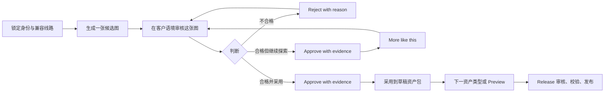

# Character Asset Studio 联合评审方案

更新日期：2026-07-16  
状态：已实施，供产品、运营、设计、研发联合验收  
关联事实来源：[角色图片生成系统](./CHARACTER_IMAGE_GENERATION_SYSTEM.md) · [运营手册](./CHARACTER_ASSET_STUDIO_OPERATIONS_GUIDE.md) · [Authority 技术参考](../architecture/16-character-asset-studio-authority.md)

## 1. 建议结论

采用 **Decision-first Character Asset Studio（以决策为中心的角色资产工作台）** 作为运营创建角色图片资产的默认流程。

它不是一个缩小版通用生图工具，而是一条明确的资产生产线：

1. 系统锁定角色身份、参考集与合格生成路线。
2. 运营只表达本轮创意意图，并从真实候选中做判断。
3. 通过身份审核的候选才能进入角色草稿资产包。
4. 草稿预览与线上角色分离；只有经过审核、校验并发布的 Release 才改变线上角色。

一句话产品原则：

> 让运营决定哪张图最适合用户，而不是要求运营充当模型工程师。

## 2. 为什么这是最重要的运营工作台

角色图片不是内容附件，而是角色产品的视觉身份。它同时影响：

- 用户是否在发现页停下来；
- 用户能否相信这是“同一个角色”；
- 角色详情页是否传达明确人格与氛围；
- 聊天开始前是否已经建立关系感；
- 后续图片生成能否持续复用稳定身份。

因此，运营工作的最小完成单位不是“生成过一批图片”，而是：

> 为一个已锁定身份的角色，完成可审核、可预览、可发布、可追溯的客户资产包。

## 3. 第一性原理

### 3.1 运营真正要完成的 Job

运营人员不是来选择 sampler、workflow、模型版本或权重的。他们的工作是连续回答四个问题：

1. **像不像她？** 身份、年龄感、体型和标志特征是否连续。
2. **适不适合这个位置？** 头像、Hero、聊天场景承担不同客户任务。
3. **用户看到时感觉对不对？** 图片必须放回 discovery、profile、chat 的真实语境评估。
4. **是否值得发布？** 选择必须留下证据，并能在发布前重验。

### 3.2 由此推出的产品约束

| 第一性事实 | 产品约束 |
| --- | --- |
| 身份漂移会破坏角色信任 | 身份与参考图默认锁定，不在主流程里反复调参 |
| 空白 prompt 很难产生稳定结果 | 每个资产类型有可直接生成的默认 brief |
| 运营判断发生在比较结果时 | 主画布围绕候选、审核、变体和采用，而非参数表单 |
| 图片脱离场景时容易误判 | 同屏展示 discovery card、character hero、chat header |
| “好看”不等于“可上线” | 审核通过、草稿采用、Release 发布是三个独立动作 |
| 异步生成会出现部分成功 | 单张候选可用后即可开始审核，不等待整批结束 |
| 生产事故必须可追溯 | 采用时固定 Run、Item、Decision、Asset 的精确 lineage |

## 4. 业界实践与我们的取舍

我们参考的不是某一个页面样式，而是成熟创作工具反复验证的交互模式：

| 业界实践 | 参考 | 对 iDream 的启发 |
| --- | --- | --- |
| 参考图先于复杂文字控制，用视觉输入稳定主体 | [Runway Gen-4 Image References](https://help.runwayml.com/hc/en-us/articles/40042718905875-Creating-with-Gen-4-Image-References) | canonical identity 与 Reference Set 自动进入生成，不要求运营重复上传 |
| 从网格候选中选择、变体、继续探索 | [Midjourney Creating on Web](https://docs.midjourney.com/hc/en-us/articles/33390732264589-Creating-on-Web) | 候选胶片、`More like this` 和批次历史形成连续决策流 |
| 在视觉画布中收集、比较和组合素材 | [Adobe Firefly Boards](https://helpx.adobe.com/firefly/web/create-mood-boards/firefly-boards/add-images.html) | 同屏保留身份参考、候选与客户语境，降低记忆切换 |
| 单图参考可用于保持角色一致性，但需要针对身份结果持续判断 | [Scenario character consistency guide](https://help.scenario.com/articles/5838320337-single-image-character-consistency-ideogram) | 身份审核是显式决策，不把“使用了参考图”等同于“身份已通过” |

我们的关键取舍是：**借鉴创作工具的视觉比较效率，但不复制面向专业创作者的参数复杂度。** iDream 的运营目标是稳定、高吞吐地完成角色资产包，而不是探索无限风格空间。

## 5. 最终体验方案

### 5.1 一条三步资产生产线

| 步骤 | 每次产量 | 客户任务 | 完成条件 |
| --- | ---: | --- | --- |
| Primary portrait | 1 | 发现页识别、角色主头像 | 一张候选身份审核通过并被采用 |
| Character hero | 1 | 角色详情页建立人格和氛围 | 一张宽场景候选审核通过并被采用 |
| Chat moments | 1 | 聊天前建立自然关系感 | 一张聊天语境候选审核通过并被采用 |

每一步都遵循同一个自然循环：

### 5.2 三栏布局的职责

- **左栏：身份事实**。展示 canonical identity、身份描述与 Reference Set，告诉运营系统正在保护什么。
- **中栏：生产与决策**。生成、候选大图、候选胶片、批准、拒绝、变体和最近 Runs 都在一个上下文里完成。
- **右栏：客户语境**。候选实时进入 discovery、hero、chat 预览，运营按用户实际体验判断。

高级 brief 与技术 lineage 默认折叠。它们可查、可调，但不会抢占主任务。

### 5.3 决策语义

| 动作 | 含义 | 是否改变线上角色 |
| --- | --- | --- |
| Generate | 创建一个绑定角色与用途的 Creative Run | 否 |
| More like this | 仅在 active route 可组合 source + canonical references 时，以已通过身份与质量证据门槛的候选作为额外 source 创建单图变体 Run；不支持时明确禁用 | 否 |
| Reject with reason | 记录不通过的审核决策；被拒候选不能作为变体源 | 否 |
| Approve with evidence | 记录 `approved + identityConsistency=passed` 与结构化质量证据 | 否 |
| Select primary/hero/chat | 把精确候选 lineage 写入 Character Project 草稿 | 否 |
| Publish Release | 经独立审核与校验后更新 Serving/live projection | 是 |

“Approve”与“Select”保持分离是刻意设计：审核回答素材是否合格，采用回答这个项目版本是否选择它。

## 6. 为什么不选其他方案

| 方案 | 优点 | 未选原因 |
| --- | --- | --- |
| 通用 prompt + 参数表单 | 灵活、研发复用直接 | 把模型知识转嫁给运营，无法形成角色级连续生产线 |
| 一键自动选图 | 吞吐高 | 无法可靠判断人格、客户语境和审美细节，责任边界不清 |
| 独立素材库后再回角色页 | 素材管理统一 | 角色上下文丢失，跨页面寻找 Run/Asset，容易采用错误素材 |
| 先生成完全部三类再统一审核 | 流程表面整齐 | 等待时间长，部分成功不可立即利用，返工发现过晚 |
| 直接把采用图片写到 live Character | 操作少一步 | 草稿与线上真相混淆，无法安全审核、比较与回滚 |

## 7. 当前实施范围

已经落地：

- Character Workspace 的 `Assets` 专用页签；
- 空白角色与严格可恢复的空 candidate 历史共用首肖像 bootstrap：每次 1 张无参考候选 → 结构化审核 → 原子建立 reviewed identity、Reference Set rev1 与 Primary portrait 草稿；
- `Visual identity` 在缺少受审锚点时只提供返回 Assets 的明确入口，并禁止创建会使流程死锁的纯文字 active identity；
- 三步资产包、默认 brief 与每次单图生成；
- canonical identity / Reference Set / compatible active route 自动应用；
- 角色范围的 Creative Run 查询与异步轮询；
- 单张候选提前审核、拒绝、批准和 `More like this`；
- discovery、hero、chat 客户语境预览；
- 基于 `If-Match` 的草稿资产包采用；
- Release proposal 对三类素材建立 immutable placement manifest；
- 发布前重验素材可用性、角色归属、用途和最新审核权威；
- 权限、审计、活动与 Outbox 证据链。

本方案不改变普通用户 Create / Generate 的产品目标；它是运营生产官方角色资产的专用工作台。

## 8. 上线后经营指标

### 8.1 北极星指标

**Qualified Asset Pack Lead Time**：从该角色首个资产 Creative Run 创建，到三类素材全部被采用的中位时长。

它同时反映生成速度、身份稳定性、候选质量与操作效率，比“生成张数”更接近业务结果。

### 8.2 核心指标

| 指标 | 定义 | 当前数据基础 |
| --- | --- | --- |
| Time to first approved asset | 首次 Run 创建到首个 approved decision | Run + Review Decision 可派生 |
| Asset pack completion rate | 创建过 Run 的角色中，三类草稿资产齐全比例 | Character Project + Run 可派生 |
| Approval yield | approved 候选数 / 已生成候选数 | Run Item + Review Decision 可派生 |
| Variation salvage rate | 发起 More like this 后最终采用的比例 | reference lineage 可派生，建议补专用事件聚合 |
| Operator touches per selected asset | 生成、切换、审核、采用等关键动作数 | 现有 Audit 覆盖后端动作；前端浏览行为需补事件 |
| Cost per selected asset | 被采用素材对应真实 provider 成本 | Generation transport/usage facts 可派生 |
| Release asset validation failure rate | Release 因素材权威失败的比例 | Validation evidence 可派生 |

上线前不为指标猜测目标值。先采集一个受控 beta 周期的基线，再按角色风格、路线和运营人员分层设定 SLO。

## 9. 联合评审检查表

### 产品与运营

- 三类默认资产是否覆盖首发客户表面；
- 默认批量与 brief 是否适合日常吞吐；
- “审核通过”与“项目采用”的双动作是否被运营正确理解；
- Preview 与 Release 的交接是否足够清晰。

### 设计

- 1440px、1024px 和 390px 下主决策是否始终可见；
- 候选状态、当前选择和下一步是否无需阅读说明即可理解；
- 客户语境预览是否足以支持判断，不制造错误的最终页面承诺。

### 研发与数据

- 所有采用动作是否保持 optimistic concurrency；
- 最新 Review Decision 是否是唯一审核权威；
- Release 是否固定并重验精确 lineage；
- 指标是否从权威事实派生，而非依赖 UI 展示状态。

## 10. 验收证据

本批次已完成 Shared/Admin/Main focused tests、完整 monorepo `check` 与测试、
隔离 PostgreSQL migration rehearsal，以及基于最新源码的 Admin/Main HTTP
检查。图片/角色资产 checkpoint `f17a2034` 的隔离 Main/Admin Playwright 9/9
在 1.6 分钟内完成空白角色
bootstrap、Portrait/Hero/Chat 三类素材真实生成/审核/采用、真实 Draft Preview、
immutable QA、strict-v2 Release、public Serving、monitor/rollback 与 receipt
recovery；同时验证 legacy avatar-only Release fail closed 且不进入 publish
写路径。desktop、375px、834px 的键盘、WCAG、overflow 与 console/LCP 门禁均通过。
此后共享 Main/Shared/Chat 仍有改动，当前全仓最终态须统一复跑 build、PM2、
HTTP/数据库与 Playwright；本节只认证该图片/角色资产 checkpoint。完整证据边界见
仓库根目录 [`design-qa.md`](../../design-qa.md)。

checkpoint 后的发布权威复核已追加完成：non-legacy Release 的执行与 Admin DTO
都要求 strict-v2 provenance 和三张不同的 Portrait/Hero/Chat 图片；qualification
触发器改为 deferred transaction-final authority，拒绝 DELETE，并要求 generated
Release 的精确 v2 policy 与完整 nested required route。fresh/upgrade migration
rehearsal、开发库 57/57 + no drift、Main focused 65/65 与 Shared
manifest 7/7 均通过。统一全仓 build/PM2/HTTP/Playwright 仍由最终终验批次复跑。
