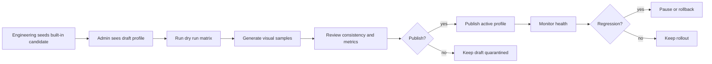
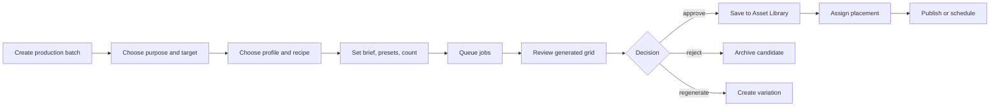
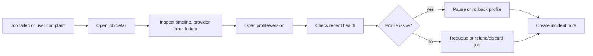
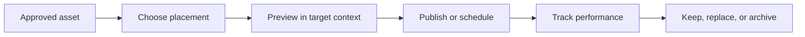

# 图片生成后台运营改造方案

更新日期：2026-06-30

状态：产品设计方案 / 待拆任务执行

适用范围：`/admin` 中图片生成相关的内置 profile 发布、生成任务、供应商健康、运营出图、素材管理和投放流程。

## 1. 结论

当前后台已经具备不少底层能力：model profile 草稿、dry run、test image、publish/rollback、generation job detail、provider health、media asset、gallery 操作等。但这些能力按数据库对象和工程模块拆散了，没有按运营任务组织。

这导致三类割裂：

1. **内置 profile 发布链路不清**：候选 profile、生成测试图、发布、观察健康分散在不同入口，缺少一条可执行的发布链路。
2. **生成配置内部混乱**：profile、prompt template、preset、feature flag、runner 参数、LoRA JSON、文件路径混在一个配置页里，运营人员必须像工程师一样理解底层字段。
3. **运营内容生产缺位**：运营需要批量生成角色图、Feed 图、首页图、SEO 图、活动图，并进行审片、标记、投放、复用；当前只有用户 gallery 和 job 列表，没有平台素材生产和内容管理工作台。

目标不是继续堆字段，而是把后台升级为：

```text
内置生成控制台 + 运营出图工作台 + 平台素材库 + 投放管理 + 排障回滚闭环
```

## 2. 证据与现状

本方案基于以下现有事实：

- `docs/product/ADMIN_CONSOLE_PLAN.md` 已定义后台是控制面，Generation 是 P0 重点。
- `docs/product/CURRENT_FUNCTIONAL_COVERAGE.md` 和 `docs/product-audits/2026-06-30-adversarial-chrome/audit-report.md` 显示本地 beta 流程已覆盖 Generate、Admin Jobs、Provider Health、Chat Ops 等核心面。
- `docs/product-audits/2026-06-29-sdcpp-admin-ops-audit/README.md` 明确指出 sd.cpp 模型导入更像工程控制台，因此不应作为普通运营路径。
- `packages/main/prisma/schema.prisma` 已有 `GenerationModelProfile`、`GenerationPromptTemplate`、`GenerationJob`、`MediaAsset`、`GenerationPreset` 等基础模型。
- `packages/main/src/components/admin/AdminConsoleClient.tsx` 已有 `generation/config`、`generation/jobs`、`ops/providers` 等入口，但没有内容生产和素材投放层；`generation/models` 不再作为产品面入口。

已有能力足够支撑第一阶段改造，缺的是产品信息架构和运营对象模型。

## 3. 第一性原理

图片生成后台的核心目的不是“配置模型”，而是让团队稳定生产和运营图片内容。

从结果倒推，后台需要回答五个问题：

1. **能不能生成**：模型文件、runner、队列、provider 是否健康。
2. **生成得好不好**：某个 profile/template/preset 组合的视觉质量、失败率、延迟、成本如何。
3. **生成给谁用**：角色封面、Feed、首页、SEO、模板封面、活动图、客服补偿、内部测试。
4. **生成后怎么处理**：审片、打标签、批准、丢弃、再生成变体、归档。
5. **投放后有没有价值**：点击、聊天转化、Remix、Like、下载、投诉、失败成本。

因此，后台对象不应只围绕 `model`、`config`、`job`，还应围绕运营任务：

- `Profile`：可发布的生成能力。
- `Recipe`：可复用的 prompt + preset + negative 组合。
- `Batch`：一次运营生产任务。
- `Asset`：可管理、可复用、可投放的图片素材。
- `Placement`：素材被放到产品哪个位置。
- `Metric`：profile、recipe、batch、placement 的表现。

## 4. 用户角色与使用场景

### 4.1 生成平台运维

目标：把工程侧已经登记好的内置 profile 安全上线，能回滚，能排障。

典型任务：

- 查看内置 profile draft 和候选状态。
- 跑 dry run matrix。
- 生成样例图并人工评估。
- 发布到 active 或灰度。
- 观察失败率、延迟、成本。
- 发现问题后一键 pause 或 rollback。

模型文件、VAE、LLM component、LoRA、ComfyUI workflow 和转换产物由工程侧 seed/config
维护，不进入普通 admin 产品路径。

### 4.2 内容运营

目标：生产可投放图片，不关心底层 runner 细节。

典型任务：

- 为新官方角色生成头像和详情页主图。
- 为 Feed 批量生成推荐图。
- 为首页、活动、SEO 页面生成视觉素材。
- 用已发布 profile 和 recipe 生成多张候选图。
- 审片并标记 `approved/rejected/regenerate`。
- 把素材投放到角色、Feed、集合或活动位。
- 根据表现挑选可复用素材。

### 4.3 增长/内容策展

目标：让图片内容服务转化和留存。

典型任务：

- 查看哪些角色封面带来更多点击和 Chat start。
- 对比不同风格 recipe 的转化。
- 管理活动素材、专题集合、首页推荐图。
- 复制高表现素材的 prompt/recipe 做变体。

### 4.4 支持/排障

目标：定位用户投诉和失败任务。

典型任务：

- 用户说生成失败，查看 job timeline、profile、provider error、退款状态。
- 用户对图片不满意，查看来源配置和是否可重试。
- 发现某 profile 失败率升高，转给运维暂停。

## 5. 目标信息架构

建议将后台生成相关入口重组为两个一级工作区。

### 5.1 Generation Ops

面向模型发布、生成配置、排障。

```text
Generation Ops
  ├─ Overview
  ├─ Profiles & Rollout
  ├─ Prompt Recipes
  ├─ Jobs & Incidents
  └─ Provider Health
```

#### Overview

回答“当前生成系统是否健康”。

核心信息：

- 近 24h / 7d 成功率、失败率、blocked、refund。
- P50/P95 延迟。
- dreamcoin 成本。
- active profile 列表和健康状态。
- 异常 profile、异常 provider、积压队列。
- 最近发布和回滚记录。

#### Profiles & Rollout

回答“哪些生成能力正在服务产品，怎么发布和回滚”。

对象：

- Draft profiles。
- Active profiles。
- Archived profiles。
- Rollout state。
- Test jobs。
- Health metrics。

核心动作：

- Run dry run。
- Generate visual samples。
- Publish。
- Pause。
- Rollback。
- Change rollout。

第一阶段不要把 `runnerConfig` 全量字段当作默认表单。默认入口已改为“选择内置模板”：

| 内置模板类型 | 运营看到的字段 | 工程隐藏字段 |
| --- | --- | --- |
| 文生图角色模板 | 名称、用途、默认比例、成本、是否支持角色一致性 seed | diffusion/text encoder/VAE 路径、sampler、scheduler、CFG、backend |
| 参考图角色模板 | 名称、用途、参考图强度、默认比例、成本 | init/ref image 映射、adapter/runtime 组件、backend |
| 高级自定义模板 | 全部字段 | 无隐藏，仅限模型运维 |

`GenerationModelProfile` 作为底层抽象保留，因为它已经能统一 sd.cpp、ComfyUI、external
provider 和未来 LoRA/adapter 服务。需要收敛的是 admin UX：普通运营只发布经过验证的模板，
模型运维才打开完整 runner JSON。

2026-06-30 调整：`Profiles & Rollout` 不再暴露模型库或手动创建 profile 的产品入口。
候选 profile 由工程侧 seed/config 进入后台；运营只负责 dry run、test image、人工一致性
复核、publish/rollback 和监控。API 层也默认关闭手动 profile 创建和底层配置编辑；
只有 `ADMIN_MODEL_DIAGNOSTICS_ENABLED=true` 时才作为工程诊断能力开放。

发布闭环也已接入人工一致性证据：image profile 的 `Publish` 弹窗要求录入已复核样本数、
一致样本数、review URL 和备注，并把 `sampleCount`、`consistencyPassCount`、
`consistencyRate` 写回 `dryRunSummary`。服务端发布时会把这些字段和既有 dry-run 合并，
不会让人工 review 覆盖掉已有 `failureMode`。

内置模板要区分“已发布默认”和“隔离候选”：

- 已跑通的 active/default 仍是 `pornmaster-zimage-turbo`；截图里的主站普通图片生成和
  admin test-job 成功，证明默认 sd.cpp 链路可用，不能和 Redcraft 候选混为一谈。
- Redcraft Krea2 现登记为 ComfyUI/Krea2 fp8 checkpoint candidate，不再建模成
  sd.cpp 文生图模板。历史 sd.cpp 多组参数测试输出为纯白图；官方 Krea2 组件
  `Qwen3VL GGUF + Wan2.1 VAE` 加 `backend=vae=cpu` 能完整退出，但输出仍被 sanity
  guard 判为纯白；25 样本矩阵已覆盖 scheduler、guidance、`mu=1.15`、VAE format、
  GGUF diffusion、`--model`、no diffusion-fa、no offload、CPU backend，成功退出样本
  仍全部纯白；fp8 text encoder safetensors 在 sd.cpp metadata shape validation 失败。
  该 Civitai 文件是 fp8-scaled ComfyUI checkpoint，不是已验证可发布的 sd.cpp 模板；
  ComfyUI GGUF text encoder 不能用普通 `CLIPLoader` 加载，fp8 text encoder 在 MPS
  KSampler 仍报 `Float8_e4m3fn` 不支持；已用仓库内置
  `packages/gen/workflows/redcraft-krea2-comfyui-text.json` 在 ComfyUI `--cpu` 路径跑通
  256x384、2 steps 非退化图；又通过 `serve:comfyui-image` +
  `launch:probe:redcraft-image:local` 走通统一 gen image pipeline 和 blob 写入。它仍保留
  draft candidate，发布前必须补 20 张一致性样本和生产 runner 策略。
- DarkBeast `darkBeastKrea2_dbkleinv2BFS.safetensors` 当前更像 reference/img2img
  runtime 资产，但不是集合里的 Krea 2 version；Civitai `modelVersionId=2740209`
  标为 `Flux.2 Klein 9B`。BFS workflow 实际需要 body/source image + face/identity image
  两张输入、Flux.2 Klein base、Qwen text encoder、Flux2 VAE、head-swap LoRA 与 ComfyUI
  conditioning workflow；当前本机缺 `flux2-vae.safetensors`、base、encoder、LoRA 和
  可导入 workflow；保留 ComfyUI candidate。

上线规则：模板发布按钮必须依赖 dry run + visual sample + 人工一致性 review，不能只因为
模型文件存在或 profile JSON 校验通过就发布。
服务端发布门禁也必须执行同样规则：image profile 要求 `sampleCount>=20`，
`consistencyRate`（或等价人工一致性字段）`>=0.8`，若提供 `successRate` 则必须
`>=0.8`，`dryRunSummary.failureMode` 为空，且 `runnerConfig.verificationStatus`
不能是失败或缺组件状态。非 image profile 保持基础 dry-run 证据门槛。
带 `sourceModelPath`、`convertedModelPath`、`diffusionModelPath`、`modelPath` 或
`workflowPath` 的本地/托管 image profile 还必须显式写入通过态
`runnerConfig.verificationStatus`，不能只靠人工填写 consistency review 发布。

新建 model profile draft 默认 `enabled=false`、`rolloutPercent=0`。只有发布动作会把
profile 切成 `status=active` 并启用；这样后台列表不会把“候选草稿”误读成“可服务模型”。
模型资产不进入运营主路径。普通 Krea2 diffusion、fp8-scaled ComfyUI checkpoint、
LoRA/adapter 等判断由工程侧完成，并以 seed/config 形式生成候选 profile；不能让运营
靠文件名或 metadata 自行创建可发布模板。
dry-run 对所有 runner 都读取 `runnerConfig.verificationStatus` 与 `componentStatus`；
缺组件或失败状态会直接显示为 failed sample，不再只校验 sd.cpp 字段。
候选模型可用 `bun run launch:probe:generation-model-candidates` 做只读审计：默认确认
Pornmaster active/default 可用，Redcraft 不 ready 时仍保持隔离；加 `--require-ready`
则把未通过发布门槛视为命令失败。
Redcraft 的 ComfyUI CPU smoke 另用 `bun run launch:probe:redcraft-comfyui` 复验；该命令
只证明 workflow 能出非退化图，不替代 publish gate。
Redcraft 的统一 pipeline smoke 用 `bun run launch:probe:redcraft-image:local` 复验；该命令
要求本地 `serve:comfyui-image` gateway 已连接 ComfyUI，并证明 gen provider/blob 链路可用，
同样不替代 publish gate。
Redcraft 的 20 张一致性样本已用 `bun run launch:probe:redcraft-consistency:local` 生成到
`.tmp/redcraft-consistency-review`；其中 `manifest.json` 和 `review.html` 可直接用于人工
review。人工 review 的 `sampleCount`、`consistencyPassCount`、`consistencyRate` 才能作为
发布证据。
#### Prompt Recipes

回答“用什么 prompt 结构生产图片”。

对象：

- Character recipe。
- Freeplay recipe。
- Negative recipe。
- Built-in preset。
- Prompt fragment。
- Recipe version。

核心动作：

- 创建/编辑 recipe draft。
- 预览拼接结果。
- 跑 sample matrix。
- 发布/回滚。
- 将 recipe 用于 Production Studio。

#### Jobs & Incidents

回答“哪些任务失败了，如何处理”。

对象：

- GenerationJob。
- Job events。
- Provider error。
- Ledger/refund。
- Source batch。
- Source placement。

核心动作：

- 查看详情。
- Requeue。
- Discard/refund。
- 标记 incident。
- 跳转到相关 profile/batch/asset。

#### Provider Health

回答“底层运行环境是否稳定”。

核心信息：

- provider/runner 成功率、失败率、延迟、成本。
- profile 维度健康。
- 最近错误码。
- 队列积压。
- chat/image/voice 分开展示，但入口一致。

### 5.2 Content Ops

面向运营生产、素材库、投放。

```text
Content Ops
  ├─ Production Studio
  ├─ Asset Library
  ├─ Placements
  └─ Campaigns / Collections
```

#### Production Studio

回答“我要为某个业务目的生成一批图片”。

这是本轮最重要的新增页面。

核心流程：

```text
选择用途 -> 选择目标对象 -> 选择 profile/recipe/preset -> 生成批次 -> 审片 -> 保存/投放
```

用途示例：

- Official character cover。
- Character detail hero。
- Feed recommendation。
- Homepage hero/strip。
- SEO article image。
- Template cover。
- Campaign image。
- Internal model evaluation。

#### Asset Library

回答“平台有哪些可复用图片素材”。

它不同于用户个人 gallery。用户 gallery 是用户私有内容；Asset Library 是平台运营素材池。

`character_chat` purpose 表示“角色聊天可复用素材”：运营在 Production Studio 以 character 为 target 批量预生成图片，在 Asset Library 审核后维护 tags 和 description。聊天侧触发图片请求时，main event consumer 会先用 igrep 检索该角色已 approved/published 的 `character_chat` 素材；高相关命中直接回写 chat attachment completed，未命中才创建新的 chat image generation job。

核心能力：

- 网格/瀑布流浏览。
- 按用途、角色、profile、recipe、状态、标签、尺寸、日期筛选。
- 查看大图、来源 job、prompt 摘要、profile version、recipe version。
- 批量 approve/reject/archive/tag。
- 生成变体。
- 投放到角色、Feed、活动、SEO。

#### Placements

回答“图片现在被用在哪里”。

对象：

- 角色头像。
- 角色详情主图。
- Feed item。
- Community collection。
- 首页模块。
- SEO 页面。
- 活动页。
- 模板封面。

核心能力：

- 查看每个投放位当前图片。
- 替换图片。
- 排期。
- 下线。
- 查看投放表现。

#### Campaigns / Collections

回答“一批内容如何组织和复盘”。

适合后续 P1/P2：

- 情人节活动。
- 新角色上线包。
- 某风格专题。
- SEO 内容包。

## 6. 关键对象模型

### 6.1 现有对象继续保留

| 对象 | 当前用途 | 改造后位置 |
| --- | --- | --- |
| `GenerationModelProfile` | 生成 profile、runner、参数、版本 | Profiles & Rollout |
| `GenerationPromptTemplate` | prompt/negative 模板 | Prompt Recipes |
| `GenerationPreset` | background/pose/outfit/mode preset | Prompt Recipes / Production Studio |
| `GenerationJob` | 异步生成任务 | Jobs & Incidents，Batch item 来源 |
| `MediaAsset` | 生成结果资产 | Asset Library 基础对象 |
| `MediaCollection` | 用户/集合关系 | Campaigns/Collections 可复用或扩展 |

### 6.2 建议新增对象

#### ContentProductionBatch

一次运营生成批次。

建议字段：

| 字段 | 说明 |
| --- | --- |
| `id` | 批次 ID |
| `title` | 批次名称 |
| `purpose` | `character_cover` / `character_hero` / `character_chat` / `feed` / `homepage` / `seo` / `template_cover` / `campaign` / `model_eval` |
| `targetType` | `character` / `route_page` / `campaign` / `template` / `none` |
| `targetId` | 目标对象 ID |
| `profileId` | 使用的 profile |
| `profileVersion` | 固化版本 |
| `recipeId` | 使用的 prompt recipe |
| `recipeVersion` | 固化版本 |
| `presetIds` | preset 组合 |
| `brief` | 运营 brief |
| `status` | `draft` / `queued` / `reviewing` / `completed` / `archived` |
| `createdById` | 创建人 |
| `createdAt` / `updatedAt` | 时间 |

#### ContentProductionItem

批次内的候选图。

建议字段：

| 字段 | 说明 |
| --- | --- |
| `id` | item ID |
| `batchId` | 所属批次 |
| `jobId` | 来源 generation job |
| `mediaAssetId` | 生成后的 asset |
| `status` | `queued` / `generated` / `approved` / `rejected` / `regenerate_requested` / `published` |
| `reviewNote` | 运营审片备注 |
| `rating` | 可选 1-5 分 |
| `tags` | 运营标签 |
| `createdAt` / `updatedAt` | 时间 |

#### MediaAssetPlacement

素材投放记录。

建议字段：

| 字段 | 说明 |
| --- | --- |
| `id` | placement ID |
| `mediaAssetId` | 被投放素材 |
| `slot` | `character_avatar` / `character_hero` / `feed_card` / `homepage_strip` / `seo_article` / `template_cover` / `campaign` |
| `targetType` | 目标类型 |
| `targetId` | 目标 ID |
| `status` | `draft` / `scheduled` / `published` / `paused` / `archived` |
| `scheduledAt` | 排期 |
| `publishedAt` | 发布时间 |
| `createdById` | 操作人 |
| `metadata` | slot-specific 配置 |

#### GenerationProfileMetricSnapshot

profile/version 聚合健康快照。

建议字段：

| 字段 | 说明 |
| --- | --- |
| `profileId` | profile |
| `profileVersion` | version |
| `windowStart` / `windowEnd` | 时间窗 |
| `totalJobs` | 总任务 |
| `completedJobs` | 完成 |
| `failedJobs` | 失败 |
| `blockedJobs` | 拦截 |
| `refundedJobs` | 退款 |
| `successRate` | 成功率 |
| `latencyP50Ms` / `latencyP95Ms` | 延迟 |
| `costDreamcoins` | 成本 |

第一阶段也可以先不加快照表，直接用 job 聚合；等数据量变大再落表。

## 7. 核心流程设计

### 7.1 内置 profile 发布流程



界面要求：

- 候选 draft 来自工程 seed/config，不在 admin 里手动创建。
- `Run Dry Run`、`Generate Samples`、`Publish` 是同一条主线的连续 CTA。
- Publish 前必须展示 readiness checklist。
- 每次 publish 记录 reason、dry run summary、sample job、previous active。
- Active profile 的详情页展示 `Rollback to vN`。

### 7.2 运营批量出图流程



界面要求：

- 运营默认只看到业务字段：用途、目标、brief、风格、数量。
- profile/recipe 用可读名称，不显示 runner path。
- 成本和预计耗时在提交前可见。
- 生成结果以图片网格呈现，不以 job 表格呈现。
- 支持批量 approve/reject/tag/assign。

### 7.3 失败排障流程



界面要求：

- Job detail 必须能跳转到 profile detail、source batch、asset、placement。
- Provider error 不只显示 JSON，要展示错误分类和建议动作。
- 如果同 profile 近 30 分钟失败率异常，job detail 顶部提示。

### 7.4 素材投放流程



界面要求：

- 投放前预览目标上下文，例如角色卡、Feed 卡、SEO 图。
- 每个 asset 展示当前使用位置。
- 替换角色头像时保留历史记录。
- 支持一图多投放，但必须知道所有使用位置。

## 8. 页面级设计

### 8.1 Generation Ops / Overview

首屏模块：

- Health score：success rate、P95 latency、failed jobs、refund。
- Active profiles：每个 profile 一行，展示版本、rollout、成功率、失败率、最近错误。
- Incidents：最近异常 profile/provider/job。
- Recent releases：最近 publish/rollback。
- Queue status：queued/running/stale。

主操作：

- `Run profile readiness`
- `Open production studio`
- `View failed jobs`

### 8.2 No Model Library Product Surface

不提供普通 admin 模型库页面。模型资产、组件路径、转换产物和 workflow 归工程配置管理，
后台只消费已经 seed 出来的 built-in profile。

```text
Old /admin/generation/models -> Profiles & Rollout
Hidden diagnostics API -> engineering only
Operator action -> test, review, publish, rollback seeded profiles
```

必须避免：

- 模型文件路径成为运营主对象。
- 让 LoRA JSON 或 runner component 成为主操作。
- 因文件存在就暗示 profile 可发布。

### 8.3 Profiles & Rollout

布局：

```text
Tabs:
  Drafts | Active | Archived | Releases

Profile detail:
  Header: name, status, version, mode, runner, rollout
  Left: configuration summary
  Middle: samples and recent jobs
  Right: readiness checklist
  Tabs: Config / Samples / Jobs / Metrics / History
```

Readiness checklist：

- Main model selected。
- Required component valid。
- LoRA stack valid。
- Orientation valid。
- Cost multiplier valid。
- Dry run passed。
- Test image completed。
- No recent fatal job for same draft。

发布条件：

- draft 状态。
- dry run passed。
- 至少一个 test image completed。
- 必须输入 reason。
- 发布后 previous active 自动 archived。

### 8.4 Prompt Recipes

当前 `GenerationPromptTemplate` 太技术化。建议运营界面改名为 Prompt Recipes。

页面结构：

- Recipes list：Character / Freeplay / Negative / Campaign。
- Recipe editor：
  - System blocks。
  - Character blocks。
  - User brief slot。
  - Preset order。
  - Negative base。
  - Preview compiled prompt。
  - Sample matrix。
- Version history。

第一阶段可以继续写入 `GenerationPromptTemplate`，只是 UI 改成 recipe 心智。

### 8.5 Production Studio

这是新增核心页面。

首屏：

```text
Create production batch

Purpose:
  Character cover
  Feed card
  Homepage
  SEO image
  Template cover
  Campaign
  Model evaluation

Target:
  Search character / route / campaign

Generation setup:
  Profile
  Recipe
  Presets
  Orientation
  Count
  Brief

Cost preview:
  estimated dreamcoins
  expected jobs
  expected dimensions

Primary CTA:
  Generate batch
```

结果区：

```text
Batch header:
  status, completed/total, failed, cost, profile, recipe

Review grid:
  image
  status
  approve / reject / regenerate
  tag
  assign

Bulk action bar:
  approve selected
  reject selected
  tag selected
  assign selected
```

### 8.6 Asset Library

筛选：

- Status：approved / draft / published / archived / rejected。
- Purpose。
- Placement。
- Character。
- Profile。
- Recipe。
- Date。
- Tags。
- Size/orientation。

资产卡：

- 图片。
- 状态 badge。
- 关联目标。
- profile/version。
- quick actions：view、assign、archive、regenerate。

详情抽屉：

- 大图。
- Source job。
- Source batch。
- Prompt 摘要。
- Profile/template/preset。
- Current placements。
- Timeline。

### 8.7 Placements

列表维度：

- Slot。
- Target。
- Current asset。
- Status。
- Performance。
- Updated by。
- Updated at。

详情：

- 当前投放预览。
- 历史素材。
- 替换操作。
- 排期。
- 下线。

## 9. 权限与角色

建议权限拆分：

| 权限 | 用途 |
| --- | --- |
| `generation.profile.read` | 查看内置 profile、draft、发布历史 |
| `generation.profile.write` | 编辑运营字段、dry run 备注和测试配置 |
| `generation.profile.publish` | 发布/回滚 profile |
| `generation.recipe.write` | 创建/编辑 prompt recipe |
| `content.production.write` | 创建运营生成批次 |
| `content.asset.read` | 查看平台素材库 |
| `content.asset.review` | approve/reject/tag 素材 |
| `content.placement.write` | 投放/替换/下线素材 |
| `generation.job.requeue` | 任务重试 |
| `ops.provider.read` | 查看 provider health |

角色建议：

| 角色 | 主要能力 |
| --- | --- |
| admin | 全部 |
| ops | Profiles & Rollout、Jobs、Provider Health、Profile pause/rollback |
| content_ops | Production Studio、Asset Library、Placements |
| analyst | 只读指标 |
| support | 只读 job 摘要和用户相关任务 |

## 10. 实施计划

### Phase 0：命名和入口整理

目标：降低认知负担，不改数据模型。

任务：

- 将 `/admin/generation/models` 从侧边栏移除，旧路径落到 `Profiles & Rollout`。
- 将 `/admin/generation/config` 命名为 `Profiles & Rollout`。
- 将 prompt template UI 文案改为 `Prompt Recipes`。
- 侧边栏分组为 `Generation Ops` 和 `Content Ops`。
- 在 Profiles & Rollout 顶部明确流程：Seeded profile -> Dry run -> Test image -> Publish -> Monitor。

验收：

- 新操作员能从侧边栏判断发布配置、看任务、生产素材分别在哪里。
- profile draft 列表中的下一步 CTA 明确指向 dry run/test image。

### Phase 1：Profile 发布工作台

目标：把内置 profile 验证、发布、回滚串成闭环。

任务：

- Profile detail 页面。
- Readiness checklist。
- Test image grid。
- 发布前 summary。
- Job/profile 双向跳转。
- Profile health 聚合。
- Rollback CTA 在 active profile detail 中显性展示。

验收：

- 从导入一个模型到发布 active profile，全程不需要跳到表格底部找按钮。
- 发布前能看到 dry run 和测试图。
- 某 profile 失败后能从 job detail 跳回 profile 并 rollback。

### Phase 2：Production Studio MVP

目标：补齐运营出图。

任务：

- 新增 `ContentProductionBatch` / `ContentProductionItem`，或先用 `GenerationJob.sourceType/sourceId/sourceMeta` 轻量承载。
- 新增 `/admin/content/production` 页面。
- 支持选择 purpose、target、profile、recipe、preset、count、brief。
- 批量创建 admin zero-cost 或 ops-cost generation jobs。
- 结果以 review grid 展示。
- 支持 approve/reject/regenerate。
- approved item 进入 Asset Library。

验收：

- 运营可以为一个角色生成 8 张候选封面，批准 1 张，保存为素材。
- 失败任务能在同批次里重试或跳转 job detail。
- 批次能看到总成本、完成数、失败数。

### Phase 3：Asset Library MVP

目标：平台素材可管理、可复用。

任务：

- 新增 `/admin/content/assets`。
- 以 `MediaAsset` 为基础增加平台素材状态和标签。
- 支持筛选、详情抽屉、批量 tag/archive。
- 支持从 asset 跳到 source job/batch/profile。

验收：

- 运营能找到某个角色所有候选图。
- 运营能筛选某个 profile 生成的 approved 图。
- 素材详情能说明它来自哪个 job 和配置版本。

### Phase 4：Placements MVP

目标：图片投放可追溯。

任务：

- 新增 `MediaAssetPlacement`。
- 支持将 approved asset 设置为角色头像/角色详情主图/Feed card/模板封面。
- 记录历史投放。
- 角色页面读取 placement 或同步回 `Character.imageAssetId`。

验收：

- 替换角色图有历史记录。
- 一个 asset 能显示当前被哪些位置使用。
- 下线某素材时能看到影响范围。

### Phase 5：指标回流

目标：从“能生产”走向“生产有效内容”。

任务：

- profile/version 健康快照。
- placement 表现数据。
- asset 表现：view、click、chat start、like、remix。
- recipe/profile 对比。

验收：

- 能回答哪个 profile 的图片更容易带来角色点击。
- 能回答哪个 recipe 的 Feed 图表现更好。
- 能基于异常指标发起 rollback 或重新生成。

## 11. 技术落地建议

### 11.1 后端

优先复用现有结构：

- `GenerationJob.sourceType/sourceId/sourceMeta` 可先承载 `production_batch` 来源。
- `MediaAsset.metadata` 可先存 tags、purpose、review 状态。
- `AdminAuditLog` 继续记录发布、审片、投放动作。
- `GenerationModelProfile.dryRunSummary` 继续承载 dry run 结果。

需要新增一等表时，优先顺序：

1. `ContentProductionBatch`
2. `ContentProductionItem`
3. `MediaAssetPlacement`
4. `GenerationProfileMetricSnapshot`

### 11.2 前端

现有 `AdminConsoleClient.tsx` 已过大，应逐步拆分：

```text
components/admin/generation/
  ModelLibraryView.tsx
  ProfilesRolloutView.tsx
  ProfileDetailView.tsx
  PromptRecipesView.tsx
  JobsIncidentsView.tsx
  ProviderHealthView.tsx

components/admin/content-ops/
  ProductionStudioView.tsx
  AssetLibraryView.tsx
  PlacementsView.tsx
```

每个页面内部遵守同一模式：

- Header：当前任务和主 CTA。
- Metrics：少量关键指标。
- Workbench：真正操作区。
- Detail drawer：复杂信息。
- Audit-aware action modal：高风险写操作。

### 11.3 API

建议新增或重组：

```text
GET  /api/v1/admin/generation/overview
GET  /api/v1/admin/generation/assets
POST /api/v1/admin/generation/assets/validate
POST /api/v1/admin/generation/assets/import

GET  /api/v1/admin/generation/profiles
GET  /api/v1/admin/generation/profiles/:id
POST /api/v1/admin/generation/profiles/:id/dry-run
POST /api/v1/admin/generation/profiles/:id/test-jobs
POST /api/v1/admin/generation/profiles/:id/publish
POST /api/v1/admin/generation/profiles/:id/rollback

GET  /api/v1/admin/content/production/batches
POST /api/v1/admin/content/production/batches
GET  /api/v1/admin/content/production/batches/:id
POST /api/v1/admin/content/production/items/:id/approve
POST /api/v1/admin/content/production/items/:id/reject
POST /api/v1/admin/content/production/items/:id/regenerate

GET  /api/v1/admin/content/assets
GET  /api/v1/admin/content/assets/:id
PATCH /api/v1/admin/content/assets/:id
POST /api/v1/admin/content/assets/bulk

GET  /api/v1/admin/content/placements
POST /api/v1/admin/content/placements
PATCH /api/v1/admin/content/placements/:id
```

第一阶段可以把这些 handler 仍放在 `modules/admin/service.ts`，但组件和 DTO 先按新边界命名，后续再拆 service。

## 12. 非目标

本方案不要求第一阶段完成：

- 视频运营工作台。
- 自动评分模型。
- 完整 A/B 实验平台。
- 外部 DAM 系统。
- 多租户素材权限。
- 复杂 campaign budget。

第一阶段只解决“运营能按业务目的生成、筛选、保存、投放图片”。

## 13. 对抗性审查

### 13.1 如果只优化 Generation Config，会失败

原因：运营不是来配置模型字段的。即使表单更漂亮，仍然无法完成批量出图、审片、素材复用和投放。

结论：必须新增 Production Studio 和 Asset Library。

### 13.2 如果只新增素材库，不串 profile，会失败

原因：素材质量问题最终要追溯到 profile/template/preset/job。如果素材库只存图片，不存来源版本，后续无法复盘和回滚。

结论：Asset 必须保留 source job、profile version、recipe version。

### 13.3 如果模型发布不要求测试图，会失败

原因：dry run 只能证明配置形状正确，不能证明视觉结果可用。

结论：Publish 前至少要有一组 completed test image，并在发布确认里展示。

### 13.4 如果把 raw JSON 留在主路径，会失败

原因：运营会误编辑，工程师也难以判断 UI 字段和 JSON 谁是准的。

结论：主路径使用结构化表单；raw JSON 只放 Advanced，并显示“覆盖范围”和校验状态。

### 13.5 如果任务列表继续做成纯表格，会失败

原因：运营决策对象是图片，不是 job ID。表格适合排障，不适合审片。

结论：Production Studio 和 Asset Library 必须图片优先，表格只用于 Jobs & Incidents。

### 13.6 如果投放没有历史，会失败

原因：替换角色图、Feed 图、活动图后，团队无法知道某张图是否仍在使用，也无法回滚。

结论：需要 `MediaAssetPlacement` 或等价历史记录。

## 14. 推荐优先级

最小可交付顺序：

1. **Profiles & Rollout 重构**：先把内置 profile 验证到发布串起来。
2. **Production Studio MVP**：让运营能创建批次并审图。
3. **Asset Library MVP**：让 approved 图片可查、可复用。
4. **Placements MVP**：让图片投放可追溯。
5. **Metrics 回流**：让团队知道哪些图片有效。

不建议优先做：

- 更多 runner 字段。
- 更复杂的 LoRA JSON 编辑器。
- 大而全的 dashboard。
- 先做 campaign，而没有 asset/placement 基础。

## 15. 验收标准

整体改造完成后，后台应能完成以下端到端任务。

### Profile 发布验收

1. 工程侧 seed 一个 draft candidate。
2. 在 Profiles & Rollout 看到 draft readiness。
3. 跑 dry run。
4. 生成测试图。
5. 录入人工一致性 review 并发布 active profile。
6. 从 profile detail 看到 test image、recent jobs、health。
7. 制造失败后可从 job detail 跳回 profile 并 rollback。

### 运营出图验收

1. 为一个官方角色创建 production batch。
2. 选择 active profile 和 character cover recipe。
3. 生成 8 张候选图。
4. 批量批准 2 张、拒绝 6 张。
5. 将 1 张设为角色封面。
6. 在 Asset Library 查到这张图。
7. 在 Placements 查到它被用于该角色。

### 排障验收

1. 找到某个 failed job。
2. 查看 provider error、timeline、ledger/refund。
3. 查看 source batch 和 profile。
4. 执行 requeue 或 discard。
5. 操作进入 audit log。

### 素材追溯验收

1. 打开任意平台素材。
2. 能看到来源 batch、job、profile version、recipe version、prompt 摘要。
3. 能看到当前 placements。
4. 能 archive 素材，并看到受影响投放位。

## 16. 文案与命名建议

推荐命名：

| 当前 | 建议 |
| --- | --- |
| Generation Config | Profiles & Rollout |
| Model Management | Engineering-only diagnostics |
| Prompt Templates | Prompt Recipes |
| Generation Jobs | Jobs & Incidents |
| Provider Health | Provider Health |
| Built-in Presets | Preset Library |
| Test Image | Generate Sample |

运营状态命名：

| 状态 | 含义 |
| --- | --- |
| `draft` | 还在准备 |
| `queued` | 已提交生成 |
| `reviewing` | 等待审片 |
| `approved` | 可投放 |
| `rejected` | 不使用 |
| `published` | 已投放 |
| `archived` | 已归档 |

## 17. 设计原则清单

后续实现时用这份清单做自检：

- 主流程按任务组织，不按表组织。
- 图片运营页面必须图片优先，不以 job ID 优先。
- 模型发布必须有 dry run + sample image + rollback。
- 素材必须能追溯到 job/profile/recipe。
- 投放必须有历史。
- 原始路径和 JSON 不进入默认视线。
- 高风险动作必须有 reason 和 audit。
- 列表页解决查找，详情页解决决策，工作台解决连续任务。
