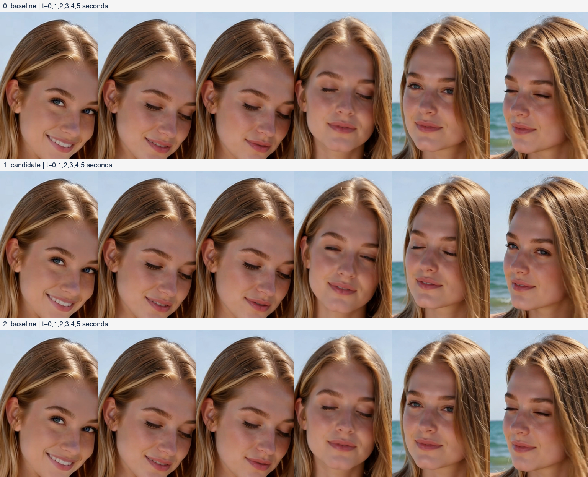

<!-- Page 1 -->
iDream / Technical research / 2026-09-05
Local A/B/A evidence; DiffSynth integration remains blocked
1
结论：不采用 DiffSynth，研究收尾
DiffSynth-Studio × RedGraft LTX 2.5
深入研究与真实视频验证 · 2026-09-05 · iDream 技术决策
当前 DiffSynth 不能直接接入现有 RedGraft LTX 2.5；把文件改成 INT4 也没有得到加速证明。 本轮进一
步验证了更直接的办法：保留现有混合量化权重，在隔离的 ComfyUI 进程中替换 MPS Linear 计算。已完
成原规格的基线→BF16 候选→基线三条完整视频。按用户最终决定，不接入 DiffSynth、不制作新 INT4 文
件，也不部署任何实验补丁。
对照
完整工作流
两阶段采样
基线 A1
16分45.2秒
732.7 秒
BF16 候选 B
14分38.0秒
588.0 秒
基线 A2
18分16.9秒
773.8 秒
BF16 候选 B 相对两次基线的整段耗时降低 12.66%–19.96%。这是本机、单一输入与提示词、插桩 A/B/A 
的观测结果，不是所有场景的速度承诺。所有视频均为 768×1152、121 帧、24 fps，保留 8+3 步、2× 
latent 放大及音频。
问题
经过验证的回答
现有模型是否纯 INT8？
不是。609 个 W4A8 层与 831 个 INT8 层已经混合。
本次是否做出了新 INT4 文件？
没有。候选继续读取原来的同一文件；改变的是计算路径。
DiffSynth 原样能完整使用吗？
不能；模型识别、W4A8 解析、Gemma4 配套均有缺口。
BF16 候选是否无损？
不是。移除 A8 量化并改用 BF16 GEMM，会改变数值与视频细节。
后续 PR107 原生 INT8 的算子测试与基础采样已得到局部一致性证据；其完整视频回放在用户要求收尾后
主动停止，不计为成功视频，也不继续扩展研究。现有服务继续使用原有实现。

| 对照 | 完整工作流 | 两阶段采样 |
| --- | --- | --- |
| 基线A1 | 16分452秒 . | 7327秒 . |
| BF16候选B | 14分380秒 . | 5880秒 . |
| 基线A2 | 18分169秒 . | 7738秒 . |

| 问题 | 经过验证的回答 |
| --- | --- |
| 现有模型是否纯INT8？ | 不是 609个W4A8层与831个INT8层已经混合 。 。 |
| 本次是否做出了新INT4文件？ | 没有 。候选继续读取原来的同 一文件；改变的是计算路径 。 |
| DiffSynth原样能完整使用吗？ | 不能；模型识别 、W4A8 解析 、Gemma4 配套均有缺口 。 |
| BF16候选是否无损？ | 不是 移除A8量化并改用BF16GEMM 会改变数值与视频细节 。 ， 。 |

---

<!-- Page 2 -->
iDream / Technical research / 2026-09-05
Local A/B/A evidence; DiffSynth integration remains blocked
2
真实模型与接入阻塞
文件名不能代表实际精度
当前工作流 modelId 中含 int8-convrot，但读取 safetensors 的每一个 comfy_quant Tensor 后确认：DiT
文件 17.026 GB，包含下面两种格式。GB 为十进制；表中“附加数据”包含 scale、码本和量化 marker。
格式
层数
逻辑参数量
权重数据
附加数据
asym_w4a8_int8
609
10.272 B
5.136 GB
0.652 GB
int8_tensorwise
831
10.263 B
10.263 GB
0.011 GB
其余 Tensor
—
—
0.963 GB
—
如果仅把余下 INT8 的裸权重减为四位，理论减少约 5.132 GB，即当前整个 DiT 文件的约 30%；新的分组
 scale 和其他开销尚未计入。该估算不包含文本编码器、VAE、激活或运行缓存，不能称为总内存减半。
配套 Gemma4 encoder 文件 15.373 GB，328 个 int8_tensorwise 层。Comfy 完整工作流使用原有完整编
码器；本轮没有更换或量化文本编码器做对照。原始同版本 RedGraft BF16/FP16 的公开可得性未确认：
Civitai 第一方接口返回 403，未将基础 LTX 或历史 2.3 权重当作替代。
真实 DiffSynth API 复现的失败
验证点
结果
ModelPool.auto_load_model(DiT)
Cannot detect the model type；shape hash
5fcfacf2b605dcbdff5117346c9cbcf9。
ModelPool.auto_load_model(enco
der)
Cannot detect the model type；shape hash
4743ded7a5725b6589bccdb62512723b。
读取真实 W4A8 marker
ValueError：asym_w4a8_int8 不在支持列表。相同 parser 接受真实 INT8
marker。
save_quantized_model(... INT4)
同样在模型识别阶段失败，没有输出候选模型文件。
自动识别依赖已登记的权重键／形状 hash；修改登记仍不能补齐格式实现。当前 Comfy backend 只解析 
int8_tensorwise 和 float8_e4m3fn。来源：DiffSynth checkpoint auto loader；DiffSynth Comfy quant 
backend。
DiffSynth LTX encoder 继承 Gemma3ForConditionalGeneration，而 LTX 2.5 官方要求配套微调的 
Gemma4。不能把只改类名、换普通 Gemma 聊天模型或跳过未知权重当作有效适配。来源：DiffSynth 
LTX support and encoder；LTX 2.5 official configuration reference。

| 格式 | 层数 | 逻辑参数量 | 权重数据 | 附加数据 |
| --- | --- | --- | --- | --- |
| asym w4a8 int8 _ _ | 609 | 10272B . | 5136GB . | 0652GB . |
| int8 tensorwise _ | 831 | 10263B . | 10263GB . | 0011GB . |
| 其余Tensor | — | — | 0963GB . | — |

| 验证点 | 结果 |
| --- | --- |
| ModelPoolauto load model(DiT) . _ _ | Cannotdetectthemodeltype；shapehash |
|  | 5fcfacf2b605dcbdff5117346c9cbcf9 。 |
| ModelPoolauto load model(enco . _ _ | Cannotdetectthemodeltype；shapehash |
| der) | 4743ded7a5725b6589bccdb62512723b 。 |
| 读取真实W4A8marker | ValueError：asym _w4a8 _int8 不在支持列表 。相同 parser 接受真实 INT8 |
|  | marker。 |
| save quantized model( INT4) _ _ ... | 同样在模型识别阶段失败 没有输出候选模型文件 ， 。 |

---

<!-- Page 3 -->
iDream / Technical research / 2026-09-05
Local A/B/A evidence; DiffSynth integration remains blocked
3
INT4、NF4 与真实执行路径
INT4 是整数四位编码；NF4 是带非均匀码本的四位编码；NVFP4 是另一种浮点格式。文件同为 
safetensors，不代表权重布局、scale、旋转规则及算子可以互换。DiffSynth 的 torchao INT4、
bitsandbytes NF4、Comfy ConvRot 分属不同 backend。来源：DiffSynth quantization API。
两个 torchao 版本都实际执行了配置入口
隔离安装 torchao 0.18.0，以及文档最低版本 0.16.0；使用本机 torch 2.13.0、MPS、BF16 Linear。两者
得到相同失败类型：
配置
实际结果
默认 plain
ImportError：Requires mslk >= 1.0.0。
tile_packed_to_4d
AssertionError：Torch not compiled with CUDA enabled。
plain_int32
NotImplementedError：不支持 mps 设备。
version=1
AssertionError：实现要求 version == 2，不能借该参数恢复旧路径。
这些结论针对所测配置入口，不代表 torchao 的所有低层 API 都不能使用 MPS。保留的 legacy layout 可
构造另一条路径；本轮已直接测试最终的 PyTorch 原生 MPS pack/mm 算子，确认它确实存在。来源：
torchao v0.18 INT4 configuration；torchao v0.16 INT4 configuration；PyTorch MPS quantized 
operations。
NF4 的能力和边界
DiffSynth NF4 层量化与 MPS forward 成功；CPU 上完成量化→safetensors 保存→严格重载→forward，对
照输出逐值相等，文件 36,170 bytes。这是一个 256×256 Linear 的序列化闭环，不是完整 LTX 模型导出。
bitsandbytes 0.50.2 在 M>1 时执行解量化后 F.linear；M=1 才可用 fused GEMV。本轮实际加载可选 
bitsandbytes-mps Metal 模块，并额外绕过分派直接测试其 linear_4bit/GEMM；大 M 下未得到相对 BF16 
的显著收益。来源：bitsandbytes 0.50.2 MPS dispatch；bitsandbytes MPS optional Metal kernel。
一次离线重放暴露出额外边界：下载过的 kernel 仍可能因 version=1 的离线版本解析失败而被 bnb 静默退
回普通 MPS 实现。报告保留该失败，最终性能表来自明确记录 loaded=true 的在线版本解析／已下载内核
运行。

| 配置 | 实际结果 |
| --- | --- |
| 默认plain | ImportError：Requires mslk >= 1 .0 .0 。 |
| tile packed to 4d _ _ _ | AssertionError：Torch not compiled with CUDA enabled 。 |
| plain int32 _ | NotImplementedError：不支持 mps 设备 。 |
| version=1 | AssertionError：实现要求 version == 2 ，不能借该参数恢复旧路径 。 |

---

<!-- Page 4 -->
iDream / Technical research / 2026-09-05
Local A/B/A evidence; DiffSynth integration remains blocked
4
每次解码计入之后，还能快多少
真实量化 Linear 的时间应包含每次权重展开、FP8 group scale 解码、旋转、activation 量化、matmul 与
缩放。上一轮预先解码的 BF16 结果只是计算阶段的参考下限，不能当作候选的完整成本。
本轮使用原始 FP8 s_rel 存储与现有 tensor_to_fp8 patch；对真实 attention 和 FFN 权重进行 2 次预热、6
次交替同步测量。下表为完整单次调用中位数，单位毫秒；input 是合成数据。
层 / M
当前路径
旋转基底 BF16
用时比 A/B
audio_attn2.to_k / 1
1.33
1.37
0.97×
audio_attn2.to_k / 1024
1.93
1.35
1.43×
audio_attn2.to_k / 3456
4.95
3.37
1.47×
attn1.to_q / 1024
9.06
8.46
1.07×
attn1.to_q / 3456
18.73
15.67
1.20×
ff.net.0.proj / 1024
35.35
34.01
1.04×
ff.net.0.proj / 3456
125.79
111.81
1.12×
ff.net.2 / 1024
39.77
37.03
1.07×
ff.net.2 / 3456
138.77
128.77
1.08×
video_to_audio_attn.to_v / 1024
4.06
3.29
1.24×
video_to_audio_attn.to_v / 3456
10.77
8.29
1.30×
候选沿用 kitchen 的 nibble→真实 codebook→s_rel→round/clamp INT8 grid 解码，保留 s_channel；旋转在
activation 上完成，每次展开浮点权重后执行 BF16 Linear，没有保留全模型 BF16 缓存。含 correction 的
W4A8 分支沿用原实现。
现有路径在 MPS 上将 INT8 matmul 转成 FP32 matmul，并产生 INT32 中间输出；候选去掉动态 A8 量化
，改变缩放与舍入顺序。因此它是数值近似的执行优化，不是 bit-exact 替换。来源：Comfy Kitchen INT8 
and W4A8 eager implementation；Comfy Kitchen PR107 MPS INT8 proposal。

| 层/M | 当前路径 | 旋转基底BF16 | 用时比A/B |
| --- | --- | --- | --- |
| audio attn2to k/1 _ . _ | 133 . | 137 . | 097× . |
| audio attn2to k/1024 _ . _ | 193 . | 135 . | 143× . |
| audio attn2to k/3456 _ . _ | 495 . | 337 . | 147× . |
| attn1to q/1024 . _ | 906 . | 846 . | 107× . |
| attn1to q/3456 . _ | 1873 . | 1567 . | 120× . |
| ffnet0proj/1024 . . . | 3535 . | 3401 . | 104× . |
| ffnet0proj/3456 . . . | 12579 . | 11181 . | 112× . |
| ffnet2/1024 . . | 3977 . | 3703 . | 107× . |
| ffnet2/3456 . . | 13877 . | 12877 . | 108× . |
| video to audio attnto v/1024 _ _ _ . _ | 406 . | 329 . | 124× . |
| video to audio attnto v/3456 _ _ _ . _ | 1077 . | 829 . | 130× . |

---

<!-- Page 5 -->
iDream / Technical research / 2026-09-05
Local A/B/A evidence; DiffSynth integration remains blocked
5
真实 activation 下的量化误差
从基线抓取 5 个真实 Linear：block 0 的视频 Q、音频 K、FFN 收缩层，以及 block 24/47 的视频 Q；覆盖
第 1、4、8、9、11 次调用，共 25 组。基础阶段视频 M=3456，放大阶段 M=13824；音频
cross-attention K 的 M=1024。每组最多均匀取 256 行，比较捕获输入上的层级重算误差；行数变化可能
改变 matmul 分派／舍入，它不是原完整 forward 的逐层输出误差，也不用来外推速度。
计算方式
最低 L2 误差
中位 L2 误差
最高 L2 误差
当前 A8 路径
0.289%
0.546%
0.581%
保留存储 / BF16
0.171%
0.261%
0.266%
再次 affine INT4
1.992%
5.407%
7.451%
再次 DiffSynth NF4
2.176%
4.864%
5.442%
参考为同一量化 checkpoint 精确解码后的 FP32 权重与 FP32 Linear，包含原有 bias；它不是训练时的原
始 BF16。上述百分比衡量额外计算／再次量化的误差，不等于最终视觉劣化百分比。
native INT4 先从重建 BF16 做 group-128 affine 量化，再直接使用 PyTorch MPS pack/mm；NF4 使用
DiffSynth 的实际 QuantizeConfig。完整视频候选保持原有权重，不经过这两次量化。因此完整视频成功不
能证明 INT4/NF4 模型质量已经通过。
视频 Q / M
BF16 计算参考
原生 MPS INT4
DiffSynth NF4
3456
8.19 ms
47.41 ms
8.88 ms
13824
34.55 ms
199.59 ms
33.03 ms
以上保留上一轮真实权重微基准，用于说明存在 INT4 算子与获得速度收益是两件事。量化和预解码不在计
时内；NF4 的 M>1 路径内部有解码。旧 current_comfy 比较还预展开了 FP8 group scales，不能替代本轮
完整每调用和工作流证据。

| 计算方式 | 最低L2误差 | 中位L2误差 | 最高L2误差 |
| --- | --- | --- | --- |
| 当前A8路径 | 0289% . | 0546% . | 0581% . |
| 保留存储/BF16 | 0171% . | 0261% . | 0266% . |
| 再次affineINT4 | 1992% . | 5407% . | 7451% . |
| 再次DiffSynthNF4 | 2176% . | 4864% . | 5442% . |

| 视频Q/M | BF16计算参考 | 原生MPSINT4 | DiffSynthNF4 |
| --- | --- | --- | --- |
| 3456 | 819ms . | 4741ms . | 888ms . |
| 13824 | 3455ms . | 19959ms . | 3303ms . |

---

<!-- Page 6 -->
iDream / Technical research / 2026-09-05
Local A/B/A evidence; DiffSynth integration remains blocked
6
原规格视频：速度与质量分别判断
阶段 / 秒
基线 A1
BF16 B
基线 A2
正向文本编码
16.8
15.7
23.8
负向文本编码
12.0
11.6
18.5
基础 8 步
282.9
208.3
287.3
放大 3 步
449.7
379.7
486.6
视频 VAE
217.0
244.4
260.4
音频 VAE
13.6
2.5
2.3
对照
逐帧平均 SSIM
最差帧 SSIM
PSNR
baseline-candidate
0.875337
0.772152
23.775381
baseline-repeat
1.000000
1.000000
inf
repeat-candidate
0.875337
0.772152
23.775381
两次基线的基础／放大视频与音频 latent 均逐值相等，解码帧 SSIM=1；候选相对基线的最终视频 latent
L2 差异约 51.14%。在本次控制条件下，差异与候选计算路径的更改一致。latent 差异也不是视觉质量劣
化率。
SSIM/PSNR 衡量对照之间的图像差异，不是美观、人物身份或语义正确性的评分。候选改变了眨眼与表
情细节；即使相对 FP32 的层级误差较小，也不代表最终轨迹逐帧相同。
计时范围从 PromptExecutor 执行开始到 SaveVideo 完成，包含图内模型加载、编码、采样与解码；不包
含进程启动、节点初始化和排队等待。
三条视频均检查完整 121 帧解码、分辨率、帧率、音轨与时长；latent 有限值、候选实际调用及 capture
覆盖也经过断言。另检查均匀抽帧和最低 SSIM 帧，视觉结论仅限本场景。音轨均可解码且数值有限；原
三条的音频 RMS 仅约 1.6×10⁻⁴；这不等于通过可听性或音质验收。没有开展 NSFW 专项、台词口型或主
观音质评审。
候选实际命中 15,168 次 MPS Linear。两臂执行相同抓取和节点同步；采样时间包含这些插桩开销，不能
称为未经插桩的线上延迟。图哈希去除输出文件名前缀后完全一致。
数据与可视复查：evidence/video-comparison/analysis.json、manifest.json、contact-sheet.png，以及每
个 prompt UUID 目录下的 MP4、prompt、latent、activation、事件和节点时间。

| 阶段/秒 | 基线A1 | BF16B | 基线A2 |
| --- | --- | --- | --- |
| 正向文本编码 | 168 . | 157 . | 238 . |
| 负向文本编码 | 120 . | 116 . | 185 . |
| 基础8步 | 2829 . | 2083 . | 2873 . |
| 放大3步 | 4497 . | 3797 . | 4866 . |
| 视频VAE | 2170 . | 2444 . | 2604 . |
| 音频VAE | 136 . | 25 . | 23 . |
| 对照 | 逐帧平均SSIM | 最差帧SSIM | PSNR |
| baseline-candidate | 0875337 . | 0772152 . | 23775381 . |
| baseline-repeat | 1000000 . | 1000000 . | inf |
| repeat -candidate | 0875337 . | 0772152 . | 23775381 . |

---

<!-- Page 7 -->
iDream / Technical research / 2026-09-05
Local A/B/A evidence; DiffSynth integration remains blocked
7
视频抽帧：保留人物，轨迹发生变化
从上到下为基线 A1、BF16 候选 B、基线 A2；每行依次为第 0、24、48、72、96、120 帧。所有帧来自
本轮生成的同一场景，未挑选不同 seed。
均匀抽帧及第 84 帧（最低 SSIM）人工复查：人物脸部外观与海边构图延续，未见明显脸部结构崩坏；候
选眨眼、嘴部表情、头部姿态与发丝细节发生变化。此观察不能覆盖其他人物、复杂动作、NSFW 专项或
口型质量。
完整 121 帧均经过自动解码检查。人工视觉检查覆盖这里的均匀抽帧以及最差差异帧，并未把自动完整解
码写成逐帧人工评审。视频和全分辨率差异帧保留于 evidence/video-comparison/。

---

<!-- Page 8 -->
iDream / Technical research / 2026-09-05
Local A/B/A evidence; DiffSynth integration remains blocked
8
Metal TensorOps：不能只按 M4/M5 推断
Apple 官方说明 TensorOps 可跨 M1–M5 使用，旧 GPU 使用优化 shader；macOS 26.4 增加 4/8-bit 
integer tensor 支持。本机是 M4 Max、macOS 26.5.1，不能仅凭缺少 M5 Neural Accelerator 就宣布所有
整数 TensorOps 不可用。来源：Apple TensorOps portability and low precision support。
本机 torch 2.13 的 compile_shader 在 macOS 26 选择 Metal 4；PR107 当前源码和现有 INT8 插件源码并
非必须 Metal 4.1。PR107 仍是 open/draft，head ae14ebb2；其原生 MPP 与 BF16 fallback 是不同分支。
来源：PyTorch MPS runtime Metal language version；Comfy Kitchen PR107 MPS INT8 proposal。
上游 PR107 原生 shader
实际状态：success。编译及所列受控整数输入检查通过。
M / K / N
逐值相等
最大绝对误差
8 / 512 / 32
True
0.0
32 / 512 / 256
True
0.0
33 / 528 / 257
True
0.0
当前 AppleSilicon-FP8 INT8 扩展
实际状态：error。RuntimeError('MPP failed exact controlled-integer correctness check')
M / K / N
逐值相等
最大绝对误差
32 / 512 / 128
False
656658.0
当前插件扩展的首例 M/K/N=32/512/128 虽然能运行，INT32 输出却与参考不符（相对 L2 差异约 140%）
；首例失败后停止，没有继续第二例。它不适合作为本机的直接启用选项。该强制原生入口不在当前启用
的 patch 列表内。
直接调用原生编译／forward，禁用将 fallback 当作通过。受控输入的每行最大值为 127，使 activation
scale 精确为 1，采用 CPU INT32 matmul 作为参考；PR 还测试了非整齐尾块。运行失败的具体原因见完
整日志，不从一种 shader 的失败外推整个 MPS 的能力。
离线 xcrun metal 编译另遇到未安装 Metal Toolchain 组件；它不是 runtime compile_shader 的成功／失败
证据。没有为这个检查修改系统工具链或在线 Python 环境。

| M/K/N | 逐值相等 | 最大绝对误差 |
| --- | --- | --- |
| 8/512/32 | True | 00 . |
| 32/512/256 | True | 00 . |
| 33/528/257 | True | 00 . |

| M/K/N | 逐值相等 | 最大绝对误差 |
| --- | --- | --- |
| 32/512/128 | False | 6566580 . |

---

<!-- Page 9 -->
iDream / Technical research / 2026-09-05
Local A/B/A evidence; DiffSynth integration remains blocked
9
原生 INT8：真实权重与捕获输入复核
PR107 保留逐行 A8 量化，以 Metal TensorOps 的 INT8→INT32 matmul 与融合缩放替换现有 MPS 浮点
模拟积累。原始 W4A8 解码、channel scale、ConvRot 和 bias 契约继续保留；测试中禁止将原生失败静
默当作 BF16 成功。
层 / M
当前路径 / ms
BF16 / ms
PR107 / ms
audio_attn2.to_k / 1024
1.96
1.44
1.25
attn1.to_q / 3456
18.64
15.60
15.06
attn1.to_q / 13824
81.22
65.47
64.24
ff.net.0.proj / 3456
130.59
117.09
118.48
ff.net.2 / 3456
139.15
131.85
131.04
本表包含每次原始 FP8 scale 解码与 W4A8 展开。2 次预热、6 次交替同步测量；真实模型权重配合合成
输入。5 组输出均与当前路径逐值相等。大 M 行的各臂耗时在轮次间明显上升，原始 samples 保留；不把
单个中位数包装成稳定性能常数。
对基线捕获的 25 组真实输入另行重算，与当前路径逐值相等 25/25 组；对应最大 L2 差异为 0。这些局部
结果需与完整视频证据联合判断，不外推为所有层／所有输入的数学等价证明。
原生完整回放在放大采样中按用户决定停止，未生成最终视频。已完成的基础阶段耗时 267.24 秒，保存的
音视频 latent 文件 SHA-256 与基线完全相同；这仅证明该阶段。未完成的整图结果不用于速度／质量结论。

| 层/M | 当前路径/ms | BF16/ms | PR107/ms |
| --- | --- | --- | --- |
| audio attn2to k/1024 _ . _ | 196 . | 144 . | 125 . |
| attn1to q/3456 . _ | 1864 . | 1560 . | 1506 . |
| attn1to q/13824 . _ | 8122 . | 6547 . | 6424 . |
| ffnet0proj/3456 . . . | 13059 . | 11709 . | 11848 . |
| ffnet2/3456 . . | 13915 . | 13185 . | 13104 . |

---

<!-- Page 10 -->
iDream / Technical research / 2026-09-05
Local A/B/A evidence; DiffSynth integration remains blocked
10
采用边界与复现证据
最终决定：保留现有模型与服务，不采用 DiffSynth，不继续适配或部署实验优化。 DiffSynth 的统一量化 
API 能用于模块实验，但它没有补齐当前 LTX 2.5 的加载／Gemma4／W4A8 契约，也没有让本机原生 
INT4 大矩阵自动变快。
如果目标是更小文件，现有 DiT 已约一半逻辑权重为四位；把剩余 INT8 裸权重减半，理论仅再省约 5.13
GB，约整个 DiT 的 30%，还未加新 scale。不能把该数字当作总运行内存降低 50%。同版本高精度
RedGraft 来源仍未确认，不把基础 LTX 权重或 2.3 权重作为替代。
内存观测
A1
B
A2
节点边界最大 driver 分配 / GiB
72.63
49.35
49.88
最小系统 available / GiB
9.93
26.39
16.56
driver 分配包含缓存，且只在节点边界观测，不能标为精确峰值显存；RSS 也不能代表 MPS 统一内存占
用。机器不是重启后的空载环境，A/B/A 期间存在 swap 与其他 CPU 工作负载，性能结论保留这一限制。
本轮新增验证为 3 条已完成的本地 Comfy 完整工作流视频，以及 1 条主动停止的原生 INT8 补充回放；没
有 Main Job、GenerationAttempt 或额度扣减记录，因此证明生成和本地文件交付，不构成产品端到端或
公开生产就绪认证。没有将候选部署到现有服务。
环境：M4 Max 128 GiB，macOS 26.5.1，Python 3.13.12，torch 2.13.0，comfy-kitchen 0.2.31。iDream
测试入口 revision bae20386f636bfb59389829d8574063f5339263d；ComfyUI
c645560264062e6a5b0688d25eaf3ee9906a7709；DiffSynth
4dbf980d4d0eb34eda136300dd0d72014cff8965。
DiT SHA-256：ab59bb5e74e76937b55a6876fb23c4b58261e798227eb544f7d8a2934728c882。
Encoder SHA-256：6ce688a0aa98a5fa36a9f1e6c3f42152a498cc2b53ee8c15674c64244f91487f。
收尾归档：/Users/kk/.codex/artifacts/idream/diffsynth-ltx25-int4-20260905.tar.gz。归档内保留执行时的原
始路径、结果 JSON、脚本、日志与媒体证据；原始工作目录为 /Users/kk/code/idream/.scratch/diffsynth-l
tx25-int4-20260905/。with-lease.ts 串行占用加速器；run_video_comparison.py 执行 A/B/A；
offline_video_probe.py 运行真实无监听 PromptExecutor；mps_weight_fallback.py 是进程内候选；
probe_real_activations.py 和 probe_mpp.py 验证数值与内核。原始数据、固定版本来源和脚本 SHA 均保
留于归档。项目内仅保留本报告；隔离 venv、下载缓存、临时源码和构建目录随研究工作目录清理。

| 内存观测 | A1 | B | A2 |
| --- | --- | --- | --- |
| 节点边界最大driver分配/GiB | 7263 . | 4935 . | 4988 . |
| 最小系统available/GiB | 993 . | 2639 . | 1656 . |