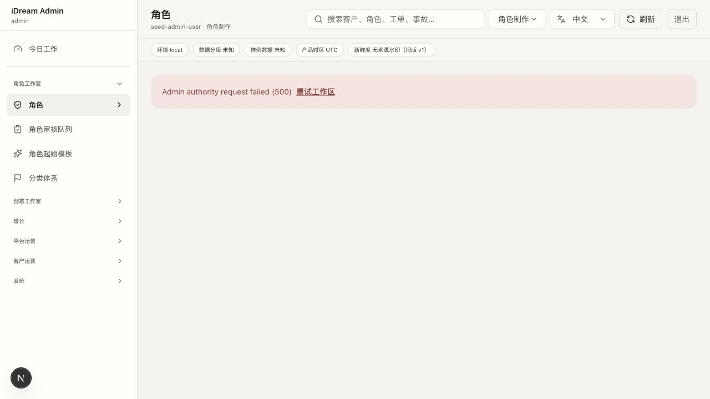
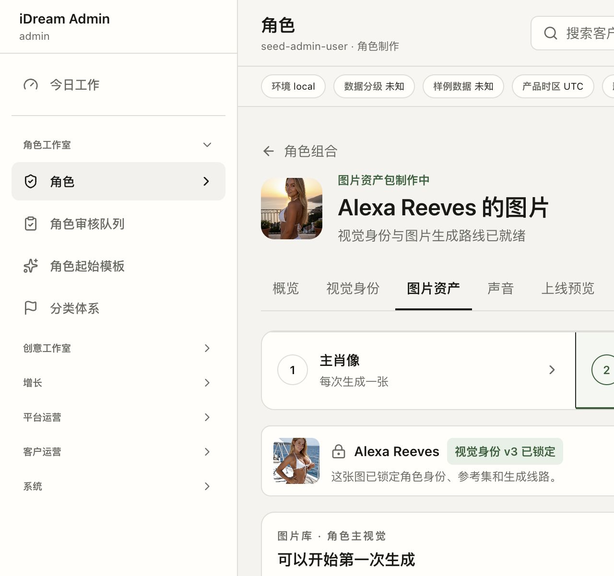

# Alexa Reeves 角色运营页复盘审计

审计时间：2026-07-25  
页面：`http://127.0.0.1:3001/admin/characters/alexa-reeves?tab=visual`

## 结论

上一轮改善了局部入口、阻塞提示和按钮落点，但没有解决角色运营页的任务模型。当前仍是“多个后台工具共用一个角色详情壳”，不是“运营人员完成角色生产、上线与持续运营的工作台”。

本轮还发现一个 P0 运行阻塞：刷新角色工作区后，`GET /api/v2/admin/characters/alexa-reeves` 返回 500。服务日志中的直接原因是 Prisma `P2022`：代码读取 `character_visual_profiles.referenceAssetIds`，但当前数据库没有该列。错误页的“重试工作区”再次返回同一错误。

## 第一性原理

运营人员的目标不是浏览“视觉身份 / 图片资产 / 上线预览 / 发布版本 / 监控”这些模块，而是让一个角色完成当前阶段的唯一任务：

1. 明确角色目前是草稿、待补资产、待 QA、待发布，还是已上线。
2. 知道阻塞结果的最早前置条件。
3. 完成一个明确的图片资产槽位。
4. 在用户场景中审核候选图。
5. 明确地把通过审核的图加入草稿资产包。
6. 对完整草稿做预览和 QA。
7. 生成不可变发布版本并上线。
8. 上线后的回滚、暂停和退役属于独立的线上管理任务。

角色身份、候选审核、草稿资产包、发布版本和线上 Serving 仍应保持不同权威阶段；问题不在于阶段太多，而在于这些阶段目前被表现成同级标签页和表单。

## 当前旅程

### 1. 打开或刷新角色工作区 — 阻塞

页面只显示 `Admin authority request failed (500)`，中文工作模式里出现英文错误；重试不提供新信息，也没有错误编号、受影响范围或可执行修复方向。运营流程在第一步就中断。

### 2. 刷新前仍可见的图片资产页 — 可理解但不是运营工作台

优点：

- 角色身份、参考图和生成路线被明确锁定。
- 明确说明“一次生成一张”“审核是独立步骤”“不会自动改变线上角色”。
- 空状态与生成入口在同屏，按钮落点比上一轮更直接。

问题：

- “主肖像 / 角色主视觉 / 聊天场景图”被叫作“用途筛选”，但业务上它们是必须完成的资产槽位。页面没有在第一屏表达每个槽位的草稿、线上、缺失、过期和审核状态。
- 当前选中“角色主视觉”，但运营人员不知道这个槽位将出现在哪个用户页面、需要什么构图、裁切和质量标准。
- 右侧是通用生成表单；它回答“生成什么”，没有回答“为什么现在要生成、生成后如何判断合格、还差什么才能上线”。
- 图片库空状态与生成表单形成工具闭环，却没有形成“生成 → 用户场景比较 → 审核 → 加入草稿资产包”的任务闭环。
- 顶部仍有七个同级标签。阶段、资产类型、高级技术设置和线上高风险操作处于同一导航层级。

### 3. 视觉身份、预览、发布与监控 — 本轮无法继续实测

刷新后角色权威接口持续 500，因此不能把剩余步骤标记为“通过”。代码结构仍暴露出以下架构性问题：

- 视觉身份页同时承载身份版本、参考集、生成路线和实验工作台；正常运营与高级技术调参没有分层。
- 图片资产未完成时，预览页仍继续展示渲染器、快照证据和 QA 表单。阻塞提示只是附加卡片，而不是把页面收敛到唯一可执行动作。
- 发布页把提议、审核、验证、发布、定时、回滚、暂停和退役集中在同一个侧栏。发布准备与线上事故操作不应共享同一个操作面。
- 发布历史优先展示原始 release ID、hash 和 lineage；运营人员更需要“当前线上版本 / 待发布版本 / 变更内容 / 风险 / 操作人 / 时间”。

## 分级问题

### P0

1. 角色权威接口刷新后 500，真实运营旅程不可进入。
2. 当前无法端到端证明图片生成、审核、加入草稿包、预览、QA 和发布可闭环。
3. 发布创建与回滚、暂停、退役混在同一高风险操作区。

### P1

1. 七个标签是系统模块导航，不是运营阶段导航。
2. 首页虽有“下一步”，但没有持续可见的角色任务、完成定义和阻塞归属。
3. 三种图片被建模成筛选器，而不是带草稿/线上/审核状态的资产包工作队列。
4. 生成前缺少真实投放场景、构图要求和验收标准。
5. 预览、QA 与发布在前置条件不满足时仍展示大量不可执行内容。
6. 视觉实验与日常运营未分层。

### P2

1. 中文界面混入英文技术错误、状态和按钮文本。
2. “图片用途筛选”使用 `aria-current="step"`，语义同时像筛选器与步骤条，辅助技术无法确定其真实角色。
3. 横向标签在窄屏依赖滚动，缺少阶段完成状态和阻塞说明。
4. 空状态没有说明预计产出位置、合格标准和下一阶段。

## 建议的信息架构

### 角色运营中心（默认页）

- 角色当前状态：线上 / 草稿 / 阻塞 / 待 QA。
- 当前任务：只展示一个可执行动作、负责人和完成定义。
- 图片资产包：主肖像、角色主视觉、聊天场景图三个槽位；每个槽位同时展示线上图、草稿图、审核状态、线路有效性和缺口。
- 最近失败与可恢复任务：生成失败、审核待续、选择待确认。

### 图片生产工作区

- 先选一个资产槽位。
- 在生成前直接展示用户投放位置、比例、裁切和验收标准。
- 生成后进入候选比较与用户场景预览。
- “审核通过”和“加入草稿资产包”保持两个明确动作。

### 上线准备

- 资产包完整后才开放。
- 同屏完成线上/草稿对比、QA 和变更摘要。
- QA 通过后才能提议不可变发布版本。

### 线上管理

- 发布、定时属于上线任务。
- 回滚、暂停、退役进入独立的“线上管理”区或高风险操作菜单，不与正常发布表单混排。

### 高级设置

- 视觉身份版本、参考集、生成路线、实验 lineage 收到“高级设置”。
- 正常运营页只显示是否锁定、何时变更、谁变更，以及为什么必须重新打开设置。

## 验收标准

重构不能以“按钮能点”为完成标准，至少需要：

1. 新运营人员进入后 10 秒内能说出角色当前状态、唯一下一步和完成定义。
2. 每个图片槽位都能区分线上、草稿、待审核、缺失和线路过期。
3. 生成前能看到真实投放场景和验收标准。
4. 生成、审核、加入草稿包、预览、QA、提议发布、上线可以在新会话刷新后连续完成。
5. 任一步刷新都能恢复到权威状态，不依赖页面内存。
6. 前置条件不满足时，下游页面只保留解释和一个修复动作。
7. 高风险线上命令不与日常发布准备共用操作区。

## 审计边界

- 本轮没有触发真实图片生成、发布、回滚、暂停或退役。
- 本轮没有执行数据库迁移，也没有修改产品代码。
- 因权威接口 500，步骤 3 之后的结论来自当前代码结构检查，不标记为浏览器实测通过。
